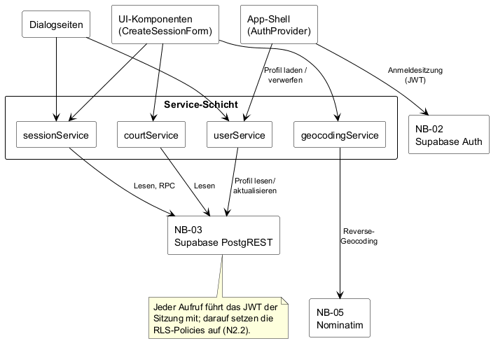

# 5 Bausteinsicht

## 5.1 Whitebox LocalCourt / Ebene 1

LocalCourt ist als browserbasierter Client ohne eigene Backend-Schicht ausgeprägt ([A04](A04-solution-strategy.md#42-top-level-zerlegung)). Die folgende Zerlegung ist die auf dieser Ebene tatsächlich belegte Struktur — fünf Bausteine, abgeleitet aus den fachlichen Bereichen in [F2](../spec/F2-anwendungsfaelle.md)/[F3](../spec/F3-anwendungsfunktionen.md), den Dialogen aus [B1](../spec/B1-dialogspezifikation.md) und den vorhandenen Verzeichnissen unter `src/`.

| Baustein | Verantwortung | Relevante fachliche Zuordnung | Relevante Abhängigkeiten / Schnittstellen | Code |
|---|---|---|---|---|
| **App-Shell & Navigation** | Routing zwischen den Dialogseiten, persistente Hauptnavigation ([B1.5.1](../spec/B1-dialogspezifikation.md#b151-hauptnavigation)) und Weiterleitung nicht angemeldeter Nutzer zu DLG-01 mit Rücksprung zum ursprünglichen Ziel ([B1.5.2](../spec/B1-dialogspezifikation.md#b152-weiterleitung-nicht-angemeldeter-nutzer)). | UC-01 (mittelbar, über Weiterleitung); trägt als Navigationsrahmen alle übrigen Use Cases. | Bindet alle Dialogseiten ein; der Zugriffsschutz beruht auf der Supabase-Auth-Sitzung, die `AuthProvider` hält ([NB-02](../spec/S1-nachbarsysteme.md#s13-nb-02--supabase-auth), [A08 §8.3](A08-crosscutting-concepts.md#83-authentifizierung-und-zugriffsschutz)). | `src/App.tsx`, `src/components/layout/`, `src/auth/` |
| **Dialogseiten** | Je Dialog aus B1 eine Seite (DLG-01–DLG-08); lädt Daten über die Service-Schicht, hält lokale UI-Zustände (z. B. die in DLG-04 unterschiedenen Zustände *Gast*/*Offen*/*Beigetreten*/*Organisator*/*Read-only*, [B1.4.4](../spec/B1-dialogspezifikation.md#b144-dlg-04--session-detail)) und löst Aktionen aus. | UC-01 bis UC-12, verteilt auf die acht Dialoge (siehe [B1 Dialog-Index](../spec/B1-dialogspezifikation.md#dialog-index)); kein 1:1-Verhältnis zwischen Use Case und Dialog — z. B. realisiert DLG-04 gemeinsam UC-03/UC-04/UC-07, DLG-02 und DLG-03 teilen sich UC-02. | Verwendet UI-Komponenten zur Darstellung, Service-Schicht für Daten/Aktionen und Fachliche Typen für die D1/D2-Modellierung. | `src/pages/` |
| **UI-Komponenten** | Wiederverwendbare Komponenten für Darstellung und Interaktion; `CreateSessionForm` ruft als einzige Komponente zusätzlich direkt die Service-Schicht für fachliche Aktionen auf (Courts laden, Reverse-Geocoding, Session anlegen), die übrigen Komponenten bleiben ohne eigenen Persistenzzugriff. | SessionCard/StatusBadge (UC-02, UC-03), CreateSessionForm/CourtLocationPicker (UC-06, UC-10), CheckInQrCode (UC-08, AF-04). | Wird von Dialogseiten eingebunden; CourtLocationPicker bindet die Kartendarstellung über Leaflet ein ([NB-04](../spec/S1-nachbarsysteme.md#s15-nb-04--openstreetmap-tiles)); CreateSessionForm ruft zusätzlich direkt die Service-Schicht auf (`courtService`, `geocodingService`, `sessionService`, siehe [5.4](#54-whitebox-service-schicht--ebene-2)). | `src/components/sessions/` |
| **Service-Schicht** | Zentraler Zugriffspunkt auf fachliche Daten, Fachoperationen und externe fachliche Dienste; kapselt PostgREST/RPC und Nominatim ([A04](A04-solution-strategy.md#41-technologie)). Die Auth-Sitzung selbst gehört nicht dazu, sie liegt bei App-Shell & Navigation ([ADR-002](A09-architecture-decisions.md#92-adr-002--service-schicht-als-integrationsgrenze-für-fachlichen-datenzugriff-und-geocoding)). Die technische Persistenz fachlicher D1-Daten wird darin von den **datenhaltenden Servicemodulen** getragen (`sessionService`, `courtService`, `userService`) — eine von der Service-Schicht getrennte Persistenz-/Repository-Abstraktion existiert nicht und ist auch nicht vorgesehen. `geocodingService` bindet dagegen mit NB-05 einen externen Auskunftsdienst ein, ohne Persistenzverantwortung zu tragen ([A08 8.1.3](A08-crosscutting-concepts.md#813-persistenzregel)). Ruft dabei die atomaren RPC-Operationen für Session-Erstellung, Beitritt und Check-in auf, ohne deren in [S1.4](../spec/S1-nachbarsysteme.md#s14-nb-03--supabase-postgrest) festgelegte Regeln selbst atomar umzusetzen — diese liegen auf Datenbankebene. | UC-02 bis UC-12; orchestriert [AF-01](../spec/F3-anwendungsfunktionen.md#af-01--beitritts--und-kapazitätsregel) (Beitritt, über `join_session`), [AF-02](../spec/F3-anwendungsfunktionen.md#af-02--check-in-validierung) (Check-in, über `check_in`) und den PIN-erzeugenden Teil von [AF-04](../spec/F3-anwendungsfunktionen.md#af-04--pin--und-qr-code-erzeugung) (über `create_session`); die QR-Inhalt-Ableitung aus AF-04 liegt bei UI-Komponenten/Fachliche Typen, nicht bei der Service-Schicht. | Schnittstellen NB-03/NB-05 ([S1](../spec/S1-nachbarsysteme.md)); verwendet Fachliche Typen sowie den Sportarten-Referenzkatalog (`src/data/sports.ts`), der die Anzeigebezeichnungen zu den Schlüsseln des D1-`sport`-Katalogs führt. | `src/services/` |
| **Fachliche Typen & Regeln** | TypeScript-Abbildung der D1-Entitäten und D2-Datentypen sowie der Aufbau des Check-in-Links als clientseitiger Teil von [AF-04](../spec/F3-anwendungsfunktionen.md#af-04--pin--und-qr-code-erzeugung) (`checkInUrl.ts`). Den Sessionstatus [AF-03](../spec/F3-anwendungsfunktionen.md#af-03--status-einer-sport-session) leitet dieser Baustein **nicht** ab: Er wird von `session_status()` in der Datenbank berechnet und über `v_session` geliefert, damit Anzeige und `check_in` dieselbe Uhr verwenden. `sessionTime.ts` formatiert nur noch Datum und Uhrzeit für die Dialoge. | D1-Entitäten (`session`, `court`, `participant`, `profile`), D2-Datentypen (`SessionStatus`, `ParticipantStatus`), AF-04. | Wird von Dialogseiten, UI-Komponenten und Service-Schicht verwendet. | `src/types/`, `src/utils/` |

Alle fünf Bausteine sind logische Bestandteile einer einzigen React-SPA unter `src/`; Verteilung und Deployment sind nicht Gegenstand dieses Kapitels (siehe Kapitel 7).

## 5.2 Bausteindiagramm

Quelle: [`diagrams/A05-bausteinsicht-ebene1.puml`](diagrams/A05-bausteinsicht-ebene1.puml). Das Diagramm zeigt LocalCourt als Whitebox mit den fünf Bausteinen aus [5.1](#51-whitebox-localcourt--ebene-1); alle fünf Nachbarsysteme aus [P2](../spec/P2-architekturueberblick.md#p22-nachbarsysteme)/[S1](../spec/S1-nachbarsysteme.md) stehen sichtbar außerhalb der Systemgrenze. NB-01 (Browser) ist als Nutzerkanal zwischen den Akteuren und LocalCourt eingezeichnet, konsistent mit dem Kontextdiagramm aus [P2.1](../spec/P2-architekturueberblick.md#p21-systemkontext); ein eigener Protokoll-Contract besteht dafür nicht — die Schnittstelle ist die Dialogfläche aus B1 ([S1.2](../spec/S1-nachbarsysteme.md#s12-nb-01--browser-nutzerkanal)).

## 5.3 Traceability zu F2/F3

| Baustein | Unterstützte Use Cases / Funktionen |
| -------- | ----------------------------------- |
| App-Shell & Navigation | UC-01 (Weiterleitung nicht angemeldeter Nutzer) |
| Dialogseiten | UC-01–UC-12, verteilt auf DLG-01–DLG-08 (siehe [B1 Dialog-Index](../spec/B1-dialogspezifikation.md#dialog-index)) |
| UI-Komponenten | UC-02, UC-03, UC-06, UC-07, UC-08, UC-09, UC-10 |
| Service-Schicht | UC-02–UC-12; AF-01, AF-02 (je über RPC), AF-04 (nur PIN-Teil, über RPC) |
| Fachliche Typen & Regeln | AF-04 (Check-in-Link); AF-03 liegt in der Datenbank |

## 5.4 Whitebox Service-Schicht / Ebene 2

Die Service-Schicht bündelt in der Zerlegung aus [5.1](#51-whitebox-localcourt--ebene-1) die servicebasierten Datenzugriffe und fachlichen Aktionen von LocalCourt in einem gemeinsamen Baustein — Kartenkacheln (NB-04) laufen davon unabhängig direkt über die UI-Komponentenschicht (siehe [5.2](#52-bausteindiagramm)). Damit die vier fachlichen Module und ihre Abhängigkeiten sichtbar werden, ohne das Übersichtsdiagramm aus 5.2 zusätzlich zu belasten, zeigt dieser Abschnitt die Service-Schicht als eigene Whitebox auf einer zweiten Ebene. Innerhalb dieser vier Module kapseln die **datenhaltenden Servicemodule** — `sessionService`, `courtService`, `userService` — die technische Persistenz fachlicher D1-Daten über NB-03 Supabase PostgREST/PostgreSQL. NB-02 Supabase Auth ist dabei kein eigener Speicherort fachlicher Daten; die Sitzung hält `AuthProvider` im Baustein App-Shell & Navigation, und ihr JWT geht als Identitätskontext in jeden NB-03-Aufruf ein, worauf die RLS-Policies aufsetzen ([A08 §8.3](A08-crosscutting-concepts.md#83-authentifizierung-und-zugriffsschutz)). `geocodingService` bildet dagegen ausschließlich den Zugriff auf den externen Auskunftsdienst NB-05 (Nominatim) ab und übernimmt keine Persistenzverantwortung. Eine eigene Persistenzschicht unterhalb der Service-Schicht existiert für keines der vier Module ([A08 8.1.3](A08-crosscutting-concepts.md#813-persistenzregel)).

Neben diesen vier fachlichen Modulen liegen unter `src/services/` drei technische Hilfsmodule ohne eigene fachliche Verantwortung: `supabaseConfig.ts` und `supabaseClient.ts` stellen den konfigurierten NB-03-/NB-02-Zugang bereit, `sessionQueries.ts` bündelt die Spaltenliste von `v_session` und die Abbildung ihrer Zeilen auf die fachlichen Typen. Sie sind keine eigenen Bausteine, sondern Bestandteil der Service-Schicht.

Quelle: [`diagrams/A05-bausteinsicht-service-schicht.puml`](diagrams/A05-bausteinsicht-service-schicht.puml). Eingangsseitig zeigt das Diagramm — abweichend von der Vereinfachung `Pages --> Services` im Übersichtsdiagramm aus 5.2 — drei tatsächliche Aufrufergruppen: Dialogseiten unter `src/pages/` (z. B. `SessionDetailPage`, `DiscoverPage`) rufen `sessionService` und `userService` direkt auf; die UI-Komponente `CreateSessionForm` (`src/components/sessions/`, eingebettet in DLG-05) importiert daneben `sessionService`, `courtService` und `geocodingService` direkt und ist damit der einzige direkte Aufrufer der beiden letzteren — keine Dialogseite ruft sie unmittelbar auf. Als dritter Aufrufer lädt `AuthProvider` aus dem Baustein App-Shell & Navigation über `userService` das Profil zur Sitzung und verwirft es beim Abmelden; NB-02 spricht ausschließlich er an.

Ausgangsseitig sind nur die tatsächlich verwendeten Nachbarsysteme aus [S1](../spec/S1-nachbarsysteme.md) je Modul eingezeichnet; NB-04 OpenStreetMap-Tiles gehört nicht dazu, da unter `src/services/` kein Modul Kartenkacheln lädt — das übernimmt Leaflet/react-leaflet direkt in der UI-Komponentenschicht (siehe Kante `UI --> NB04` im Diagramm aus 5.2). Untereinander sind die vier fachlichen Module unabhängig: Keines importiert ein anderes. Solange `sessionService` den angemeldeten Nutzer noch selbst kennen musste, las es ihn aus `userService`; seit die RPCs die Nutzerkennung serverseitig über `auth.uid()` bestimmen, entfällt diese Kopplung. Dass `sessionService`, `courtService` und `userService` alle gegen NB-03 Supabase PostgREST aufrufen, ist keine Abhängigkeit zwischen den Modulen, sondern eine gemeinsame Nutzung derselben externen Schnittstelle — technisch über den gemeinsamen Client aus `supabaseClient.ts`.

Die Service-Schicht besteht aus vier fachlichen Modulen mit unterschiedlicher Verantwortung und AF-/UC-Zuordnung; die Schnittstellen aus [S1](../spec/S1-nachbarsysteme.md) sind dabei teils gemeinsam (`sessionService`, `courtService` und `userService` nutzen alle NB-03), teils modulspezifisch (`geocodingService` ausschließlich NB-05).

| Modul | Verantwortung | Fachliche Zuordnung | Schnittstelle | Code |
|---|---|---|---|---|
| `sessionService` | Sessions lesen/suchen/filtern; ruft die RPCs für Session-Erstellung, Beitritt und Check-in auf, ohne deren atomare Regeln selbst zu implementieren. | UC-02, UC-03, UC-05, UC-06, UC-11 (Lesen); UC-04/AF-01 (Beitritt, Aufruf `join_session`); UC-08, UC-09/AF-02 (Check-in, Aufruf `check_in`); UC-06/AF-04 (Aufruf `create_session`, PIN wird dabei serverseitig atomar erzeugt). | NB-03 Supabase PostgREST — Lesen über `v_session` sowie die RPCs `create_session`, `join_session`, `check_in` ([S1.4](../spec/S1-nachbarsysteme.md#s14-nb-03--supabase-postgrest)). | `src/services/sessionService.ts` |
| `courtService` | Vorhandene Courts zur Auswahl lesen. Das Anlegen eines neuen Courts liegt nicht hier, sondern in `create_session`, damit kein verwaister Court zurückbleibt, wenn die Session-Erstellung scheitert ([ADR-001](A09-architecture-decisions.md#91-adr-001--atomare-fachoperationen-über-postgresql-funktionen-rpc-statt-clientseitiger-prüfung), [A06 §6.3](A06-runtime-view.md#63-session-und-court-erstellen)). | UC-10. | NB-03 Supabase PostgREST — Lesen ([S1.4](../spec/S1-nachbarsysteme.md#s14-nb-03--supabase-postgrest)). | `src/services/courtService.ts` |
| `userService` | Profil und Sportpräferenzen lesen und aktualisieren. | UC-12. | NB-03 Supabase PostgREST — `my_profile()`, `profilAktualisieren`, `sportpraeferenzSetzen`/`-Entfernen` ([S1.4](../spec/S1-nachbarsysteme.md#s14-nb-03--supabase-postgrest)). Die Nutzerkennung kommt nicht aus einem eigenen NB-02-Aufruf, sondern serverseitig aus `auth.uid()` des mitgeführten JWT. | `src/services/userService.ts` |
| `geocodingService` | Reverse-Geocoding eines gesetzten Kartenpins. | UC-10. | NB-05 Nominatim (`ortAufloesen`, [S1.6](../spec/S1-nachbarsysteme.md#s16-nb-05--nominatim-reverse-geocoding)). | `src/services/geocodingService.ts` |
