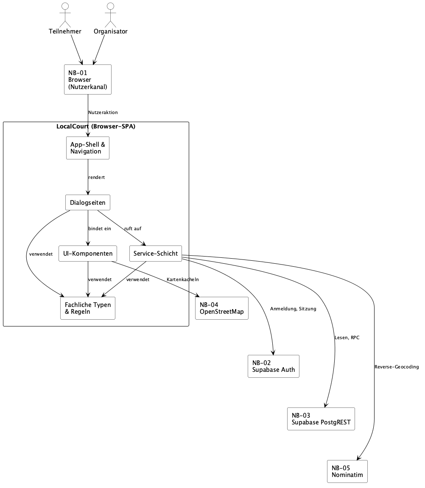

# 5 Bausteinsicht

## 5.1 Whitebox LocalCourt / Ebene 1

LocalCourt ist als browserbasierter Client ohne eigene Backend-Schicht ausgeprägt ([A04](A04-solution-strategy.md#42-top-level-zerlegung)). Die folgende Zerlegung ist die auf dieser Ebene tatsächlich belegte Struktur — fünf Bausteine, abgeleitet aus den fachlichen Bereichen in [F2](../spec/F2-anwendungsfaelle.md)/[F3](../spec/F3-anwendungsfunktionen.md), den Dialogen aus [B1](../spec/B1-dialogspezifikation.md) und den vorhandenen Verzeichnissen unter `src/`.

| Baustein | Verantwortung | Relevante fachliche Zuordnung | Relevante Abhängigkeiten / Schnittstellen | Code |
|---|---|---|---|---|
| **App-Shell & Navigation** | Routing zwischen den Dialogseiten, persistente Hauptnavigation ([B1.5.1](../spec/B1-dialogspezifikation.md#b151-hauptnavigation)) und Weiterleitung nicht angemeldeter Nutzer zu DLG-01 mit Rücksprung zum ursprünglichen Ziel ([B1.5.2](../spec/B1-dialogspezifikation.md#b152-weiterleitung-nicht-angemeldeter-nutzer)). | UC-01 (mittelbar, über Weiterleitung); trägt als Navigationsrahmen alle übrigen Use Cases. | Bindet alle Dialogseiten ein; der Zugriffsschutz beruht im Zielbild auf der Supabase-Auth-Sitzung ([NB-02](../spec/S1-nachbarsysteme.md#s13-nb-02--supabase-auth)). | `src/App.tsx`, `src/components/layout/`, `src/auth/` |
| **Dialogseiten** | Je Dialog aus B1 eine Seite (DLG-01–DLG-08); lädt Daten über die Service-Schicht, hält lokale UI-Zustände (z. B. die in DLG-04 unterschiedenen Zustände *Gast*/*Offen*/*Beigetreten*/*Organisator*/*Read-only*, [B1.4.4](../spec/B1-dialogspezifikation.md#b144-dlg-04--session-detail)) und löst Aktionen aus. | UC-01 bis UC-12, verteilt auf die acht Dialoge (siehe [B1 Dialog-Index](../spec/B1-dialogspezifikation.md#dialog-index)); kein 1:1-Verhältnis zwischen Use Case und Dialog — z. B. realisiert DLG-04 gemeinsam UC-03/UC-04/UC-07, DLG-02 und DLG-03 teilen sich UC-02. | Verwendet UI-Komponenten zur Darstellung, Service-Schicht für Daten/Aktionen und Fachliche Typen für die D1/D2-Modellierung. | `src/pages/` |
| **UI-Komponenten** | Wiederverwendbare, auf Darstellung beschränkte Komponenten für fachliche Objekte ohne eigenen Persistenzzugriff. | SessionCard/StatusBadge (UC-02, UC-03), CreateSessionForm/CourtLocationPicker (UC-06, UC-10), CheckInQrCode (UC-08, AF-04). | Wird von Dialogseiten eingebunden; CourtLocationPicker bindet die Kartendarstellung über Leaflet ein ([NB-04](../spec/S1-nachbarsysteme.md#s15-nb-04--openstreetmap-tiles)). | `src/components/sessions/` |
| **Service-Schicht** | Zentraler Zugriffspunkt auf fachliche Daten und Aktionen; kapselt im Zielbild Supabase Auth, PostgREST/RPC und Nominatim ([A04](A04-solution-strategy.md#41-technologie)). Ruft dabei die atomaren RPC-Operationen für Session-Erstellung, Beitritt und Check-in auf, ohne deren in [S1.4](../spec/S1-nachbarsysteme.md#s14-nb-03--supabase-postgrest) festgelegte Regeln selbst atomar umzusetzen — diese liegen auf Datenbankebene. | UC-02 bis UC-12; orchestriert [AF-01](../spec/F3-anwendungsfunktionen.md#af-01--beitritts--und-kapazitätsregel) (Beitritt, über `join_session`), [AF-02](../spec/F3-anwendungsfunktionen.md#af-02--check-in-validierung) (Check-in, über `check_in`) und den PIN-erzeugenden Teil von [AF-04](../spec/F3-anwendungsfunktionen.md#af-04--pin--und-qr-code-erzeugung) (über `create_session`); die QR-Inhalt-Ableitung aus AF-04 liegt bei UI-Komponenten/Fachliche Typen, nicht bei der Service-Schicht. | Zielschnittstellen NB-02/NB-03/NB-05 ([S1](../spec/S1-nachbarsysteme.md)); verwendet Fachliche Typen sowie im Prototyp den Sportarten-Referenzkatalog (`src/data/sports.ts`, entspricht dem D1-`sport`-Katalog) und zusätzliche Mockdaten für Sessions, Courts und Nutzerprofil, die im Zielbild durch NB-03-Daten ersetzt werden. | `src/services/` |
| **Fachliche Typen & Regeln** | TypeScript-Abbildung der D1-Entitäten und D2-Datentypen sowie clientseitige Funktionen, die F3-Ableitungsregeln umsetzen (Sessionstatus [AF-03](../spec/F3-anwendungsfunktionen.md#af-03--status-einer-sport-session) in `sessionTime.ts`; Aufbau des Check-in-Links als Teil von AF-04 in `checkInUrl.ts`). | D1-Entitäten (`session`, `court`, `participant`, `profile`), D2-Datentypen (`SessionStatus`, `ParticipantStatus`), AF-03, AF-04. | Wird von Dialogseiten, UI-Komponenten und Service-Schicht verwendet. | `src/types/`, `src/utils/` |

Alle fünf Bausteine sind logische Bestandteile einer einzigen React-SPA unter `src/`; Verteilung und Deployment sind nicht Gegenstand dieses Kapitels (siehe Kapitel 7).

## 5.2 Bausteindiagramm

Quelle: [`diagrams/A05-bausteinsicht-ebene1.puml`](diagrams/A05-bausteinsicht-ebene1.puml). Das Diagramm zeigt LocalCourt als Whitebox mit den fünf Bausteinen aus [5.1](#51-whitebox-localcourt--ebene-1); alle fünf Nachbarsysteme aus [P2](../spec/P2-architekturueberblick.md#p22-nachbarsysteme)/[S1](../spec/S1-nachbarsysteme.md) stehen sichtbar außerhalb der Systemgrenze. NB-01 (Browser) ist als Nutzerkanal zwischen den Akteuren und LocalCourt eingezeichnet, konsistent mit dem Kontextdiagramm aus [P2.1](../spec/P2-architekturueberblick.md#p21-systemkontext); ein eigener Protokoll-Contract besteht dafür nicht — die Schnittstelle ist die Dialogfläche aus B1 ([S1.2](../spec/S1-nachbarsysteme.md#s12-nb-01--browser-nutzerkanal)).

## 5.3 Traceability zu F2/F3

| Baustein | Unterstützte Use Cases / Funktionen |
| -------- | ----------------------------------- |
| App-Shell & Navigation | UC-01 (Weiterleitung nicht angemeldeter Nutzer) |
| Dialogseiten | UC-01–UC-12, verteilt auf DLG-01–DLG-08 (siehe [B1 Dialog-Index](../spec/B1-dialogspezifikation.md#dialog-index)) |
| UI-Komponenten | UC-02, UC-03, UC-06, UC-07, UC-08, UC-09, UC-10 |
| Service-Schicht | UC-02–UC-12; AF-01, AF-02 (je über RPC), AF-04 (nur PIN-Teil, über RPC) |
| Fachliche Typen & Regeln | AF-03, AF-04 |

## 5.4 Whitebox Service-Schicht / Ebene 2

Die Service-Schicht besteht aus vier Modulen mit unterschiedlicher fachlicher Verantwortung und AF-/UC-Zuordnung; die Zielschnittstellen aus [S1](../spec/S1-nachbarsysteme.md) sind dabei teils gemeinsam (`sessionService` und `courtService` nutzen beide NB-03), teils modulspezifisch (`geocodingService` ausschließlich NB-05).

| Modul | Verantwortung | Fachliche Zuordnung | Zielschnittstelle | Code |
|---|---|---|---|---|
| `sessionService` | Sessions lesen/suchen/filtern; ruft im Zielbild die RPCs für Session-Erstellung, Beitritt und Check-in auf, ohne deren atomare Regeln selbst zu implementieren. | UC-02, UC-03, UC-05, UC-06, UC-11 (Lesen); UC-04/AF-01 (Beitritt, Aufruf `join_session`); UC-08, UC-09/AF-02 (Check-in, Aufruf `check_in`); UC-06/AF-04 (Aufruf `create_session`, PIN wird dabei serverseitig atomar erzeugt). | NB-03 Supabase PostgREST — Lese-Operationen sowie die RPCs `create_session`, `join_session`, `check_in` ([S1.4](../spec/S1-nachbarsysteme.md#s14-nb-03--supabase-postgrest)). | `src/services/sessionService.ts` |
| `courtService` | Courts lesen und anlegen. | UC-10. | NB-03 Supabase PostgREST — Lesen sowie `courtAnlegen` ([S1.4](../spec/S1-nachbarsysteme.md#s14-nb-03--supabase-postgrest)). | `src/services/courtService.ts` |
| `userService` | Profil lesen und aktualisieren. | UC-12. | NB-02 Supabase Auth (Nutzerkennung); NB-03 Supabase PostgREST (`profilAktualisieren`, [S1.4](../spec/S1-nachbarsysteme.md#s14-nb-03--supabase-postgrest)). | `src/services/userService.ts` |
| `geocodingService` | Reverse-Geocoding eines gesetzten Kartenpins. | UC-10. | NB-05 Nominatim (`ortAufloesen`, [S1.6](../spec/S1-nachbarsysteme.md#s16-nb-05--nominatim-reverse-geocoding)). | `src/services/geocodingService.ts` |

## 5.5 Eingesetzte KI-Werkzeuge

| Aspekt | Inhalt |
| ------ | ------ |
| Werkzeug | Claude Code |
| Verwendung | Analyse von Spezifikation ([F2](../spec/F2-anwendungsfaelle.md), [F3](../spec/F3-anwendungsfunktionen.md), [D1](../spec/D1-datenmodell.md), [D2](../spec/D2-datentypen.md), [B1](../spec/B1-dialogspezifikation.md), [S1](../spec/S1-nachbarsysteme.md)), bestehender Architektur (A01–A04, README) und aktuellem Code (`src/`) sowie Entwurf von Kapitel 5 „Bausteinsicht" samt PlantUML-Bausteindiagramm. |
| Prüfung | Bausteine gegen F2/F3, D1/D2, B1, A04 und die tatsächliche Code-Struktur unter `src/` geprüft; keine unbelegten Komponenten ergänzt; Diagramm gegen die Tabellen in 5.1/5.4 auf Konsistenz geprüft. |
