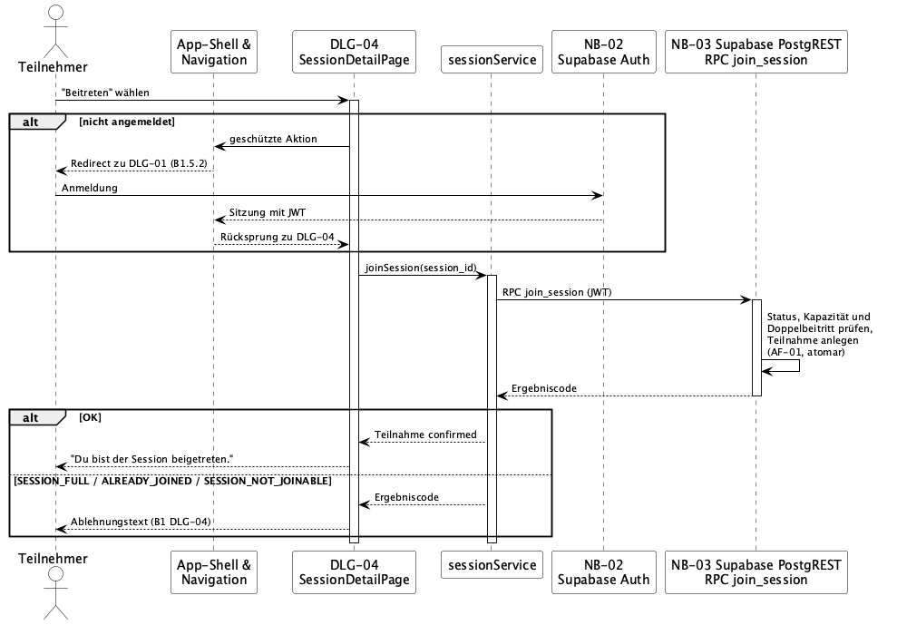
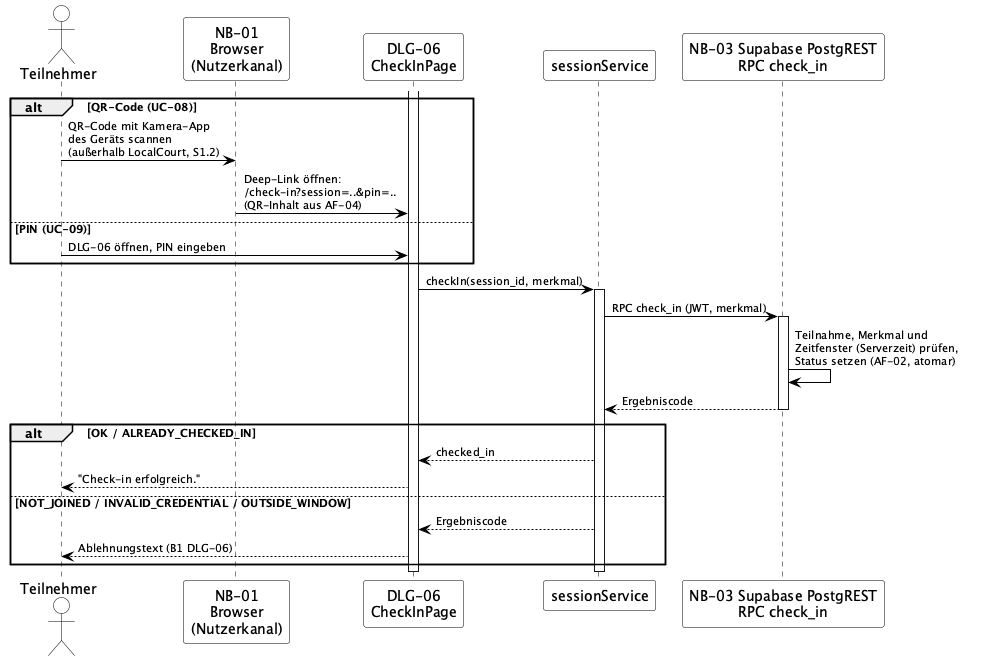
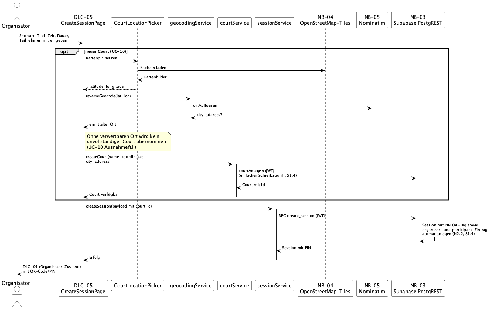

# 6 Laufzeitsicht

Dieses Kapitel zeigt ausgewählte, architekturrelevante Laufzeitszenarien: Abläufe, die mehrere Bausteine aus [A05](A05-building-block-view.md) betreffen, relevante Nachbarsysteme aus [A03](A03-context-and-scope.md)/[S1](../spec/S1-nachbarsysteme.md) einbeziehen und atomare Fachlogik aus [F3](../spec/F3-anwendungsfunktionen.md) enthalten. Reine Lesezugriffe ohne besondere Laufzeitentscheidung — Session suchen (UC-02), Session-Detail ansehen (UC-03), Teilnehmerliste anzeigen (UC-07), Historie (UC-11), Profil (UC-12) — folgen dem einfachen Muster „Dialogseite ruft Service-Schicht, Service-Schicht liest über NB-03" und werden hier nicht eigens diagrammiert.

| Szenario | Use Cases | Warum architekturrelevant |
|---|---|---|
| [6.1](#61-session-beitreten) Session beitreten | [UC-04](../spec/F2-anwendungsfaelle.md#uc-04--session-beitreten) (inkl. [UC-01](../spec/F2-anwendungsfaelle.md#uc-01--registrieren--anmelden) als Alternativpfad) | Harte Kapazitätsgrenze ohne Warteliste; Prüfung und Schreibvorgang müssen atomar sein ([F3 AF-01](../spec/F3-anwendungsfunktionen.md#af-01--beitritts--und-kapazitätsregel), [N1-QA-01](../spec/N1-nichtfunktionale-anforderungen.md#n1-qa-01--konsistenz-von-beitritt-und-check-in)). |
| [6.2](#62-check-in-per-qr-code-oder-pin) Check-in per QR-Code oder PIN | [UC-08](../spec/F2-anwendungsfaelle.md#uc-08--check-in-per-qr-code-durchführen), [UC-09](../spec/F2-anwendungsfaelle.md#uc-09--check-in-per-pin-durchführen) | Zwei Einstiegspunkte (Deep-Link, manuelle Eingabe) münden in dieselbe atomare Prüfung; Idempotenz bei wiederholtem Check-in ([F3 AF-02](../spec/F3-anwendungsfunktionen.md#af-02--check-in-validierung), [N1-QA-01](../spec/N1-nichtfunktionale-anforderungen.md#n1-qa-01--konsistenz-von-beitritt-und-check-in)). |
| [6.3](#63-session-und-court-erstellen) Session und Court erstellen | [UC-06](../spec/F2-anwendungsfaelle.md#uc-06--session-erstellen), [UC-10](../spec/F2-anwendungsfaelle.md#uc-10--court--sportort-erfassen-oder-auswählen) | Ablauf mit drei Nachbarsystemen zugleich (NB-03/NB-04/NB-05); erzeugt PIN/QR ([F3 AF-04](../spec/F3-anwendungsfunktionen.md#af-04--pin--und-qr-code-erzeugung)) und legt Session sowie Organisator-Teilnahme atomar an. |

Die Kommunikation mit den beteiligten Nachbarsystemen erfolgt synchron über HTTPS; Warteschlangen und Push-Kanäle sind nicht vorgesehen ([A04 4.2](A04-solution-strategy.md#42-top-level-zerlegung)).

## 6.1 Session beitreten

**Auslöser:** Ein Teilnehmer öffnet eine Session in der Detailansicht und wählt „Beitreten" ([DLG-04](../spec/B1-dialogspezifikation.md#b144-dlg-04--session-detail), Zustand *Offen*).

**Beteiligte Bausteine ([A05](A05-building-block-view.md)):** App-Shell & Navigation (Weiterleitung nicht angemeldeter Nutzer), Dialogseiten (`SessionDetailPage`), Service-Schicht (`sessionService`).
**Beteiligte Nachbarsysteme ([S1](../spec/S1-nachbarsysteme.md)):** NB-02 Supabase Auth (Alternativpfad), NB-03 Supabase PostgREST (RPC `join_session`).

Quelle: [`diagrams/A06-session-beitreten.puml`](diagrams/A06-session-beitreten.puml).

**Bemerkenswert:**

- **Prüfung und Schreibvorgang sind unteilbar.** `join_session` prüft Anmeldestatus, Sessionstatus, Kapazität und Doppelbeitritt und legt bei Zulässigkeit die Teilnahme in einem Schritt an ([F3 AF-01](../spec/F3-anwendungsfunktionen.md#af-01--beitritts--und-kapazitätsregel)); die Kapazitätsinvariante gilt dadurch auch bei gleichzeitigen Beitritten mehrerer Nutzer.
- **Die Service-Schicht entscheidet nicht selbst.** Sie reicht die Prüfung unverändert an die Datenbank weiter ([A05 5.1](A05-building-block-view.md#51-whitebox-localcourt--ebene-1) „Service-Schicht").
- **Weiterleitung vor jedem Aufruf.** Ist der Nutzer nicht angemeldet, unterbricht der Baustein App-Shell & Navigation die Aktion und kehrt nach der Anmeldung über NB-02 zur Detailansicht zurück ([B1.5.2](../spec/B1-dialogspezifikation.md#b152-weiterleitung-nicht-angemeldeter-nutzer); F2 UC-04 Alternativszenario) — dieselbe Weiterleitung, die [A05 5.3](A05-building-block-view.md#53-traceability-zu-f2f3) diesem Baustein zuordnet.
- **Ablehnung ändert nichts.** Die fünf Ergebniscodes aus AF-01 werden unverändert bis zur Dialogseite durchgereicht und dort mit den verbindlichen Texten aus [B1.4.4](../spec/B1-dialogspezifikation.md#b144-dlg-04--session-detail) angezeigt.

## 6.2 Check-in per QR-Code oder PIN

**Auslöser:** Ein beigetretener Teilnehmer scannt am Treffpunkt den vom Organisator gezeigten QR-Code oder öffnet den Check-in-Dialog und gibt die PIN manuell ein.

**Beteiligte Bausteine ([A05](A05-building-block-view.md)):** Dialogseiten (`CheckInPage`), Service-Schicht (`sessionService`).
**Beteiligte Nachbarsysteme ([S1](../spec/S1-nachbarsysteme.md)):** NB-01 Browser (empfängt den Deep-Link; die Kamera-App des Geräts liegt außerhalb der Systemgrenze, [S1.2](../spec/S1-nachbarsysteme.md#s12-nb-01--browser-nutzerkanal)), NB-03 Supabase PostgREST (RPC `check_in`).

Quelle: [`diagrams/A06-check-in.puml`](diagrams/A06-check-in.puml).

**Bemerkenswert:**

- **Ein Algorithmus, zwei Einstiege.** QR-Code und PIN liefern dasselbe Merkmal (die Session-PIN — beim QR-Weg aus dem Deep-Link vorbelegt, dessen Inhalt bei der Session-Erstellung nach AF-04 erzeugt wurde, siehe [6.3](#63-session-und-court-erstellen)) und durchlaufen denselben Aufruf `check_in`.
- **Die Prüfung liegt in der RPC, nicht im Client.** `check_in` prüft Teilnahme, Merkmal und Zeitfenster gegen die Serverzeit und setzt den Status atomar ([F3 AF-02](../spec/F3-anwendungsfunktionen.md#af-02--check-in-validierung)); die Dialogseite reicht das Merkmal nur unverändert über die Service-Schicht an NB-03 durch.
- **Kein Toleranzfenster.** Maßgeblich für das Zeitfenster ist ausschließlich der aus AF-03 abgeleitete Status `active`.
- **Idempotent bei Wiederholung.** `OK` und `ALREADY_CHECKED_IN` sind gleichermaßen erfolgreich; ein bereits gesetzter `checked_in`-Status wird nie zurückgenommen. Die Zuordnung der übrigen Ergebniscodes zu HTTP-Status und Anzeigetext steht in [N2.3](../spec/N2-querschnittskonzepte.md#n23-fehler-mapping-ergebniscodes--http) und [B1.4.6](../spec/B1-dialogspezifikation.md#b146-dlg-06--check-in).

## 6.3 Session und Court erstellen

**Auslöser:** Ein Organisator füllt das Erstellungsformular aus und wählt einen vorhandenen Court oder erfasst einen neuen Sportort über einen Kartenpin.

**Beteiligte Bausteine ([A05](A05-building-block-view.md)):** Dialogseiten (`CreateSessionPage`), UI-Komponenten (`CourtLocationPicker`), Service-Schicht (`sessionService`, `courtService`, `geocodingService`).
**Beteiligte Nachbarsysteme ([S1](../spec/S1-nachbarsysteme.md)):** NB-04 OpenStreetMap-Tiles (Kartendarstellung), NB-05 Nominatim (Reverse-Geocoding), NB-03 Supabase PostgREST (RPC `create_session`).

Quelle: [`diagrams/A06-session-und-court-erstellen.puml`](diagrams/A06-session-und-court-erstellen.puml).

**Bemerkenswert:**

- **Reverse-Geocoding vor der Übernahme.** `geocodingService` löst den gesetzten Kartenpin über Nominatim in Ort und optionale Adresse auf ([S1.6](../spec/S1-nachbarsysteme.md#s16-nb-05--nominatim-reverse-geocoding)); liefert der Dienst keinen verwertbaren Ort, wird kein unvollständiger Court in die Erstellung übernommen ([UC-10](../spec/F2-anwendungsfaelle.md#uc-10--court--sportort-erfassen-oder-auswählen) Ausnahmefall).
- **Court-Anlage ist kein Teil der atomaren RPC.** `courtService` legt einen neuen Court über den einfach geprüften Schreibzugriff `courtAnlegen` an — laut [S1.4](../spec/S1-nachbarsysteme.md#s14-nb-03--supabase-postgrest) ausdrücklich getrennt von den drei atomaren RPCs.
- **`create_session` ist atomar für Session und Organisator-Teilnahme.** Die RPC legt die Session mit erzeugter PIN ([F3 AF-04](../spec/F3-anwendungsfunktionen.md#af-04--pin--und-qr-code-erzeugung)) sowie den `organizer`- und `participant`-Eintrag in einem Schritt an — belegt durch [N2.2](../spec/N2-querschnittskonzepte.md#n22-row-level-security-rls) („kein Schreibzugriff außer über die Erstellungs-RPC, die `organizer`- und `participant`-Eintrag atomar mit der Session anlegt") und [S1.4](../spec/S1-nachbarsysteme.md#s14-nb-03--supabase-postgrest) (`create_session` als eine der drei atomaren RPCs).
- **QR-Ableitung bleibt clientseitig.** Der QR-Inhalt wird nicht von der Service-Schicht, sondern aus Session-Kennung und PIN abgeleitet ([A05 5.1](A05-building-block-view.md#51-whitebox-localcourt--ebene-1) „Fachliche Typen & Regeln") und beim anschließenden Wechsel zur Detailansicht im Organisator-Zustand angezeigt.

## 6.4 Eingesetzte KI-Werkzeuge

| Aspekt | Inhalt |
|---|---|
| Werkzeug | Claude Code |
| Verwendung | Analyse von Spezifikation, bestehender Architektur und aktuellem Code sowie Entwurf von Kapitel 6 „Laufzeitsicht" und der zugehörigen PlantUML-Sequenzdiagramme. |
| Prüfung | Abläufe gegen F2/F3, A03/A05, S1 und die tatsächliche Code-Struktur geprüft; keine unbelegten Laufzeitschritte oder Komponenten ergänzt. |
