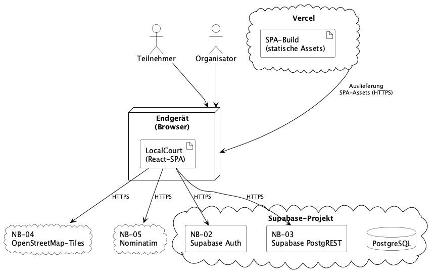

# 7 Verteilungssicht

Dieses Kapitel bildet die Bausteine aus [A05](A05-building-block-view.md) auf die für Ausführung und Bereitstellung relevanten Infrastrukturknoten ab und zeigt die dafür belegten Kommunikationsbeziehungen. Die Bausteine selbst werden nicht erneut beschrieben ([A05](A05-building-block-view.md)), ebenso wenig die Laufzeitabläufe aus [A06](A06-runtime-view.md).

## 7.1 Infrastrukturebene 1

### 7.1.1 Produktionsumgebung

Für LocalCourt ist nur die Produktionsverteilung architektonisch relevant dokumentiert; eine gesonderte Staging- oder Deployment-Entwicklungsumgebung ist nicht spezifiziert. Die beteiligten Knoten übernehmen dabei unterschiedliche Rollen und sind keine austauschbaren, gleichartigen Laufzeitorte.

Quelle: [`diagrams/A07-deployment-view.puml`](diagrams/A07-deployment-view.puml). Supabase Auth (NB-02), Supabase PostgREST (NB-03) und PostgreSQL sind im Diagramm als gemeinsamer Knoten `Supabase-Projekt` dargestellt; ihre interne Kommunikation untereinander ist nicht Gegenstand dieser Sicht und wird deshalb nicht als Pfeil gezeichnet.

**Bausteine aus A05 → Ausführungsort.** Alle fünf Bausteine der Whitebox LocalCourt — App-Shell & Navigation, Dialogseiten, UI-Komponenten, Service-Schicht, Fachliche Typen & Regeln ([A05 5.1](A05-building-block-view.md#51-whitebox-localcourt--ebene-1)) — sind Teil derselben React-SPA und werden vollständig im Browser des Nutzers ausgeführt; keiner dieser Bausteine hat eine eigene serverseitige Laufzeitumgebung. Die RPC- und Datenbanklogik (`create_session`, `join_session`, `check_in`, Views, RLS-Policies) ist ausdrücklich nicht Teil der React-SPA, sondern läuft innerhalb von Supabase ([A05 5.1](A05-building-block-view.md#51-whitebox-localcourt--ebene-1) „Service-Schicht"; [A05 5.4](A05-building-block-view.md#54-whitebox-service-schicht--ebene-2)).

| Knoten | Rolle | Inhalt |
|---|---|---|
| Browser (Endgerät, NB-01) | Ausführungsort der SPA | Alle fünf Bausteine aus [A05 5.1](A05-building-block-view.md#51-whitebox-localcourt--ebene-1); einziger Kontaktpunkt zum Menschen ([S1.2](../spec/S1-nachbarsysteme.md#s12-nb-01--browser-nutzerkanal)). |
| Vercel | Bereitstellungsplattform | Statisch gebaute SPA-Artefakte; liefert für jede Route `index.html` aus (Rewrite in [`vercel.json`](../../vercel.json)). Kein eigener Anwendungsserver, keine serverseitige Rendering-Schicht. |
| Supabase-Projekt | Verwaltete Backend-/Datenplattform | Supabase Auth (NB-02) für Anmeldung und Sitzungsverwaltung, Supabase PostgREST (NB-03) für Lesezugriffe und die atomaren RPCs, sowie die zugrundeliegende PostgreSQL-Datenbank mit Tabellen, Views, RPC-Funktionen und RLS-Policies ([N2.2](../spec/N2-querschnittskonzepte.md#n22-row-level-security-rls)). Diese Datenbankobjekte liegen versioniert als Migrationen unter [`supabase/migrations/`](../../supabase/migrations); sie sind das Bereitstellungsartefakt dieses Knotens, so wie der statische Build es für Vercel ist. Aus Sicht von LocalCourt ein gemeinsamer Deployment-Kontext; interne Supabase-Prozesse sind nicht Bestandteil dieser Sicht ([P2.2](../spec/P2-architekturueberblick.md#p22-nachbarsysteme)). |
| NB-04 OpenStreetMap-Tiles | Externes Nachbarsystem | Kartendarstellung ([S1.5](../spec/S1-nachbarsysteme.md#s15-nb-04--openstreetmap-tiles)); wird nicht von LocalCourt betrieben und ist kein Teil des eigenen Deployments. |
| NB-05 Nominatim | Externes Nachbarsystem | Reverse-Geocoding ([S1.6](../spec/S1-nachbarsysteme.md#s16-nb-05--nominatim-reverse-geocoding)); wird nicht von LocalCourt betrieben und ist kein Teil des eigenen Deployments. |

Die deployment-relevanten Kommunikationsbeziehungen sind im Diagramm dargestellt; die vollständigen Schnittstellen-Contracts und technischen Eigenschaften sind in [S1](../spec/S1-nachbarsysteme.md) und [A03.2](A03-context-and-scope.md#32-technischer-kontext) dokumentiert.
