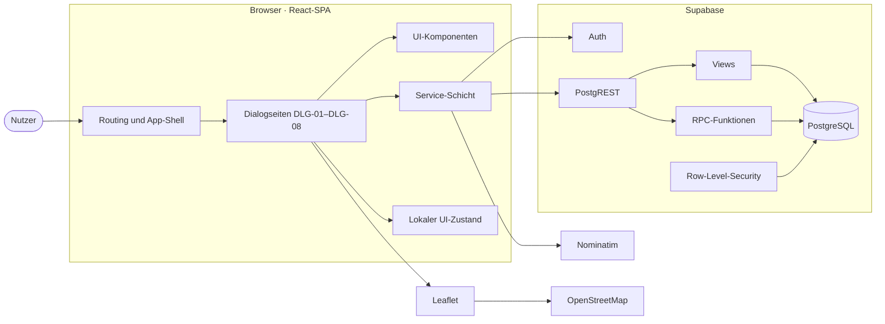
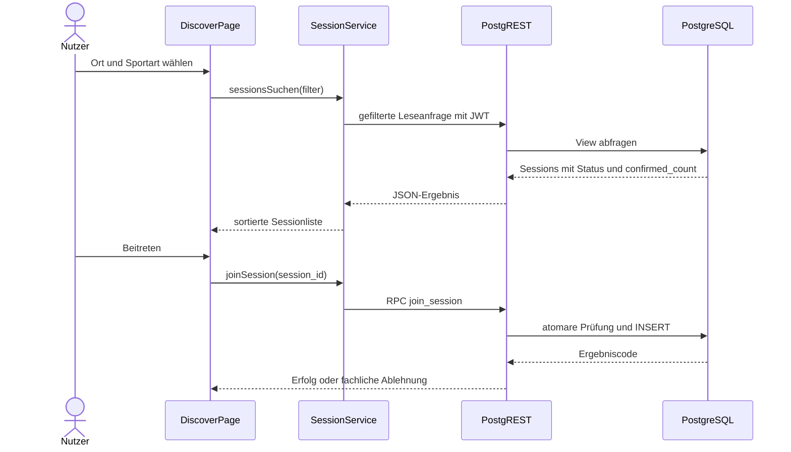
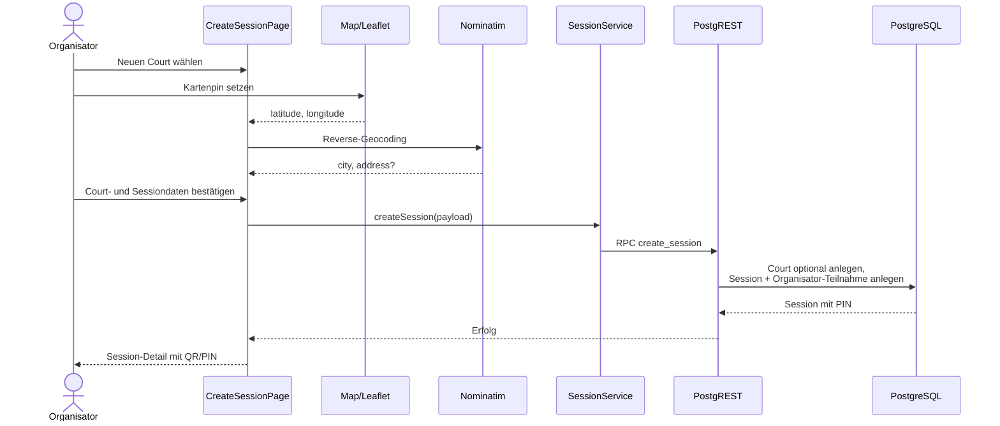
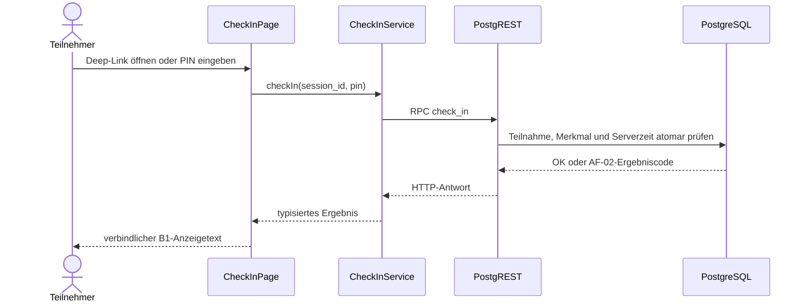
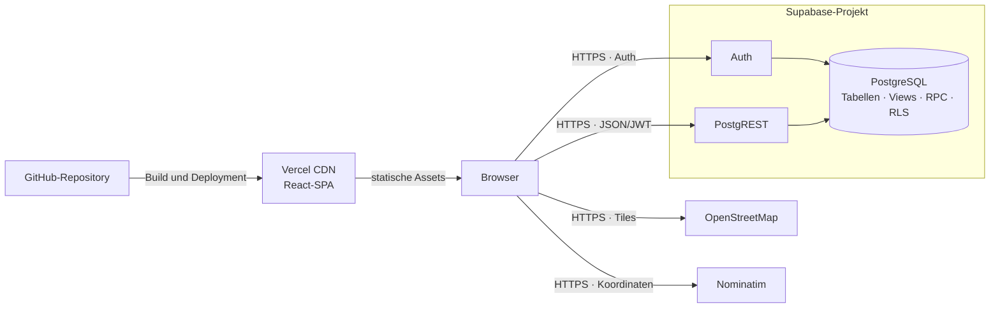

# LocalCourt — Architekturdokumentation

## 1. Zweck und Abgrenzung

Dieses Dokument beschreibt die innere Architektur von LocalCourt in Anlehnung
an arc42. Es verbindet die fachliche Spezifikation mit der späteren
Implementierung und ergänzt insbesondere:

- den Systemkontext und die Deployment-Topologie aus
  [P2](../spec/P2-architekturueberblick.md),
- die Schnittstellen-Contracts aus
  [S1](../spec/S1-nachbarsysteme.md),
- das fachliche Datenmodell aus
  [D1](../spec/D1-datenmodell.md) und
- die technischen Querschnittsentscheidungen aus
  [N2](../spec/N2-querschnittskonzepte.md).

Fachliche Anforderungen, Dialogfelder und Ergebniscodes werden hier nicht
erneut definiert. Dafür bleiben F2, F3 und B1 maßgeblich. Die Architektur
beschreibt den angestrebten MVP-Zustand. Abweichungen des gegenwärtigen
UI-Prototyps sind in [Abschnitt 8](#8-aktueller-implementierungsstand)
ausgewiesen.

## 2. Architekturziele und Randbedingungen

### 2.1 Qualitätsziele

| Priorität | Ziel | Architektonische Konsequenz |
|---|---|---|
| 1 | Fachliche Konsistenz bei Beitritt und Check-in | Kapazitätsprüfung, Beitritt und Check-in laufen atomar in PostgreSQL-Funktionen. |
| 2 | Datenschutz und Zugriffsschutz | Supabase Auth liefert die Nutzeridentität; Row-Level-Security begrenzt Datenzugriffe. |
| 3 | Einfache mobile Bedienung | Mobile-first React-SPA mit synchronen, nutzergetriebenen Abläufen und verständlichen Fehlerzuständen. |
| 4 | Betrieb im Free-/Student-Tier | Kein eigener Anwendungsserver, keine Queue, keine Hintergrundjobs und keine kostenpflichtigen Zusatzdienste. |
| 5 | Nachvollziehbarkeit | Modulnamen, Schnittstellen und Datenobjekte verweisen auf die stabilen IDs aus F2/F3/B1/D1. |

Die prüfbaren Qualitätsanforderungen stehen vollständig in
[N1](../spec/N1-nichtfunktionale-anforderungen.md).

### 2.2 Verbindliche Randbedingungen

| Bereich | Festlegung |
|---|---|
| Client | React, TypeScript, Vite, React Router und Tailwind CSS |
| Karten-UI | Leaflet/react-leaflet mit OpenStreetMap-Kacheln |
| Hosting | Statische SPA auf Vercel |
| Authentifizierung | Supabase Auth mit E-Mail und Passwort |
| Anwendungszugriff | Supabase PostgREST mit JWT |
| Persistenz | PostgreSQL in Supabase |
| Geocoding | Nominatim-Reverse-Geocoding nach Setzen eines Kartenpins |
| Kommunikation | HTTPS, synchron und durch eine Nutzeraktion ausgelöst |
| Nicht vorhanden | Eigener Anwendungsserver, Scheduler, Message Queue, WebSocket, OAuth, Dateiupload |

Die geschäftlichen, technischen und organisatorischen Randbedingungen stehen
in [P1.5](../spec/P1-ziele-rahmenbedingungen.md#p15-rahmenbedingungen-constraints).

## 3. Lösungsstrategie

LocalCourt verwendet eine schlanke Client-Cloud-Architektur:

1. Die React-SPA stellt die Dialoge DLG-01 bis DLG-08 dar und koordiniert die
   Nutzerinteraktion.
2. Eine Frontend-Service-Schicht kapselt Authentifizierung, Lesezugriffe und
   fachliche Schreiboperationen.
3. Supabase Auth authentifiziert Nutzer und stellt JWTs bereit.
4. PostgREST stellt Tabellen, Views und PostgreSQL-Funktionen als HTTPS-API
   bereit.
5. PostgreSQL ist die maßgebliche Quelle für persistente Daten, Serverzeit,
   Constraints, Row-Level-Security und atomare Geschäftsoperationen.
6. Leaflet rendert Karten im Browser. OpenStreetMap liefert Kacheln;
   Nominatim löst einen gesetzten Court-Pin in Ort und optionale Adresse auf.

Fachlich kritische Regeln liegen nicht im Browser. Das Frontend kann
Eingabefehler früh anzeigen, aber nur die Datenbank entscheidet atomar über
Beitritt, Check-in und Session-Erstellung.

## 4. Bausteinsicht

### 4.1 Frontend

| Baustein | Verantwortung | Geplante Code-Zuordnung |
|---|---|---|
| App-Shell und Routing | Routen, Hauptnavigation, Layout und Weiterleitung nicht angemeldeter Nutzer | `src/App.tsx`, `src/components/layout/` |
| Dialogseiten | Koordination je B1-Dialog, Laden von Daten, UI-Zustände und Aktionen | `src/pages/` |
| UI-Komponenten | Wiederverwendbare Darstellung ohne eigenen Persistenzzugriff | `src/components/` |
| Service-Schicht | Einziger Zugriffspunkt der Seiten auf Auth, PostgREST, RPC und Nominatim | `src/services/` |
| Fachliche Typen | TypeScript-Abbildung der D1-/D2-Begriffe und API-Ergebnisse | `src/types/` |
| Referenz- und Mockdaten | Sportartenkatalog sowie ausschließlich prototypspezifische Daten | `src/data/` |

Seiten greifen nicht direkt auf Supabase, `fetch` oder Datenbankdetails zu.
Diese Abhängigkeiten werden in Services gekapselt. Dadurch kann der
UI-Prototyp schrittweise von Mock- auf persistente Services umgestellt werden,
ohne die Dialogkomponenten neu zu strukturieren.

### 4.2 Supabase Auth

Supabase Auth verwaltet Registrierung, Anmeldung, Abmeldung und
Sitzungserneuerung. Das Frontend verwendet ausschließlich den öffentlichen
Projektschlüssel und das JWT des angemeldeten Nutzers. Der Service-Role-Key
wird nie an den Browser ausgeliefert.

### 4.3 PostgREST und PostgreSQL

| Baustein | Verantwortung |
|---|---|
| Tabellen | Persistenz der Entitäten aus D1 |
| Views | Bereitstellung von berechnetem Sessionstatus und `confirmed_count` |
| RLS-Policies | Autorisierung anhand `auth.uid()` |
| `create_session` | Session, PIN und Organisator-Teilnahme atomar anlegen |
| `join_session` | Kapazität prüfen und Teilnahme atomar anlegen |
| `check_in` | Teilnahme, PIN und Zeitfenster prüfen und Status atomar aktualisieren |

Die Zugriffsregeln und die Abbildung der Ergebniscodes auf HTTP-Antworten stehen
in [N2](../spec/N2-querschnittskonzepte.md).

### 4.4 Karten und Reverse-Geocoding

Leaflet ist eine Browser-Bibliothek und kein Nachbarsystem. OpenStreetMap und
Nominatim sind externe Nachbarsysteme. Ein neuer Court wird erst gespeichert,
wenn Name, Koordinaten und erfolgreich aufgelöster Ort gemeinsam vorliegen.
Eine automatische Dublettenprüfung ist kein Bestandteil des MVP.

## 5. Laufzeitsichten

### 5.1 Session suchen und beitreten

Discovery lädt im MVP die vollständig gefilterte Ergebnismenge. Eine feste
Seitengröße wird erst eingeführt, wenn reale Nutzungsdaten zeigen, dass die
Indizes und die vollständige Antwort nicht ausreichen. Laufende Sessions
stehen vor bevorstehenden Sessions; die genaue fachliche Sortierung definiert
B1 DLG-02.

### 5.2 Session und Court erstellen

Schlägt Karte oder Reverse-Geocoding fehl, wird kein unvollständiger Court
gespeichert. Wiederholungen erfolgen ausschließlich durch eine erneute
Nutzeraktion; automatische Retries sind im MVP nicht vorgesehen.

### 5.3 Check-in per QR-Code oder PIN

QR und PIN führen in dieselbe Funktion. Der QR-Inhalt wird clientseitig aus
Frontend-Origin, Session-ID und PIN erzeugt und nicht als Bild gespeichert.

## 6. Verteilung und Deployment

Vercel liefert für alle SPA-Routen `index.html` aus. Konfigurationswerte wie
Supabase-URL, öffentlicher Projektschlüssel und Frontend-Origin werden als
Deployment-Umgebungsvariablen bereitgestellt. Geheimnisse und insbesondere ein
Service-Role-Key gehören weder in Vercel-Clientvariablen noch ins Repository.

Monitoring erfolgt über Vercel Dashboard sowie Supabase Auth-, PostgREST- und
Database-Logs. Eine zusätzliche Monitoring-Plattform ist kein MVP-Bestandteil.

### 6.1 Free-Tier-Grenzen

Konkrete Kontingente der genutzten Dienste (P1 CON-T-02, CON-T-05; N1-QA-10):

| Komponente | Anbieter | Tier | Grenze |
|---|---|---|---|
| Frontend (Vercel) | Vercel Inc. | Free | Auto-Scale, CDN |
| PostgREST API | Supabase | Free | ~50 Anfragen/s |
| PostgreSQL | Supabase | Free | 500 MB, 2 Verbindungen |
| Auth | Supabase | Free | Unlimitierte Nutzer |
| Kartenkacheln (OSM) | OpenStreetMap Foundation | Free/Community | Community-Nutzungsrichtlinie |

## 7. Querschnittskonzepte

| Konzept | Architekturregel | Maßgebliche Fundstelle |
|---|---|---|
| Authentifizierung | Geschützte Aktionen benötigen ein gültiges Supabase-JWT; nach Login wird zum ursprünglichen Ziel zurückgekehrt. | B1.5.2, S1.3 |
| Autorisierung | Tabellenzugriffe werden über RLS auf `auth.uid()` begrenzt; sensible PIN-Daten werden nicht in Discovery-Antworten geliefert. | N2.2 |
| Atomarität | Kapazitätskritische und statusändernde Abläufe werden als PostgreSQL-RPC ausgeführt. | F3 AF-01/AF-02, S1.4 |
| Status und Zählung | `status` und `confirmed_count` werden bei Abfragen berechnet, nicht redundant persistiert. | F3 AF-03, D1.6 |
| Fehlerbehandlung | Services übersetzen HTTP- und fachliche Ergebniscodes in typisierte Ergebnisse; Seiten zeigen die verbindlichen B1-Texte. | B1 DLG-04/DLG-06, N2.3 |
| Ausfallverhalten | Keine automatischen Retries; Nutzer erhält eine Wiederholmöglichkeit. Kartenfehler führen zur Listenansicht. | B1.5.4, S1.1 |
| Datensparsamkeit | Nur erforderliche Profilfelder werden übertragen; für andere Nutzer sind ausschließlich Anzeigename und optionales Profilbild sichtbar. | N1-QA-04, D1.4 |
| Protokollierung | Keine Tokens, PINs, personenbezogenen Payloads oder technischen Interna in nutzerseitigen Meldungen. | N1-QA-05/N1-QA-09 |
| Testbarkeit | F2-Akzeptanzkriterien und F3-Entscheidungstabellen bilden die Testgrundlage; RPCs haben höchste Testpriorität. | N1.6 |

## 8. Aktueller Implementierungsstand

| Bereich | UI-Prototyp | Zielarchitektur |
|---|---|---|
| Routing und Dialoge | React Router, DLG-01–DLG-08 und simulierter Schutz personenbezogener Routen vorhanden | Schutz auf echte Supabase-Anmeldesitzung umstellen |
| Datenzugriff | synchrone Services auf Mockdaten | asynchrone Services auf Supabase Auth/PostgREST |
| Persistenz | lokaler React-Zustand und Mock-Persistenz für Sessions, Courts und Profil in `localStorage` | PostgreSQL über Views und RPCs |
| Sessionstatus/Zählung | Status aus Start und Dauer abgeleitet; Teilnehmerzahl im Mockobjekt geführt | serverseitig berechnete Werte |
| Court-Erfassung | Kartenpin, Nominatim-Reverse-Geocoding und lokale Court-Persistenz | serverseitige, atomare Speicherung |
| QR/PIN | echte clientseitige QR-Erzeugung und gemeinsame lokale Prüfung | serverseitige `check_in`-RPC |
| RLS | nicht vorhanden | Policies gemäß N2.2 |

Damit ist die aktuelle Ordnerstruktur ein UI-Prototyp der Bausteinsicht, aber
noch keine vollständige Implementierung der Cloud- und Persistenzbausteine.
Der detaillierte Abgleich steht in [docs/frontend.md](../frontend.md).

## 9. Architekturentscheidungen

| ID | Entscheidung | Begründung und Konsequenz |
|---|---|---|
| ADR-01 | React-SPA auf Vercel | Ein Deployment-Artefakt, mobile Web-Nutzung und kein eigener Serverbetrieb; Browser trägt die UI- und Integrationslogik. |
| ADR-02 | Direkter Zugriff auf Supabase | Reduziert Betriebsaufwand und Kosten; RLS und RPCs sind zwingend, weil keine eigene Autorisierungsschicht existiert. |
| ADR-03 | Fachlich kritische Schreibvorgänge als PostgreSQL-RPC | Verhindert Race Conditions und umgeht manipulierbare Clientprüfungen. |
| ADR-04 | Status und Teilnehmerzahl berechnen | Verhindert redundante, inkonsistente Daten; Datenbank-Views bündeln die Berechnung. |
| ADR-05 | Leaflet mit OpenStreetMap und Nominatim | Kostenloser, austauschbarer Karten-/Geocoding-Stack; öffentliche Nutzungsgrenzen und Attribution müssen eingehalten werden. |
| ADR-06 | QR als clientseitig erzeugter Deep-Link | Kein Bildspeicher und kein Scanner im Browser nötig; PIN bleibt gleichwertiger Fallback. |
| ADR-07 | Keine Hintergrundverarbeitung | Status wird zur Abfragezeit bestimmt; keine Queue, Cronjobs oder verzögerten Retries im MVP. |
| ADR-08 | Keine Pagination und keine automatischen Retries im MVP | Erwartete Datenmenge bleibt klein; Antworten werden gefiltert vollständig geladen, Fehler nach bewusster Nutzeraktion wiederholt. |

Diese Tabelle dokumentiert ausschließlich bereits aus P1, P2, S1 und N2
abgeleitete Entscheidungen. Neue oder ersetzende Entscheidungen werden künftig
als zusätzliche ADR-Zeile mit Status und Begründung ergänzt.

## 10. Risiken und technische Schulden

| Risiko | Auswirkung | Umgang im MVP |
|---|---|---|
| Öffentliche OSM-/Nominatim-Dienste | Rate-Limit oder zeitweilige Nichterreichbarkeit | Attribution, höchstens eine Nominatim-Anfrage pro Sekunde, keine automatischen Retries, verständlicher Fallback |
| Direkter Browser-zu-Supabase-Zugriff | Fehlerhafte RLS könnte Daten offenlegen | RLS-Review und Berechtigungstests vor Backend-Freigabe |
| Fehlende automatisierte Tests | Regressionen in RPCs und Dialogzuständen | Entscheidungstabellen manuell prüfen; RPC-Integrationstests zuerst ergänzen |
| Keine Pagination | Größere Ergebnismengen erhöhen Antwortzeit | Indizes und Nutzungsdaten beobachten; später serverseitige Pagination ergänzen |
| Free-Tier-Grenzen | Begrenzte Kapazität und Logs | Vercel-/Supabase-Dashboards beobachten; keine Zusatzdienste voraussetzen |
| Prototyp nutzt Mockdaten | Architektur ist im Code noch nicht vollständig nachweisbar | Service-Schicht schrittweise austauschen; Abweichungen in `docs/frontend.md` aktuell halten |

## 11. Eingesetzte KI-Werkzeuge

| Aspekt | Inhalt |
|---|---|
| Werkzeug | ChatGPT, Codex |
| Verwendung | Strukturierung nach arc42, Ableitung der Baustein-, Laufzeit- und Deployment-Sichten aus P2, S1, D1 und N1/N2 sowie Abgleich mit dem aktuellen React-Prototyp. |
| Prüfung | Abgeglichen mit der Spezifikation sowie `package.json`, `src/`, `vite.config.ts` und `vercel.json`. Es wurden keine neuen fachlichen Funktionen eingeführt. |
