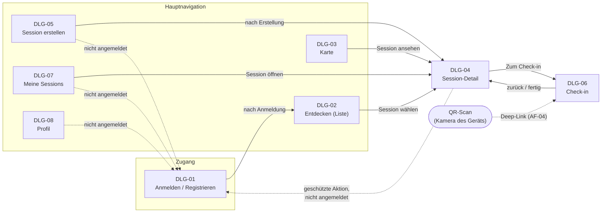

# B1 — Dialogspezifikation

## B1.1 Zweck und Einordnung

Dieser Baustein spezifiziert die Benutzerdialoge von LocalCourt nach Siedersleben: die **Dialoglandkarte** (welche Dialoge gibt es, wie navigiert man dazwischen), je Dialog die **Statik** (was sieht der Benutzer — Formular und Feldliste) und die **Dynamik** (was kann der Benutzer tun — Aktionsliste, ggf. Zustände).

B1 beschreibt den **MVP-Sollzustand** und ist damit die verbindliche Referenz für das Frontend. Der vorhandene UI-Prototyp (`src/pages/`) dient als Illustration und Ausgangspunkt. Alle acht spezifizierten Dialoge sind dort inzwischen als klickbare Oberflächen vorhanden, jedoch noch ohne Backend beziehungsweise Persistenz und teilweise nur als Simulation fachlicher Zustände. Die verbleibenden Abweichungen sind in [B1.6](#b16-abweichungen-des-prototyps) ausgewiesen und widersprechen B1 nicht — sie sind Arbeitsstand.

**Abgrenzung:** Visuelles Design (Farben, Typografie, Pixel-Layout, Komponentenbibliothek) ist nicht Teil von B1. Die Feld- und Aktionslisten definieren, *welche* Informationen und Interaktionen ein Dialog fachlich bietet; das *Wie* der Gestaltung bleibt dem Frontend überlassen (responsive, mobile-first gemäß P1 CON-T-04 und SC-05). Fachliche Regeln hinter den Aktionen stehen in [F3](F3-anwendungsfunktionen.md); Datenobjekte und -typen in [D1](D1-datenmodell.md)/[D2](D2-datentypen.md).

## B1.2 Dialoglandkarte

Die Hauptnavigation ist eine persistente Navigationsleiste mit fünf Zielen ([B1.5.1](#b151-hauptnavigation)). Session-Detail und Check-in werden kontextbezogen erreicht.

Suche und Detailansicht (DLG-02, DLG-03, DLG-04) sind ohne Anmeldung nutzbar (UC-02); alle personenbezogenen Aktionen (Beitreten, Erstellen, Check-in, Meine Sessions, Profil) erfordern Anmeldung und leiten sonst zu DLG-01 ([B1.5.2](#b152-weiterleitung-nicht-angemeldeter-nutzer)).

### Dialog-Index

| DLG-ID | Name | Realisiert (UC) | Nutzt Regeln (AF) | Route (Prototyp) |
|---|---|---|---|---|
| [DLG-01](#b141-dlg-01--anmelden--registrieren) | Anmelden / Registrieren | UC-01 | — | `/login` |
| [DLG-02](#b142-dlg-02--session-entdecken-liste) | Session entdecken (Liste) | UC-02 | AF-03 (Sichtbarkeit) | `/discover` |
| [DLG-03](#b143-dlg-03--session-karte) | Session-Karte | UC-02 | AF-03 (Sichtbarkeit) | `/map` |
| [DLG-04](#b144-dlg-04--session-detail) | Session-Detail | UC-03, UC-04, UC-07 | AF-01, AF-03 | `/sessions/:sessionId` |
| [DLG-05](#b145-dlg-05--session-erstellen) | Session erstellen | UC-06, UC-10 | AF-03, AF-04 | `/sessions/new` |
| [DLG-06](#b146-dlg-06--check-in) | Check-in | UC-08, UC-09 | AF-02, AF-03, AF-04 | `/check-in/:sessionId` |
| [DLG-07](#b147-dlg-07--meine-sessions) | Meine Sessions | UC-05, UC-11 | AF-03 | `/my-sessions` |
| [DLG-08](#b148-dlg-08--profil) | Profil | UC-12 | — | `/profile` |

## B1.3 Gliederungsschema je Dialog

Jeder Dialog wird einheitlich beschrieben:

- **Steckbrief**: Identifier, realisierte Use Cases, Zweck, Einstiegspunkte, Ergebnis.
- **Statik (Feldliste)**: alle Felder mit Art (`Anzeige` / `Eingabe (Muss)` / `Eingabe (Kann)`), Datentyp ([D2](D2-datentypen.md)), Bezug zum Datenmodell ([D1](D1-datenmodell.md)), Vorbelegung und Prüfung. Ohne diese Angaben ist der Dialog nicht programmierbar.
- **Dynamik (Aktionsliste)**: alle Nicht-Standard-Aktionen mit Auslöser, Vorbedingung und Wirkung. Bei der Wirkung wird unterschieden, ob sie sich nur auf den Dialog bezieht (*Dialog*) oder einen Anwendungsfall beginnt/fortsetzt (*UC-nn*).
- **Zustände**, wenn das Verhalten zustandsabhängig ist; je Zustand werden abweichende Felder/Aktionen genannt. Persistierte Statuswerte stehen in `Backticks` (z. B. `active`), reine UI-Zustände *kursiv* (z. B. *PIN-Eingabe*).

Standard-Benutzeraktionen, die in allen Dialogen gleich funktionieren, sind einmalig in [B1.5](#b15-standard-benutzeraktionen) beschrieben und werden nicht je Dialog wiederholt.

## B1.4 Dialogspezifikationen

### B1.4.1 DLG-01 — Anmelden / Registrieren

| Abschnitt | Inhalt |
|---|---|
| Identifier | DLG-01 |
| Realisiert | [UC-01](F2-anwendungsfaelle.md#uc-01--registrieren--anmelden) |
| Zweck | Nutzer authentifizieren sich, damit personenbezogene Aktionen eindeutig zugeordnet werden können. |
| Einstiegspunkte | Direktaufruf; automatische Weiterleitung bei geschützter Aktion ([B1.5.2](#b152-weiterleitung-nicht-angemeldeter-nutzer)). |
| Ergebnis | Nutzer ist angemeldet und kehrt zur ursprünglich gewünschten Funktion zurück (sonst DLG-02). |

Der Dialog hat zwei Zustände: *Anmelden* und *Registrieren* (umschaltbar). Die Authentifizierung erbringt Supabase Auth ([S1](S1-nachbarsysteme.md), NB-02); E-Mail und Passwort sind Auth-Daten und **kein** Bestandteil des Datenmodells D1.

**Statik — Zustand *Anmelden***

| Feld | Art | Datentyp | Bezug Datenmodell | Vorbelegung | Prüfung / Hinweise |
|---|---|---|---|---|---|
| E-Mail | Eingabe (Muss) | Text (E-Mail-Format) | — (Supabase Auth) | leer | syntaktisch gültige E-Mail |
| Passwort | Eingabe (Muss) | Text (maskiert) | — (Supabase Auth) | leer | nicht leer; Richtlinie des Auth-Dienstes |

**Statik — Zustand *Registrieren*** (zusätzlich zu E-Mail/Passwort)

| Feld | Art | Datentyp | Bezug Datenmodell | Vorbelegung | Prüfung / Hinweise |
|---|---|---|---|---|---|
| Anzeigename | Eingabe (Muss) | Text | `profile.display_name` | leer | nicht leer; Länge → N1 |

**Dynamik**

| Aktion | Auslöser | Vorbedingung | Wirkung |
|---|---|---|---|
| Anmelden | Schaltfläche „Anmelden" | Zustand *Anmelden*, Felder gültig | *UC-01*: Prüfung über Supabase Auth; bei Erfolg angemeldet, Rücksprung zum Ursprung; bei Fehler Meldung ([B1.5.4](#b154-fehler--und-ladezustände)), Zustand unverändert |
| Registrieren | Schaltfläche „Konto erstellen" | Zustand *Registrieren*, Felder gültig | *UC-01*: Konto + `profile` anlegen; danach wie Anmelden |
| Zustand wechseln | Link „Registrieren" / „Anmelden" | — | *Dialog*: Umschalten der Zustände |

### B1.4.2 DLG-02 — Session entdecken (Liste)

| Abschnitt | Inhalt |
|---|---|
| Identifier | DLG-02 |
| Realisiert | [UC-02](F2-anwendungsfaelle.md#uc-02--session-suchen) |
| Zweck | Teilnehmer finden passende zukünftige Sessions in einer Region als Liste. |
| Einstiegspunkte | Hauptnavigation „Entdecken" (Startdialog nach Anmeldung); Standardroute `/`. |
| Ergebnis | Ergebnisliste (ggf. leer); Auswahl führt zu DLG-04. |

**Statik**

| Feld | Art | Datentyp | Bezug Datenmodell | Vorbelegung | Prüfung / Hinweise |
|---|---|---|---|---|---|
| Ort / Region | Eingabe (Kann) | Text | `court.city` (Filterkriterium) | letzter Suchort, sonst leer | leer = keine Ortseinschränkung |
| Sportart-Filter | Eingabe (Kann) | Auswahl | `sport` (Katalog) | „Alle" | Werteliste aus `sport`-Katalog + „Alle" (GP-03) |
| Ergebnisliste | Anzeige | Liste | `session` (title, sport, start_at, status), `court` (name, city), abgeleitet `confirmed_count`/`max_participants` | — | nur Sessions mit Status `scheduled`/`active` (AF-03); abgeschlossene nur in DLG-07 |
| Leerer Zustand | Anzeige | Text | — | — | erscheint bei 0 Treffern ([B1.5.5](#b155-leere-zustände)) |

**Dynamik**

| Aktion | Auslöser | Vorbedingung | Wirkung |
|---|---|---|---|
| Suchen / Filtern | Eingabe Ort, Auswahl Sportart-Chip | — | *UC-02*: Ergebnisliste wird neu ermittelt |
| Session öffnen | Tippen auf Listeneintrag | Treffer vorhanden | *Dialog*: Wechsel zu [DLG-04](#b144-dlg-04--session-detail) |
| Session erstellen (aus Leerzustand) | Schaltfläche im leeren Zustand | keine Treffer | *Dialog*: Wechsel zu [DLG-05](#b145-dlg-05--session-erstellen) |

### B1.4.3 DLG-03 — Session-Karte

| Abschnitt | Inhalt |
|---|---|
| Identifier | DLG-03 |
| Realisiert | [UC-02](F2-anwendungsfaelle.md#uc-02--session-suchen) (Kartensicht) |
| Zweck | Sessions in der Umgebung räumlich entdecken; Court-Positionen visualisieren. |
| Einstiegspunkte | Hauptnavigation „Karte". |
| Ergebnis | Auswahl eines Kartenmarkers führt über eine Vorschaukarte zu DLG-04. |

**Statik**

| Feld | Art | Datentyp | Bezug Datenmodell | Vorbelegung | Prüfung / Hinweise |
|---|---|---|---|---|---|
| Kartenansicht | Anzeige | Karte (OSM/Leaflet) | `court.latitude`/`longitude` | Standardregion | nur Courts mit Koordinaten; sonst nur Liste (Graceful Degradation, UC-02) |
| Sportart-Filter | Eingabe (Kann) | Auswahl | `sport` (Katalog) | „Alle" | wie DLG-02 |
| Session-Marker | Anzeige | Marker je Session | `session` ↔ `court` | — | nur `scheduled`/`active` |
| Vorschaukarte | Anzeige | Kachel | `session` (title, sport, status, start_at), abgeleitet Plätze | ausgeblendet | erscheint nach Marker-Auswahl |

**Dynamik**

| Aktion | Auslöser | Vorbedingung | Wirkung |
|---|---|---|---|
| Marker auswählen | Tippen auf Marker | — | *Dialog*: Vorschaukarte der Session einblenden, Karte zentriert |
| Session ansehen | Schaltfläche in Vorschaukarte | Marker ausgewählt | *Dialog*: Wechsel zu [DLG-04](#b144-dlg-04--session-detail) |
| Filter wählen | Sportart-Chip | — | *UC-02*: Marker werden neu gefiltert |
| Ansicht zurücksetzen | Zentrier-Schaltfläche | — | *Dialog*: Auswahl aufheben, Standardausschnitt |

**Fehlerfall Karte:** Ist der Kartendienst nicht erreichbar, zeigt der Dialog einen Hinweis und verweist auf die Listenansicht DLG-02 (UC-02, Graceful Degradation).

### B1.4.4 DLG-04 — Session-Detail

| Abschnitt | Inhalt |
|---|---|
| Identifier | DLG-04 |
| Realisiert | [UC-03](F2-anwendungsfaelle.md#uc-03--session-detail-ansehen), [UC-04](F2-anwendungsfaelle.md#uc-04--session-beitreten), [UC-07](F2-anwendungsfaelle.md#uc-07--teilnehmerliste-anzeigen) |
| Zweck | Nutzer beurteilen eine Session und führen rollen-/statusabhängige Folgeaktionen aus. |
| Einstiegspunkte | DLG-02, DLG-03, DLG-07; nach Erstellung aus DLG-05. |
| Ergebnis | Information; optional Beitritt (AF-01) oder Wechsel zum Check-in (DLG-06). |

**Statik** (für alle Zustände gleich; Sichtbarkeit einzelner Bereiche siehe Zustandstabelle)

| Feld | Art | Datentyp | Bezug Datenmodell | Vorbelegung | Prüfung / Hinweise |
|---|---|---|---|---|---|
| Titel, Sportart, Status | Anzeige | Text, Katalog, `SessionStatus` | `session.title`, `sport`, abgeleitet `status` | — | Statusdarstellung gemäß AF-03 |
| Beschreibung | Anzeige | Text | `session.description` | — | leer möglich |
| Datum / Uhrzeit / Dauer | Anzeige | Timestamp, Duration | `session.start_at`, `duration_min` | — | Ende = Start + Dauer |
| Sportort | Anzeige | Text (+ Kartenausschnitt) | `court.name`, `city`; Karte nur bei Koordinaten | — | — |
| Organisator | Anzeige | Text | `profile.display_name` via `organizer_id` | — | — |
| Belegung | Anzeige | Text/Balken | abgeleitet `confirmed_count` / `max_participants` | — | — |
| Teilnehmerliste | Anzeige | Liste | `participant` (→ `profile.display_name`, `status`) | — | Umfang sichtbarer Profildaten offen → [B1.8](#b18-offene-punkte); Check-in-Status nur für Organisator |
| QR-Code + PIN | Anzeige | `QrContent`, `Pin` | abgeleitet `qr_content`, `session.pin` | — | **nur Organisator-Zustand** (AF-04) |

**Zustände und verfügbare Aktionen**

Der Zustand ergibt sich aus Anmeldung, Rolle, Teilnahme und Session-Status (AF-03/AF-01):

| Zustand | Bedingung | Beitreten | Zum Check-in | QR/PIN sichtbar | Teilnehmer-Check-in-Status |
|---|---|---|---|---|---|
| *Gast* | nicht angemeldet | → DLG-01 | nein | nein | nein |
| *Offen* | angemeldet, nicht beigetreten, `scheduled`/`active` | ja (AF-01) | nein | nein | nein |
| *Beigetreten* | Teilnahme `confirmed`, `scheduled`/`active` | nein (bereits Teilnehmer) | ja, bei `active` | nein | nein |
| *Organisator* | Nutzer = `organizer_id` | nein (zählt bereits, AF-01 R3) | nein | ja | ja (UC-07) |
| *Read-only* | `completed` (oder `cancelled`) | nein | nein | nein | ja für Organisator (UC-11) |

**Dynamik**

| Aktion | Auslöser | Vorbedingung | Wirkung |
|---|---|---|---|
| Beitreten | Schaltfläche „Beitreten" | Zustand *Offen* | *UC-04 / AF-01*: atomare Prüfung; bei `OK` Teilnahme `confirmed`, Belegung aktualisiert; bei `SESSION_FULL` Meldung „Session ist voll" (keine Warteliste, NG-10); weitere Ergebniscodes gemäß AF-01 |
| Zum Check-in | Schaltfläche „Zum Check-in" | Zustand *Beigetreten*, Status `active` | *Dialog*: Wechsel zu [DLG-06](#b146-dlg-06--check-in) |
| QR/PIN anzeigen | Bereich in Organisator-Sicht | Zustand *Organisator*, Status `scheduled`/`active` | *Dialog*: QR-Code (AF-04) und PIN prominent anzeigen, für Teilnehmer-Check-in (UC-08/09) |
| Teilnehmerliste aktualisieren | erneutes Laden / automatische Aktualisierung | Zustand *Organisator* | *UC-07*: aktuelle Teilnahme- und Check-in-Stände |

### B1.4.5 DLG-05 — Session erstellen

| Abschnitt | Inhalt |
|---|---|
| Identifier | DLG-05 |
| Realisiert | [UC-06](F2-anwendungsfaelle.md#uc-06--session-erstellen), [UC-10](F2-anwendungsfaelle.md#uc-10--court--sportort-erfassen-oder-auswählen) |
| Zweck | Organisator veröffentlicht eine neue Session mit allen Pflichtangaben (Ziel: < 2 Minuten, P1 SC-02). |
| Einstiegspunkte | Hauptnavigation „Erstellen"; Leerzustand von DLG-02. Nicht angemeldet → DLG-01. |
| Ergebnis | Neue Session im Status `scheduled` mit erzeugter PIN/QR (AF-04); Organisator als Teilnehmer erfasst; Wechsel zu DLG-04 (*Organisator*). |

**Statik (Feldliste — normativ für das MVP)**

| Feld | Art | Datentyp | Bezug Datenmodell | Vorbelegung | Prüfung / Hinweise |
|---|---|---|---|---|---|
| Sportart | Eingabe (Muss) | Auswahl | `session.sport_id` → `sport` | erste bevorzugte Sportart des Nutzers, sonst erster Katalogeintrag | Wert aus `sport`-Katalog |
| Titel | Eingabe (Muss) | Text | `session.title` | leer | nicht leer; Länge → N1 |
| Beschreibung | Eingabe (Kann) | Text | `session.description` | leer | Länge → N1 |
| Datum | Eingabe (Muss) | Datum | `session.start_at` (Datumsteil) | leer | zusammen mit Uhrzeit: in der Zukunft (UC-06) |
| Uhrzeit | Eingabe (Muss) | Uhrzeit | `session.start_at` (Zeitteil) | leer | s. o. |
| Dauer (Minuten) | Eingabe (Muss) | `Duration` | `session.duration_min` | 60 | ≥ 1; bestimmt Ende und Auto-Close (AF-03) |
| Court / Sportort | Eingabe (Muss) | Auswahl oder Neuerfassung | `session.court_id` → `court` | leer | Auswahl aus Verzeichnis **oder** Neuerfassung (UC-10): `name` (Muss), `city` (Muss), `address` (Kann); Koordinaten optional |
| Teilnehmerlimit | Eingabe (Muss) | Integer | `session.max_participants` | 10 | ≥ 1; Hinweis im Dialog: Organisator belegt einen Platz (AF-01 R4) |

Frühere Prototyp-Felder „Empfohlener Rang" und „Sichtbarkeit" sind **nicht** Teil dieser Feldliste und im aktuellen Prototyp nicht mehr vorhanden.

**Dynamik**

| Aktion | Auslöser | Vorbedingung | Wirkung |
|---|---|---|---|
| Court auswählen | Auswahlfeld / Suche im Court-Verzeichnis | — | *UC-10*: bestehenden Court übernehmen |
| Court neu erfassen | Schaltfläche „Neuen Sportort anlegen" | kein passender Court | *UC-10*: Erfassungsmaske (name, city, address); nach Speichern ausgewählt |
| Session erstellen | Schaltfläche „Session erstellen" | alle Muss-Felder gültig | *UC-06*: Session anlegen (`scheduled`, AF-03); PIN/QR erzeugen (AF-04); Organisator als `participant` `confirmed`; Wechsel zu DLG-04 (*Organisator*) mit Bestätigung |
| Abbrechen | Zurück-Navigation | — | *Dialog*: keine Session wird gespeichert (UC-06 Alternativszenario) |

**Validierungsfehler** werden feldbezogen angezeigt ([B1.5.3](#b153-formular-validierung)); es wird keine unvollständige Session veröffentlicht (UC-06 Nachbedingung).

### B1.4.6 DLG-06 — Check-in

| Abschnitt | Inhalt |
|---|---|
| Identifier | DLG-06 |
| Realisiert | [UC-08](F2-anwendungsfaelle.md#uc-08--check-in-per-qr-code-durchführen), [UC-09](F2-anwendungsfaelle.md#uc-09--check-in-per-pin-durchführen) |
| Zweck | Teilnehmer bestätigt seine Anwesenheit vor Ort — per QR-Code oder gleichwertig per PIN (AF-02). |
| Einstiegspunkte | DLG-04 („Zum Check-in", Zustand *Beigetreten* + `active`); **Deep-Link** aus QR-Scan mit der Gerätekamera (`…/check-in?session=<id>&pin=<pin>`, AF-04). Nicht angemeldet → DLG-01, danach zurück. |
| Ergebnis | Teilnahmestatus `checked_in` mit Zeitstempel — oder begründete Ablehnung, Status unverändert (AF-02). |

**Zustände:** *QR-Einstieg* (PIN kommt aus dem Deep-Link) → *Prüfung* → *Erfolg* oder *Abgelehnt*; alternativ *PIN-Eingabe* (manuell, UC-09) → *Prüfung* → …

**Statik**

| Feld | Art | Datentyp | Bezug Datenmodell | Vorbelegung | Prüfung / Hinweise |
|---|---|---|---|---|---|
| Session-Kontext | Anzeige | Text | `session.title` | aus Route/Deep-Link | zeigt, wofür eingecheckt wird (Schutz vor falscher Session) |
| PIN | Eingabe (Muss im Zustand *PIN-Eingabe*) | `Pin` | geprüft gegen `session.pin` | aus Deep-Link vorbelegt (QR-Weg), sonst leer | genau 4 Ziffern (Formprüfung vor fachlicher Prüfung, D2.4) |
| Ergebnis | Anzeige | Text | `participant.status`, `checked_in_at` | — | Zustand *Erfolg* / *Abgelehnt* |

**Dynamik**

| Aktion | Auslöser | Vorbedingung | Wirkung |
|---|---|---|---|
| Teilnahme bestätigen | Schaltfläche „Teilnahme bestätigen" bzw. automatisch nach Deep-Link | angemeldet | *UC-08/09 / AF-02*: Prüfung Teilnahme, Merkmal, Zeitfenster; bei `OK` → Zustand *Erfolg* |
| Code manuell eingeben | Schaltfläche „Code manuell eingeben" | — | *Dialog*: Wechsel in Zustand *PIN-Eingabe* (UC-09) |
| Zurück zur Session | Link/Schaltfläche | — | *Dialog*: Wechsel zu DLG-04 |

**Ablehnungen** (Zustand *Abgelehnt*, Ergebniscodes aus AF-02 mit verständlichem Text):

| Ergebniscode | Anzeigetext (sinngemäß) |
|---|---|
| `NOT_JOINED` | „Du bist dieser Session nicht beigetreten." (Verweis auf DLG-04 / Beitreten) |
| `INVALID_CREDENTIAL` | „Ungültiger Code für diese Session." |
| `OUTSIDE_WINDOW` | „Check-in ist nur während der laufenden Session möglich." |
| `ALREADY_CHECKED_IN` | Bestätigung ohne Änderung — wird wie *Erfolg* dargestellt (idempotent, AF-02 R5) |

### B1.4.7 DLG-07 — Meine Sessions

| Abschnitt | Inhalt |
|---|---|
| Identifier | DLG-07 |
| Realisiert | [UC-05](F2-anwendungsfaelle.md#uc-05--eigene-sessions-anzeigen), [UC-11](F2-anwendungsfaelle.md#uc-11--session-historie-ansehen) |
| Zweck | Nutzer überblicken Sessions, an denen sie teilnehmen oder die sie organisieren — bevorstehend und vergangen. |
| Einstiegspunkte | Hauptnavigation „Meine Sessions". Nicht angemeldet → DLG-01. |
| Ergebnis | Übersicht; Auswahl führt zu DLG-04 (bei vergangenen: *Read-only*). |

Der Dialog hat zwei Zustände (Tabs): *Bevorstehend* (UC-05, Status `scheduled`/`active`) und *Vergangen* (UC-11, Status `completed`, read-only).

**Statik**

| Feld | Art | Datentyp | Bezug Datenmodell | Vorbelegung | Prüfung / Hinweise |
|---|---|---|---|---|---|
| Tab-Auswahl | Eingabe (Kann) | Umschalter | — | *Bevorstehend* | — |
| Session-Liste | Anzeige | Liste | `session` (title, sport, start_at, `status`), Rolle (Organisator/Teilnehmer aus `organizer_id` bzw. `participant`) | — | nur Sessions mit eigener Teilnahme oder Organisatorrolle (UC-05); Rolle unterscheidbar |
| Check-in-Info (nur *Vergangen*) | Anzeige | Text | `participant.checked_in_at` | — | einfache Anwesenheitsinfo, kein Reporting (UC-11) |
| Leerer Zustand | Anzeige | Text | — | — | je Tab ([B1.5.5](#b155-leere-zustände)) |

**Dynamik**

| Aktion | Auslöser | Vorbedingung | Wirkung |
|---|---|---|---|
| Tab wechseln | Tippen auf *Bevorstehend* / *Vergangen* | — | *Dialog*: Liste des jeweiligen Zustands (UC-05 bzw. UC-11) |
| Session öffnen | Tippen auf Listeneintrag | — | *Dialog*: Wechsel zu DLG-04; bei `completed` im Zustand *Read-only* |

### B1.4.8 DLG-08 — Profil

| Abschnitt | Inhalt |
|---|---|
| Identifier | DLG-08 |
| Realisiert | [UC-12](F2-anwendungsfaelle.md#uc-12--profil-und-sportpräferenzen-verwalten) |
| Zweck | Nutzer verwalten MVP-relevante Basisdaten: Anzeigename, optionales Profilbild, bevorzugte Sportarten. |
| Einstiegspunkte | Hauptnavigation „Profil". Nicht angemeldet → DLG-01. |
| Ergebnis | Gespeicherte Änderungen; bei Abbruch/Fehler bleibt der vorherige Stand erhalten (UC-12). |

Zwei Zustände: *Ansicht* und *Bearbeiten*.

**Statik**

| Feld | Art | Datentyp | Bezug Datenmodell | Vorbelegung | Prüfung / Hinweise |
|---|---|---|---|---|---|
| Anzeigename | Anzeige / Eingabe (Muss im Zustand *Bearbeiten*) | Text | `profile.display_name` | aktueller Wert | nicht leer |
| Profilbild | Anzeige / Eingabe (Kann) | `Url` | `profile.avatar_url` | aktueller Wert | MVP-Umfang offen ([D1.9](D1-datenmodell.md#d19-offene-punkte)) |
| E-Mail | Anzeige | Text | — (Supabase Auth) | aktueller Wert | read-only; Änderung ist Auth-Funktion, nicht MVP |
| Bevorzugte Sportarten | Anzeige / Eingabe (Kann) | Mehrfachauswahl | `sport_preference` → `sport` | aktuelle Auswahl | jede Sportart höchstens einmal (D1) |

**Dynamik**

| Aktion | Auslöser | Vorbedingung | Wirkung |
|---|---|---|---|
| Bearbeiten | Schaltfläche „Bearbeiten" | Zustand *Ansicht* | *Dialog*: Wechsel in Zustand *Bearbeiten* |
| Speichern | Schaltfläche „Speichern" | Zustand *Bearbeiten*, Felder gültig | *UC-12*: Änderungen persistieren; zurück in *Ansicht* |
| Abbrechen | Schaltfläche „Abbrechen" | Zustand *Bearbeiten* | *Dialog*: Änderungen verwerfen, zurück in *Ansicht* |
| Abmelden | Schaltfläche „Abmelden" | angemeldet | *UC-01*: Sitzung beenden; Wechsel zu DLG-02 (öffentliche Sicht) |

## B1.5 Standard-Benutzeraktionen

Diese Aktionen und Muster funktionieren in allen Dialogen gleich und werden dort nicht wiederholt.

### B1.5.1 Hauptnavigation

Persistente Navigationsleiste (mobil unten) mit fünf Zielen: **Entdecken** (DLG-02), **Karte** (DLG-03), **Erstellen** (DLG-05, hervorgehoben), **Meine Sessions** (DLG-07), **Profil** (DLG-08). Das aktive Ziel ist markiert. DLG-04 und DLG-06 sind Kontextdialoge ohne eigenen Navigationseintrag; die Leiste bleibt sichtbar. Diese Navigationsstruktur ist im UI-Prototyp umgesetzt.

### B1.5.2 Weiterleitung nicht angemeldeter Nutzer

Löst ein nicht angemeldeter Nutzer eine geschützte Aktion aus (Beitreten, Erstellen, Check-in, Meine Sessions, Profil), wird er zu DLG-01 geleitet und kehrt nach erfolgreicher Anmeldung zur ursprünglichen Stelle zurück (UC-01, UC-04 Alternativszenario).

### B1.5.3 Formular-Validierung

Beim Absenden eines Formulars werden alle Felder geprüft; Fehler erscheinen **feldbezogen** mit verständlichem Text (z. B. „Bitte gib einen Titel ein."). Das Absenden unterbleibt, bis alle Muss-Felder gültig sind. Fachliche Ablehnungen des Systems (z. B. `SESSION_FULL`) werden zusätzlich als Dialogmeldung angezeigt.

### B1.5.4 Fehler- und Ladezustände

Während synchroner Anfragen zeigt der Dialog eine Ladeanzeige; Bedienelemente, die die Aktion erneut auslösen würden, sind deaktiviert (Schutz gegen Doppelklick, ergänzend zur fachlichen Idempotenz AF-01 R7/AF-02 R5). Netzwerk-/Serverfehler erscheinen als nicht-blockierende Meldung mit Wiederholen-Möglichkeit; der Datenstand des Dialogs bleibt unverändert (Nachbedingungen bei Fehler, F2).

### B1.5.5 Leere Zustände

Listen ohne Inhalte zeigen einen erklärenden Leerzustand statt einer leeren Fläche, wo sinnvoll mit Folgeaktion (z. B. „Session erstellen" in DLG-02). Ein leerer Zustand ist kein Fehler (UC-02, UC-05, UC-11 Akzeptanzkriterien).

### B1.5.6 Zurück-Navigation

Kontextdialoge (DLG-04, DLG-06) bieten eine Zurück-Aktion zum aufrufenden Dialog; die Browser-Zurück-Funktion verhält sich gleich. Ungespeicherte Formulareingaben gehen dabei verloren (Abbrechen-Semantik, UC-06/UC-12 Alternativszenarien).

## B1.6 Abweichungen des Prototyps

Der aktuelle UI-Prototyp bildet alle Dialoge DLG-01 bis DLG-08 ab. Die nachfolgend genannten Funktionen sind **im UI-Prototyp realisiert, aber noch ohne Backend beziehungsweise Persistenz**. Eine sichtbare Oberfläche oder lokale Zustandsänderung gilt daher nicht als vollständige Umsetzung des zugehörigen Use Cases oder der Anwendungsfunktion.

### Im UI-Prototyp realisiert

| Dialog / Bereich | Realisierter UI-Stand | Begrenzung |
|---|---|---|
| DLG-01 Anmelden / Registrieren | Zustandswechsel, Eingabefelder und clientseitige Validierung | keine echte Authentifizierung oder Sitzung |
| DLG-02 Entdecken | Textsuche, Sportartenfilter, Ergebnis- und Leerzustand | Filterung ausschließlich über Mockdaten |
| DLG-03 Karte | Leaflet-/OpenStreetMap-Karte, Marker, Filter und Vorschau | keine API-Daten und kein Fehler-Fallback |
| DLG-04 Session-Detail | Kerndaten, Belegung, Teilnehmerliste, Organisator-, Beitritts-, Check-in- und Read-only-Darstellung | Rolle, Teilnahme und Status stammen aus Mockdaten; Beitritt bleibt lokal |
| DLG-05 Session erstellen | vollständige aktuelle Feldgruppe einschließlich Dauer und Court-Auswahl/-Neuerfassung, Validierung und Erfolgsvorschau | keine Session- oder Court-Persistenz; keine neue Detailseite |
| DLG-06 Check-in | QR-Platzhalter, PIN-Eingabe, lokale PIN-Prüfung, Zeitfensterdarstellung und Erfolg | kein QR-Scan/Deep-Link und kein persistenter Check-in |
| DLG-07 Meine Sessions | bevorstehende und vergangene Sessions, Rollen- und Check-in-Anzeige, Leerzustände | ausschließlich aus Mockdaten abgeleitet |
| DLG-08 Profil | Ansicht und Bearbeitung von Anzeigename, Ort und Sportpräferenzen | Änderungen nur im lokalen Seitenzustand; Profilbild nicht editierbar |
| Hauptnavigation | fünf spezifizierte Navigationsziele | geschützte Ziele sind ohne Auth-Prüfung direkt erreichbar |

### Tatsächlich verbleibende Abweichungen

| Abweichung | Aktueller Prototypstand | Bezug / offener Bedarf |
|---|---|---|
| Backend und Persistenz | Mockdaten und lokaler React-Zustand | persistente Umsetzung aller schreibenden Use Cases fehlt |
| Authentifizierung und Abmeldung | DLG-01 navigiert nach lokaler Validierung weiter; Abmelden navigiert nur zu `/login` | echte Authentifizierung, Sitzung und Fehlerbehandlung über NB-02 fehlen |
| Schutz personenbezogener Aktionen | Erstellen, Meine Sessions, Profil und Check-in sind direkt aufrufbar | Weiterleitung und Rückkehr gemäß [B1.5.2](#b152-weiterleitung-nicht-angemeldeter-nutzer) fehlen |
| Atomarer Beitritt | Schaltfläche setzt lokalen Zustand | AF-01, gemeinsame Aktualisierung von Belegung und DLG-07 sowie fachliche Ergebniscodes fehlen |
| Session-Erstellung | lokale Erfolgsvorschau mit zufälliger PIN | persistente Session, Court und Organisator-Teilnahme sowie Wechsel zur neuen DLG-04 fehlen |
| QR-Verarbeitung | QR-Symbol als Platzhalter | echte QR-Erzeugung, Scan beziehungsweise Deep-Link und konkretes Format bleiben offen |
| Check-in | PIN wird lokal gegen Mockdaten geprüft; QR-Weg bestätigt direkt | Teilnahmeprüfung, Idempotenz, Persistenz und vollständige AF-02-Ergebniscodes fehlen |
| Session-Lifecycle | Statuswerte sind statische Mockdaten | Umsetzung der Statusableitung nach AF-03 fehlt; technische Ausgestaltung bleibt offen |
| Kartenfehler | echte OSM-Karte ist eingebunden | Graceful Degradation zu DLG-02 bei Ausfall fehlt |
| Lade- und Netzwerkzustände | keine asynchronen Backend-Anfragen | Muster aus [B1.5.4](#b154-fehler--und-ladezustände) sind noch nicht demonstriert |
| Profil | Bearbeitung lokal; Ort wird zusätzlich angezeigt und bearbeitet | Persistenz fehlt; Profilbild-Umfang und weitere sichtbare Profildaten bleiben offene Punkte |
| Validierungsgrenzen | ausgewählte Pflichtfelder werden geprüft | endgültige Feldlängen, Obergrenzen und Fehlertexte bleiben offen |

Im aktuellen Prototyp sind keine früher dokumentierten Gamification-, Events-/Challenges-, Benachrichtigungs-, Rang-, Sichtbarkeits-, Merken- oder Teilen-Funktionen mehr vorhanden.

## B1.7 Konsistenz und Cross-References

| Baustein | Relevanz für B1 |
|---|---|
| [P1](P1-ziele-rahmenbedingungen.md) | Scope-Grenzen der Dialoge (NG-02, NG-05, NG-10); UX-Ziele SC-02/SC-03/SC-05; responsive Web-UI (CON-T-04). |
| [F2](F2-anwendungsfaelle.md) | Jeder Dialog realisiert benannte Use Cases; „Bezug zu Benutzerschnittstelle" der UCs wird hier konkretisiert. |
| [F3](F3-anwendungsfunktionen.md) | Aktionen binden die fachlichen Regeln an: Beitreten (AF-01), Check-in (AF-02), Statusabhängigkeit (AF-03), QR/PIN (AF-04). |
| [D1](D1-datenmodell.md) / [D2](D2-datentypen.md) | Feldlisten referenzieren Entitäten/Attribute (D1) und Datentypen inkl. Prüfregeln (D2). |
| [S1](S1-nachbarsysteme.md) | Auth-Dialog (NB-02), Kartendarstellung (NB-04) werden durch Nachbarsysteme erbracht. |
| [N1](N1-nichtfunktionale-anforderungen.md) | Qualitätsanforderungen an Performance, mobile Nutzbarkeit, Fehlertexte, Datenschutz und Robustheit. |
| E2 (geplant) | Einheitliche Begriffe in Beschriftungen (Session, Teilnahme, Check-in, Court). |

## B1.8 Offene Punkte

| Punkt | Beschreibung | Zuständiger Baustein |
|---|---|---|
| Sichtbare Profildaten in Teilnehmerlisten | Welche Felder anderer Nutzer DLG-04 zeigt (offen aus UC-03/07, D1.9). | N1 / Team |
| Sortierung/Gruppierung der Listen | DLG-02 (Reihenfolge der Treffer), DLG-07 (Sortierung je Tab). | Team / Frontend |
| Konkrete Fehlertexte | Endgültige Formulierungen je Ergebniscode (AF-01/AF-02). | N1 / E2 |
| Profilbild-Umfang | Ob `avatar_url` im MVP editierbar ist (D1.9). | Team |
| Court-Dubletten in der Auswahl | UI-Verhalten bei offensichtlichen Dubletten (UC-10). | N1 / N2 |
| Profil-Ort | Der Prototyp zeigt und bearbeitet einen Ort, während Umfang und Datenmodellbezug in den bestehenden Bausteinen nicht abschließend geklärt sind. | Team / Spezifikation |
| Angleichung des Prototyps | Umsetzung der weiterhin bestehenden Abweichungen aus [B1.6](#b16-abweichungen-des-prototyps). | Frontend / Backend |

## B1.9 Versionshistorie

| Datum | Autor | Änderung |
|---|---|---|
| 2026-07-12 | Claude Code (Fable 5) | B1 mit Dialoglandkarte, DLG-01 bis DLG-08 und initialem Prototyp-Abgleich erstellt |
| 2026-07-16 | ChatGPT / Codex | Dialogrouten und Prototyp-Abgleich an den aktuellen UI-Stand angepasst; verbleibende Abweichungen und offene Punkte aktualisiert |

## B1.10 Eingesetzte KI-Werkzeuge

| Aspekt | Inhalt |
|---|---|
| Werkzeug | Claude Code (Fable 5), ChatGPT / Codex |
| Verwendung | Entwurf des B1-Bausteins sowie späterer Abgleich des Prototypstatus mit den vorhandenen Routen, Seiten, Komponenten, Mockdaten und Services. Aktualisierung des Dialogindex und der Abweichungsanalyse. |
| Prüfung | Inhalte wurden gegen [F2](F2-anwendungsfaelle.md), [F3](F3-anwendungsfunktionen.md), [D1](D1-datenmodell.md), [D2](D2-datentypen.md), [N1](N1-nichtfunktionale-anforderungen.md), [`../frontend.md`](../frontend.md) und den aktuellen Prototyp-Code (`src/App.tsx`, `src/pages/`, `src/components/`, `src/data/`, `src/services/`) geprüft. Es wurden keine neuen fachlichen oder technischen Entscheidungen getroffen; ungeklärte Punkte bleiben als offene Punkte markiert. |
