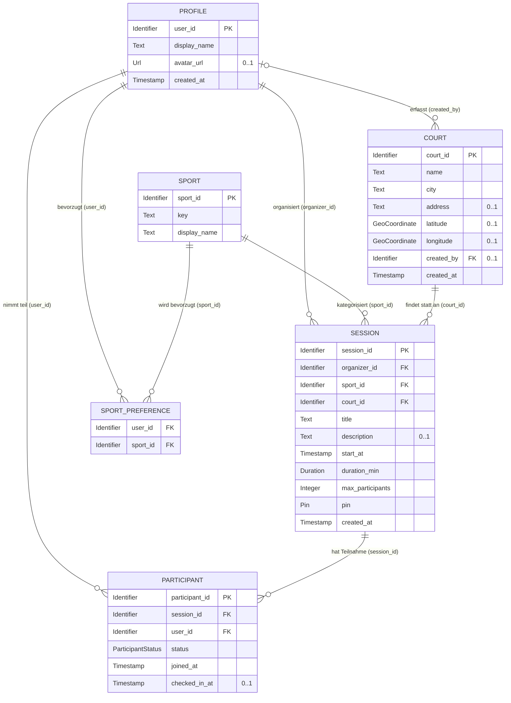

# D1 — Datenmodell

## D1.1 Zweck und Einordnung

Dieser Baustein beschreibt das **fachliche Datenmodell** von LocalCourt: die fachlichen Objekte (Entitätstypen), ihre Attribute und ihre Beziehungen zueinander. Er beantwortet die Frage, *welche Daten* das System kennt und *wie sie fachlich zusammenhängen* — unabhängig von der konkreten technischen Umsetzung.

Nach Siedersleben ist D1 ein **fachliches, konzeptionelles Modell**. Es legt Entitätstypen, Attribute und Assoziationen fest, jedoch **nicht** die technische Realisierung. Konkrete Datenbanktabellen, PostgreSQL-Spaltentypen, Primär-/Fremdschlüssel, Indizes, Sperr- und Transaktionsstrategien gehören in [N2](#) und die Architekturbausteine. Die formale Definition der verwendeten **Datentypen und Wertebereiche** erfolgt im zugehörigen Baustein [D2 — Datentypen](D2-datentypen.md).

D1 ist die gemeinsame Referenz für die Datenobjekte, die in [F2](F2-anwendungsfaelle.md) („Bezug zu Daten") und [F3](F3-anwendungsfunktionen.md) („Bezug zu Daten") bereits genannt, aber dort nicht formal definiert wurden. Die Benennung der Entitäten und Attribute erfolgt in **englischem `snake_case`** (konsistent mit den Pseudocode-Kernen in F3 und den Datenflüssen in [P2](P2-architekturueberblick.md)); die Beschreibung bleibt deutsch.

**Abgrenzung:** D1 zeigt Entitätstypen und ihre fachlichen Attribute. Fachliche *Regeln* über diese Daten (Beitritt, Kapazität, Check-in, Lifecycle) stehen in [F3](F3-anwendungsfunktionen.md); D1 verweist nur auf sie. Rein technische Hilfsobjekte (Auth-Sitzungen, Tokens, Kartenkacheln) sind Sache der Nachbarsysteme ([S1](S1-nachbarsysteme.md)) und nicht Teil des fachlichen Datenmodells.

## D1.2 Überblick (ER-Diagramm)

Das folgende Diagramm zeigt die Entitätstypen und ihre Beziehungen. Attribute stehen in den Tabellen unter [D1.4](#d14-entitätstypen); abgeleitete Merkmale sind in [D1.6](#d16-abgeleitete-merkmale) beschrieben.

> **Hinweis:** Die im Diagramm genannten Typen (`Identifier`, `Text`, `Url`, `Timestamp`, `Duration`, `Pin`, `Integer`, `GeoCoordinate`, `ParticipantStatus`) sind in [D2](D2-datentypen.md) definiert. `PK` = Primärschlüssel (fachliche Identität), `FK` = Verweis auf eine andere Entität, `0..1` = optionales Attribut.

## D1.3 Entitätstypen im Überblick

| Entität | Fachliche Bedeutung | Identität | Zentrale Bezüge (F2/F3) |
|---|---|---|---|
| **`profile`** | Registrierter Nutzer mit Basisprofil und Sportpräferenzen. Repräsentiert die im System bekannte Person hinter einer Supabase-Auth-Kennung. | `user_id` (= Auth-Kennung) | UC-01, UC-12; AF-01/AF-02 (angemeldeter Nutzer) |
| **`sport`** | Katalogeintrag einer Sportart (z. B. Fußball, Basketball). Vordefinierte Referenzdaten. | `sport_id` | UC-02, UC-06, UC-12 |
| **`court`** | Sportort/Platz, an dem Sessions stattfinden. Fachlich benannt, optional geokodiert. | `court_id` | UC-10, UC-02, UC-03 |
| **`session`** | Eine konkrete Sport-Session mit Zeit, Ort, Sportart, Kapazität und Check-in-Geheimnis. Zentrales Objekt des Systems. | `session_id` | UC-02..UC-09, UC-11; AF-01..AF-04 |
| **`participant`** | Teilnahme eines Nutzers an einer Session inkl. Beitritts- und Check-in-Zustand. Auflösung der n:m-Beziehung Profile↔Session. | `participant_id`, fachlich eindeutig über (`session_id`, `user_id`) | UC-04, UC-07, UC-08, UC-09; AF-01, AF-02 |
| **`sport_preference`** | Bevorzugte Sportart eines Nutzers. Auflösung der n:m-Beziehung Profile↔Sport. | (`user_id`, `sport_id`) | UC-12, UC-02 |

## D1.4 Entitätstypen im Detail

### `profile` — Nutzerprofil

| Attribut | Typ | Mult. | Notiz |
|---|---|---|---|
| `user_id` | [`Identifier`](D2-datentypen.md#d22-identifier) | 1 | Primärschlüssel. Entspricht der **externen Auth-Kennung** aus Supabase Auth ([NB-02](P2-architekturueberblick.md#p22-nachbarsysteme)). Der Auth-Nutzer selbst (E-Mail, Passwort, Tokens) gehört zum Nachbarsystem und ist **nicht** Teil dieses Modells. |
| `display_name` | [`Text`](D2-datentypen.md#d21-zweck-und-geltungsbereich) | 1 | Anzeigename in Session-Detail und Teilnehmerliste (UC-03, UC-07). |
| `avatar_url` | [`Url`](D2-datentypen.md#d21-zweck-und-geltungsbereich) | 0..1 | Profilbild (P1 erwähnt, MVP-Umfang laut UC-12 offen). |
| `created_at` | [`Timestamp`](D2-datentypen.md#d21-zweck-und-geltungsbereich) | 1 | Zeitpunkt der Anlage. |

**Assoziationen:** organisiert 0..* `session` (als `organizer_id`); besitzt 0..* `participant` (als `user_id`); bevorzugt 0..* `sport` über `sport_preference`; erfasst optional 0..* `court` (als `created_by`).

**Datenschutz:** Profildaten werden auf MVP-relevante Basisangaben begrenzt (UC-12, [P1](P1-ziele-rahmenbedingungen.md) CON-D-01). Welche Profilfelder anderen Nutzern in Teilnehmerlisten sichtbar sind, ist in UC-03/UC-07 als offener Punkt markiert und in B1 zu konkretisieren.

### `sport` — Sportart (Katalog)

| Attribut | Typ | Mult. | Notiz |
|---|---|---|---|
| `sport_id` | [`Identifier`](D2-datentypen.md#d22-identifier) | 1 | Primärschlüssel. |
| `key` | [`Text`](D2-datentypen.md#d21-zweck-und-geltungsbereich) | 1 | Stabiler technischer Schlüssel (z. B. `football`, `basketball`), eindeutig über den Katalog. |
| `display_name` | [`Text`](D2-datentypen.md#d21-zweck-und-geltungsbereich) | 1 | Angezeigte Bezeichnung (z. B. „Fußball"). |

**Assoziationen:** kategorisiert 0..* `session` (als `sport_id`); wird bevorzugt von 0..* `profile` über `sport_preference`.

**Charakter:** `sport` ist **Referenz-/Stammdaten** (vordefinierter Katalog). Sportarten werden im MVP nicht durch Endnutzer angelegt; die Pflege des Katalogs ist Betrieb/Datenpflege. Diese Modellierung ermöglicht verlässliche Filterung (UC-02) und Präferenzen (UC-12) mit Referenzintegrität.

### `court` — Sportort

| Attribut | Typ | Mult. | Notiz |
|---|---|---|---|
| `court_id` | [`Identifier`](D2-datentypen.md#d22-identifier) | 1 | Primärschlüssel. |
| `name` | [`Text`](D2-datentypen.md#d21-zweck-und-geltungsbereich) | 1 | Fachliche Benennung des Sportorts. Pflicht (UC-10). |
| `city` | [`Text`](D2-datentypen.md#d21-zweck-und-geltungsbereich) | 1 | Ort/Region, Grundlage der ortsbasierten Suche (UC-02). |
| `address` | [`Text`](D2-datentypen.md#d21-zweck-und-geltungsbereich) | 0..1 | Optionale genauere Adressangabe. |
| `latitude` | [`GeoCoordinate`](D2-datentypen.md#d27-geocoordinate) | 0..1 | Geografische Breite für die Kartendarstellung ([NB-04](P2-architekturueberblick.md#p22-nachbarsysteme)). |
| `longitude` | [`GeoCoordinate`](D2-datentypen.md#d27-geocoordinate) | 0..1 | Geografische Länge. |
| `created_by` | [`Identifier`](D2-datentypen.md#d22-identifier) | 0..1 | Optionaler Verweis auf das `profile`, das den Court erfasst hat. |
| `created_at` | [`Timestamp`](D2-datentypen.md#d21-zweck-und-geltungsbereich) | 1 | Zeitpunkt der Anlage. |

**Assoziationen:** ist Austragungsort von 0..* `session` (als `court_id`); optional erfasst von 0..1 `profile` (als `created_by`).

**Invariante (fachlich, UC-10):** Ein Court benötigt mindestens `name` und `city`. Koordinaten sind optional und verbessern nur die Kartendarstellung; sie ersetzen nicht die fachliche Benennung. Die beiden Koordinaten treten fachlich **gemeinsam** auf: entweder sind beide gesetzt oder beide leer.

### `session` — Sport-Session

| Attribut | Typ | Mult. | Notiz |
|---|---|---|---|
| `session_id` | [`Identifier`](D2-datentypen.md#d22-identifier) | 1 | Primärschlüssel. Wird auch im QR-Inhalt referenziert (AF-04). |
| `organizer_id` | [`Identifier`](D2-datentypen.md#d22-identifier) | 1 | Verweis auf das organisierende `profile`. Der Organisator zählt ab Erstellung als Teilnehmer (F1 GP-02 A7, siehe Invariante in [D1.5](#d15-beziehungen)). |
| `sport_id` | [`Identifier`](D2-datentypen.md#d22-identifier) | 1 | Verweis auf die Sportart (`sport`). |
| `court_id` | [`Identifier`](D2-datentypen.md#d22-identifier) | 1 | Verweis auf den Sportort (`court`). |
| `title` | [`Text`](D2-datentypen.md#d21-zweck-und-geltungsbereich) | 1 | Kurzbezeichnung der Session. |
| `description` | [`Text`](D2-datentypen.md#d21-zweck-und-geltungsbereich) | 0..1 | Optionale Beschreibung. |
| `start_at` | [`Timestamp`](D2-datentypen.md#d21-zweck-und-geltungsbereich) | 1 | Geplanter Startzeitpunkt. Grundlage der Statusableitung (AF-03). Muss bei Erstellung in der Zukunft liegen (UC-06). |
| `duration_min` | [`Duration`](D2-datentypen.md#d26-duration) | 1 | Geplante Dauer in Minuten. Ende = `start_at` + `duration_min` (AF-03). |
| `max_participants` | [`Integer`](D2-datentypen.md#d21-zweck-und-geltungsbereich) | 1 | Teilnehmerlimit (harte Kapazitätsgrenze, AF-01). Muss ≥ 1 sein (D2). |
| `pin` | [`Pin`](D2-datentypen.md#d24-pin) | 1 | 4-stelliges Check-in-Geheimnis, bei Erstellung erzeugt (AF-04), geprüft in AF-02. |
| `created_at` | [`Timestamp`](D2-datentypen.md#d21-zweck-und-geltungsbereich) | 1 | Zeitpunkt der Erstellung. |

**Abgeleitete Merkmale** (nicht eigenständig gepflegt, siehe [D1.6](#d16-abgeleitete-merkmale)): `status` (aus Zeit + `start_at`/`duration_min` gemäß AF-03), `confirmed_count` (Anzahl `participant` mit `status = confirmed`/`checked_in`), `qr_content` (Verweis mit `session_id` + `pin`, AF-04).

**Assoziationen:** organisiert von 1 `profile` (`organizer_id`); kategorisiert durch 1 `sport`; findet statt an 1 `court`; hat 0..* `participant`.

### `participant` — Teilnahme

| Attribut | Typ | Mult. | Notiz |
|---|---|---|---|
| `participant_id` | [`Identifier`](D2-datentypen.md#d22-identifier) | 1 | Primärschlüssel. |
| `session_id` | [`Identifier`](D2-datentypen.md#d22-identifier) | 1 | Verweis auf die `session`. |
| `user_id` | [`Identifier`](D2-datentypen.md#d22-identifier) | 1 | Verweis auf das teilnehmende `profile`. |
| `status` | [`ParticipantStatus`](D2-datentypen.md#d25-participantstatus) | 1 | `confirmed` (beigetreten) oder `checked_in` (anwesend). |
| `joined_at` | [`Timestamp`](D2-datentypen.md#d21-zweck-und-geltungsbereich) | 1 | Zeitpunkt des Beitritts. Reihenfolge für die Concurrency-Regel (AF-01 R6). |
| `checked_in_at` | [`Timestamp`](D2-datentypen.md#d21-zweck-und-geltungsbereich) | 0..1 | Zeitpunkt des Check-ins; gesetzt genau dann, wenn `status = checked_in` (AF-02). |

**Assoziationen:** gehört zu 1 `session`; gehört zu 1 `profile`.

**Invarianten (fachlich):**
- **Eindeutigkeit:** Höchstens eine Teilnahme je (`session_id`, `user_id`) — kein Doppelbeitritt (AF-01 R3). Die technische Umsetzung (Unique-Constraint, atomares Insert) gehört in D2/N2.
- **Check-in-Kopplung:** `checked_in_at` ist gesetzt ⇔ `status = checked_in`. Der Übergang `confirmed → checked_in` ist monoton (keine Rücknahme, AF-02 R6).

### `sport_preference` — Sportpräferenz (n:m)

| Attribut | Typ | Mult. | Notiz |
|---|---|---|---|
| `user_id` | [`Identifier`](D2-datentypen.md#d22-identifier) | 1 | Verweis auf das `profile`. |
| `sport_id` | [`Identifier`](D2-datentypen.md#d22-identifier) | 1 | Verweis auf die bevorzugte `sport`. |

**Identität:** fachlich eindeutig über die Kombination (`user_id`, `sport_id`) — jede Sportart höchstens einmal je Profil.

**Assoziationen:** verbindet 1 `profile` mit 1 `sport`. Löst die n:m-Beziehung „Nutzer bevorzugt Sportarten" (UC-12) auf und unterstützt die Suche (UC-02).

## D1.5 Beziehungen

| # | Von | Nach | Kardinalität | Bedeutung | Bezug |
|---|---|---|---|---|---|
| B1 | `profile` | `session` | 1 : 0..* | Ein Profil organisiert beliebig viele Sessions; jede Session hat genau einen Organisator. | UC-06, F1 GP-02 |
| B2 | `session` | `participant` | 1 : 0..* | Eine Session hat beliebig viele Teilnahmen. | UC-04, UC-07 |
| B3 | `profile` | `participant` | 1 : 0..* | Ein Profil kann an beliebig vielen Sessions teilnehmen. | UC-04, UC-05 |
| B4 | `sport` | `session` | 1 : 0..* | Eine Sportart kategorisiert beliebig viele Sessions; jede Session hat genau eine Sportart. | UC-02, UC-06 |
| B5 | `court` | `session` | 1 : 0..* | Ein Court ist Austragungsort beliebig vieler Sessions; jede Session hat genau einen Court. | UC-10, UC-06 |
| B6 | `profile` | `sport` | 0..* : 0..* | Nutzer bevorzugen Sportarten (aufgelöst über `sport_preference`). | UC-12 |
| B7 | `profile` | `court` | 0..1 : 0..* | Ein Profil kann Courts erfassen; ein Court ist optional einem Ersteller zugeordnet. | UC-10 |

Die n:m-Beziehung zwischen `profile` und `session` (Teilnahme) wird durch die Entität `participant` aufgelöst (B2 + B3), weil die Teilnahme eigene Attribute trägt (`status`, `joined_at`, `checked_in_at`). Die n:m-Beziehung zwischen `profile` und `sport` (Präferenz) wird durch `sport_preference` aufgelöst (B6).

**Organisator-als-Teilnehmer (Invariante über B1/B2/B3):** Nach F1 GP-02 A7 und F3 AF-01 zählt der Organisator einer Session ab Erstellung als Teilnehmer. Fachlich existiert damit für `organizer_id` einer Session **zusätzlich** ein `participant`-Eintrag mit demselben `user_id` und `status = confirmed`. `organizer_id` bleibt als eigenständiger Verweis erhalten (Rolle „Organisator"), während der Kapazitäts- und Check-in-Zustand über `participant` geführt wird.

## D1.6 Abgeleitete Merkmale

Einige fachlich zentrale Merkmale werden **nicht als eigenständig gepflegte Attribute** modelliert, sondern aus vorhandenen Daten abgeleitet. Ob sie zur Laufzeit berechnet oder aus Performancegründen materialisiert werden, ist eine Umsetzungsentscheidung (N2/Architektur) und bewusst **nicht** hier festgelegt.

| Merkmal | Zugehörige Entität | Ableitung | Definiert in |
|---|---|---|---|
| `status` | `session` | Aus aktueller Zeit im Verhältnis zu `start_at` und `start_at + duration_min`: `scheduled` / `active` / `completed`; `cancelled` reserviert. | [F3 AF-03](F3-anwendungsfunktionen.md#f35-af-03--session-lifecycle--statusübergänge), [D2](D2-datentypen.md#d23-sessionstatus) |
| `confirmed_count` | `session` | Anzahl `participant` der Session mit `status ∈ {confirmed, checked_in}`. Grundlage der Kapazitätsprüfung (AF-01) und der Anzeige „x/max". | [F3 AF-01](F3-anwendungsfunktionen.md#f33-af-01--beitritts--und-kapazitätsregel) |
| `qr_content` | `session` | Verweis auf die Check-in-Ansicht mit `session_id` und `pin` (konzeptionell `…/check-in?session=<id>&pin=<pin>`). | [F3 AF-04](F3-anwendungsfunktionen.md#f36-af-04--pin--und-qr-code-erzeugung), [D2](D2-datentypen.md#d28-qrcontent) |

Diese Merkmale erscheinen deshalb **nicht** in den Attributtabellen von [D1.4](#d14-entitätstypen), sind aber fachlich Teil der Session-Sicht (z. B. in UC-03, UC-07).

## D1.7 Nicht modellierte Datenobjekte

| Objekt | Begründung |
|---|---|
| Warteliste / `waiting`-Status | Out of scope (P1 NG-10). AF-01 kennt keine Warteliste; `participant.status` hat daher nur `confirmed`/`checked_in`, kein `waiting`. |
| Benachrichtigungen, Nachrichten, Kommentare | Out of scope (P1 NG-02, F1-Grenzen, F2.6). Kein Daten­objekt im MVP. |
| Ratings / Reviews | Out of scope (P1 NG-04). |
| Zahlungs-/Buchungsdaten | Out of scope (P1 NG-01, CON-D-02). |
| Session-Serien / wiederkehrende Termine | F1 modelliert keine Serien; jede `session` ist eigenständig (F2.6). |
| Auth-Nutzer, Sitzungen, Tokens | Gehören zum Nachbarsystem Supabase Auth ([S1](S1-nachbarsysteme.md)); im Modell nur als externe `user_id` referenziert. |
| Rollen/Berechtigungen als eigene Entität | Rollen sind im MVP fachlich durch die Aktion bestimmt (UC-01): Organisator ist, wer eine Session erstellt (`organizer_id`). Keine eigene Rollen-Entität. |
| Kartenkacheln / Geodaten von OpenStreetMap | Werden clientseitig gerendert ([NB-04](P2-architekturueberblick.md#p22-nachbarsysteme)), nicht persistiert. |

## D1.8 Konsistenz und Cross-References

| Baustein | Relevanz für D1 |
|---|---|
| [P1](P1-ziele-rahmenbedingungen.md) | Scope der Datenobjekte; Ausschluss von Warteliste (NG-10), Zahlung (NG-01), Messaging (NG-02); Datenschutz (CON-D-01). |
| [P2](P2-architekturueberblick.md) | Nennt die Datenobjekte in den Datenflüssen (Sessions, Courts, Participants, Profiles); `user_id` stammt aus Supabase Auth (NB-02). |
| [F1](F1-geschaeftsprozesse.md) | Liefert fachliche Herkunft der Attribute (Beitritt, Check-in, QR/PIN, Organisator-als-Teilnehmer GP-02 A7). |
| [F2](F2-anwendungsfaelle.md) | Jeder „Bezug zu Daten" der Use Cases wird hier durch eine Entität abgedeckt (Profile, Session, Court, Participant, Sportart). |
| [F3](F3-anwendungsfunktionen.md) | Nennt Felder wie `status`, `max_participants`, `checked_in_at`, `pin`; D1 bindet sie an Entitäten, F3 definiert die Regeln darüber. |
| [D2](D2-datentypen.md) | Formale Definition aller in D1 verwendeten Datentypen und Wertebereiche. |
| N1 / N2 | Technische Umsetzung: Schlüssel, Constraints, Indizes, Atomarität, Statuspersistenz, Zählstrategie, PIN-Speicherung. |
| B1 | Sichtbarkeit einzelner Profil-/Teilnehmerfelder in den Dialogen. |
| [S1](S1-nachbarsysteme.md) | Auth-Kennung und Kartendaten stammen aus Nachbarsystemen und sind hier nur referenziert. |
| E2 | Glossar: einheitliche Begriffe (Session, Teilnahme/Participant, Court/Sportort, Profil, Sportart). |

## D1.9 Offene Punkte

| Punkt | Beschreibung | Zuständiger Baustein |
|---|---|---|
| Sichtbare Profilfelder | Welche `profile`-Attribute anderen Teilnehmern sichtbar sind (UC-03, UC-07). | B1 / N1 |
| Zählung `confirmed_count` | Berechnet (COUNT) vs. geführtes Feld; beeinflusst AF-01. | N2 |
| Statuspersistenz | `session.status` abgeleitet bei Abfrage vs. zeitgesteuert materialisiert. | N2 / Architektur |
| Identität `participant` | Eigener `participant_id` vs. zusammengesetzter Schlüssel (`session_id`, `user_id`). | N2 |
| Profilbild | MVP-Umfang von `avatar_url` (UC-12). | Team / B1 |

## D1.10 Eingesetzte KI-Werkzeuge

| Aspekt | Inhalt |
|---|---|
| Werkzeug | Claude Code (Opus 4.8) |
| Verwendung | Entwurf des D1-Bausteins: Ableitung der Entitätstypen, Attribute und Beziehungen aus den „Bezug zu Daten"-Angaben in F2/F3, Erstellung des ER-Diagramms und der Invarianten. |
| Prüfung | Inhalte wurden gegen [P1](P1-ziele-rahmenbedingungen.md), [P2](P2-architekturueberblick.md), [F1](F1-geschaeftsprozesse.md), [F2](F2-anwendungsfaelle.md), [F3](F3-anwendungsfunktionen.md) und die Herold-Referenz geprüft und mit dem Team abzustimmen. Richtungsentscheidungen (fachliche Abstraktion, Sportart als Katalog, englische Feldnamen, Mermaid-ER-Diagramm) wurden vorab bestätigt. |
