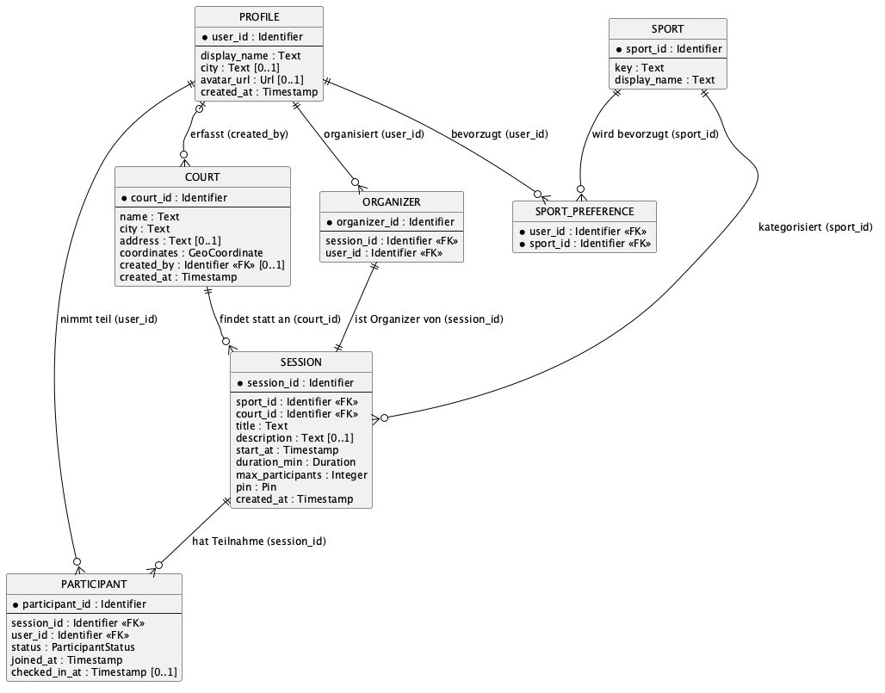

# D1 — Datenmodell

## D1.2 Überblick (ER-Diagramm)

Das folgende Diagramm zeigt die Entitätstypen und ihre Beziehungen. Attribute stehen in den Tabellen unter [D1.4](#d14-entitätstypen-im-detail); abgeleitete Merkmale sind in [D1.6](#d16-abgeleitete-merkmale) beschrieben.

Quelle: [`diagrams/D1-er-diagramm.puml`](diagrams/D1-er-diagramm.puml).

> **Hinweis:** `*` markiert den Primärschlüssel, `<<FK>>` einen Verweis auf eine andere Entität, `[0..1]` ein optionales Attribut. Die im Diagramm genannten Typen (`Identifier`, `Text`, `Url`, `Timestamp`, `Duration`, `Pin`, `Integer`, `GeoCoordinate`, `ParticipantStatus`) sind in [D2](D2-datentypen.md) definiert.

## D1.3 Entitätstypen im Überblick

| Entität | Fachliche Bedeutung | Identität | Zentrale Bezüge (F2/F3) |
|---|---|---|---|
| **`profile`** | Technischer Nutzeraccount mit Basisprofil und Sportpräferenzen; referenziert die Supabase-Auth-Kennung. Teilnahme (`participant`) und Organisation (`organizer`) einer Session sind eigene Auflösungsentitäten zwischen Profil und Session — keine Eigenschaften der Person selbst (siehe [Rollenmodellierung](#rollenmodellierung-organisator-und-teilnehmer)). | `user_id` (= Auth-Kennung) | UC-01, UC-12; AF-01/AF-02 (angemeldeter Nutzer) |
| **`sport`** | Katalogeintrag einer Sportart (z. B. Fußball, Basketball). Vordefinierte Referenzdaten. | `sport_id` | UC-02, UC-06, UC-12 |
| **`court`** | Sportort/Platz, an dem Sessions stattfinden. Fachlich benannt, optional geokodiert. | `court_id` | UC-10, UC-02, UC-03 |
| **`session`** | Eine konkrete Sport-Session mit Zeit, Ort, Sportart, Kapazität und Check-in-Geheimnis. Zentrales Objekt des Systems. | `session_id` | UC-02..UC-09, UC-11; AF-01..AF-04 |
| **`organizer`** | Organisation **einer Session** durch ein Profil — löst die 1:1-Beziehung zwischen `session` und dem organisierenden `profile` auf; entsteht atomar mit der Session. | `organizer_id`, fachlich eindeutig über `session_id` | UC-06; F1 GP-01 A2 |
| **`participant`** | Teilnahme **eines Profils** an einer Session inkl. Beitritts- und Check-in-Zustand — kein eigener Personentyp, sondern Auflösung der n:m-Beziehung Profile↔Session. | `participant_id`, fachlich eindeutig über (`session_id`, `user_id`) | UC-04, UC-07, UC-08, UC-09; AF-01, AF-02 |
| **`sport_preference`** | Bevorzugte Sportart eines Nutzers. Auflösung der n:m-Beziehung Profile↔Sport. | (`user_id`, `sport_id`) | UC-12, UC-02 |

### Rollenmodellierung: Organisator und Teilnehmer

`organizer` und `participant` sind beides Auflösungsentitäten zwischen `profile` und `session` — keine Personentypen und keine dauerhafte Nutzerart. `participant` modelliert die *Teilnahme*: eine echte n:m-Beziehung (B2/B3) mit eigenen, veränderlichen Zustandsattributen (`status`, `joined_at`, `checked_in_at`). `organizer` modelliert die *Organisation*: eine 1:1-Beziehung zu `session` (B1/B8) ohne eigene Zustandsattribute — sie hält lediglich fest, welches Profil die Session angelegt hat.

`organizer` ersetzt das frühere Attribut `session.organizer_id`: Statt eines Fremdschlüssels direkt auf `session` läuft die Organisation über eine eigene Zeile, strukturell analog zu `participant`. Das ändert nichts an der fachlichen Grundaussage aus [F1 GP-01](F1-geschaeftsprozesse.md#f111-akteure): Die Rolle „Organisator" entsteht durch die Handlung „Session erstellen", nicht durch eine Berechtigung oder eine eigenständige Nutzerart. Ein Profil *ist* nicht dauerhaft „Organisator" — es hat lediglich für jede von ihm erstellte Session einen `organizer`-Eintrag, der atomar mit der Session entsteht ([S1.4](S1-nachbarsysteme.md#s14-nb-03--supabase-postgrest) `create_session`) und im MVP unveränderlich ist (keine Übertragung der Organisatorrolle).

Weil der Organisator zugleich Teilnehmer seiner eigenen Session ist ([F1 GP-01](F1-geschaeftsprozesse.md#f111-akteure): „Der Organisator ist zugleich Teilnehmer seiner eigenen Gelegenheit."), erhält er zusätzlich einen `participant`-Eintrag mit `status = confirmed` (Invariante in [D1.5](#d15-beziehungen)). `organizer` und `participant` bestehen damit **nebeneinander** für dieselbe (`session_id`, `user_id`)-Kombination des Organisators — keine Widersprüchlichkeit, sondern zwei unterschiedliche fachliche Aussagen: „hat erstellt" (`organizer`) und „nimmt teil bzw. ist eingecheckt" (`participant`).

## D1.4 Entitätstypen im Detail

### `profile` — Nutzerprofil

`profile` ist der **technische Nutzeraccount**: die im System geführte Repräsentation der Auth-Identität aus Supabase Auth, keine eigenständige „Person"-Entität mit eigenem Lebenszyklus. Rollen wie Teilnehmer oder Organisator sind eigene Auflösungsentitäten zu `session` (`participant`, `organizer`), keine Eigenschaften von `profile` selbst (siehe [Rollenmodellierung](#rollenmodellierung-organisator-und-teilnehmer)).

| Attribut | Typ | Mult. | Notiz |
|---|---|---|---|
| `user_id` | [`Identifier`](D2-datentypen.md#d22-identifier) | 1 | Primärschlüssel. Entspricht der **externen Auth-Kennung** aus Supabase Auth ([NB-02](P2-architekturueberblick.md#p22-nachbarsysteme)). Der Auth-Nutzer selbst (E-Mail, Passwort, Tokens) gehört zum Nachbarsystem und ist **nicht** Teil dieses Modells. |
| `display_name` | [`Text`](D2-datentypen.md#d21-zweck-und-geltungsbereich) | 1 | Anzeigename in Session-Detail und Teilnehmerliste (UC-03, UC-07). |
| `city` | [`Text`](D2-datentypen.md#d21-zweck-und-geltungsbereich) | 0..1 | Heimatort. Vorbelegung der Ortssuche (UC-02, B1 DLG-02); anderen Nutzern **nicht** angezeigt. |
| `avatar_url` | [`Url`](D2-datentypen.md#d21-zweck-und-geltungsbereich) | 0..1 | Anzeigewert für ein vorhandenes Profilbild. Upload/Bearbeitung sind nicht Teil des MVP (UC-12). |
| `created_at` | [`Timestamp`](D2-datentypen.md#d21-zweck-und-geltungsbereich) | 1 | Zeitpunkt der Anlage. |

**Assoziationen:** organisiert 0..* `session` (über `organizer`); besitzt 0..* `participant` (als `user_id`); bevorzugt 0..* `sport` über `sport_preference`; erfasst optional 0..* `court` (als `created_by`).

**Datenschutz & Löschung:** Für andere Nutzer sichtbar sind ausschließlich `display_name` und optional `avatar_url` ([N2.2](N2-querschnittskonzepte.md#n22-row-level-security-rls)); `city` dient nur der eigenen Ortsvorbelegung. Beim Löschen eines Nutzerkontos entfallen Profil, Sportpräferenzen, Teilnahmen sowie die organisierten Sessions samt ihrer `organizer`- und `participant`-Einträge; bei erfassten Courts wird nur `created_by` geleert, der Sportort selbst bleibt erhalten.

### `sport` — Sportart (Katalog)

| Attribut | Typ | Mult. | Notiz |
|---|---|---|---|
| `sport_id` | [`Identifier`](D2-datentypen.md#d22-identifier) | 1 | Primärschlüssel. |
| `key` | [`Text`](D2-datentypen.md#d21-zweck-und-geltungsbereich) | 1 | Stabiler technischer Schlüssel (z. B. `football`, `basketball`), eindeutig über den Katalog. |
| `display_name` | [`Text`](D2-datentypen.md#d21-zweck-und-geltungsbereich) | 1 | Angezeigte Bezeichnung (z. B. „Fußball"). |

**Assoziationen:** kategorisiert 0..* `session` (als `sport_id`); wird bevorzugt von 0..* `profile` über `sport_preference`.

**Charakter:** `sport` ist **Referenz-/Stammdaten**. Sportarten werden im MVP nicht durch Endnutzer angelegt, sondern von Betrieb/Datenpflege verwaltet — Grundlage für verlässliche Filterung (UC-02) und Präferenzen (UC-12) mit Referenzintegrität.

**Initialer Katalog (MVP):** sieben Einträge, erweiterbar ohne Modelländerung.

| `key` | `display_name` |
|---|---|
| `running` | Laufen |
| `cycling` | Radfahren |
| `football` | Fußball |
| `basketball` | Basketball |
| `badminton` | Badminton |
| `swimming` | Schwimmen |
| `other` | Sonstiges |

`other` fängt Randsportarten ohne eigenen Eintrag ab und verhält sich in der Suche (UC-02) wie jede andere Sportart.

### `court` — Sportort

| Attribut | Typ | Mult. | Notiz |
|---|---|---|---|
| `court_id` | [`Identifier`](D2-datentypen.md#d22-identifier) | 1 | Primärschlüssel. |
| `name` | [`Text`](D2-datentypen.md#d21-zweck-und-geltungsbereich) | 1 | Fachliche Benennung des Sportorts. Pflicht (UC-10). |
| `city` | [`Text`](D2-datentypen.md#d21-zweck-und-geltungsbereich) | 1 | Ort/Region, Grundlage der ortsbasierten Suche (UC-02). |
| `address` | [`Text`](D2-datentypen.md#d21-zweck-und-geltungsbereich) | 0..1 | Vom Reverse-Geocoding gelieferte genauere Adresse, sofern verfügbar. |
| `coordinates` | [`GeoCoordinate`](D2-datentypen.md#d27-geocoordinate) | 1 | Koordinatenpaar (Breite/Länge) des gesetzten Kartenpins. |
| `created_by` | [`Identifier`](D2-datentypen.md#d22-identifier) | 0..1 | Optionaler Verweis auf das erfassende `profile`. |
| `created_at` | [`Timestamp`](D2-datentypen.md#d21-zweck-und-geltungsbereich) | 1 | Zeitpunkt der Anlage. |

**Assoziationen:** ist Austragungsort von 0..* `session` (als `court_id`); optional erfasst von 0..1 `profile` (als `created_by`).

**Invariante (UC-10):** `name`, `city` und `coordinates` sind Pflicht. Das Koordinatenpaar entsteht durch den verpflichtenden Kartenpin; `city` und die optionale `address` werden daraus per Reverse-Geocoding abgeleitet, nicht als unabhängige Freitexte gespeichert.

### `session` — Sport-Session

| Attribut | Typ | Mult. | Notiz |
|---|---|---|---|
| `session_id` | [`Identifier`](D2-datentypen.md#d22-identifier) | 1 | Primärschlüssel. Wird auch im QR-Inhalt referenziert (AF-04). |
| `sport_id` | [`Identifier`](D2-datentypen.md#d22-identifier) | 1 | Verweis auf die Sportart (`sport`). |
| `court_id` | [`Identifier`](D2-datentypen.md#d22-identifier) | 1 | Verweis auf den Sportort (`court`). |
| `title` | [`Text`](D2-datentypen.md#d21-zweck-und-geltungsbereich) | 1 | Kurzbezeichnung der Session. |
| `description` | [`Text`](D2-datentypen.md#d21-zweck-und-geltungsbereich) | 0..1 | Optionale Beschreibung. |
| `start_at` | [`Timestamp`](D2-datentypen.md#d21-zweck-und-geltungsbereich) | 1 | Geplanter Startzeitpunkt. Grundlage der Statusableitung (AF-03); muss bei Erstellung in der Zukunft liegen (UC-06). |
| `duration_min` | [`Duration`](D2-datentypen.md#d26-duration) | 1 | Geplante Dauer in Minuten. Ende = `start_at` + `duration_min` (AF-03). |
| `max_participants` | [`Integer`](D2-datentypen.md#d21-zweck-und-geltungsbereich) | 1 | Teilnehmerlimit (harte Kapazitätsgrenze, AF-01). Muss ≥ 1 sein (D2). |
| `pin` | [`Pin`](D2-datentypen.md#d24-pin) | 1 | 4-stelliges Check-in-Geheimnis, bei Erstellung erzeugt (AF-04), geprüft in AF-02. |
| `created_at` | [`Timestamp`](D2-datentypen.md#d21-zweck-und-geltungsbereich) | 1 | Zeitpunkt der Erstellung. |

Der Organisator wird nicht mehr über ein Attribut auf `session`, sondern über die eigene Entität [`organizer`](#organizer--organisation) geführt (B8).

**Abgeleitete Merkmale** (nicht eigenständig gepflegt, siehe [D1.6](#d16-abgeleitete-merkmale)): `status`, `confirmed_count`, `qr_content`.

**Assoziationen:** kategorisiert durch 1 `sport`; findet statt an 1 `court`; hat genau 1 `organizer`; hat 0..* `participant`.

### `organizer` — Organisation

`organizer` modelliert keine eigene Person und keine Rolle, sondern die **Organisation** — die 1:1-Beziehung zwischen einer `session` und dem `profile`, das sie erstellt hat (siehe [Rollenmodellierung](#rollenmodellierung-organisator-und-teilnehmer)). Der Eintrag entsteht atomar mit der Session ([S1.4](S1-nachbarsysteme.md#s14-nb-03--supabase-postgrest) `create_session`) und ist im MVP unveränderlich.

| Attribut | Typ | Mult. | Notiz |
|---|---|---|---|
| `organizer_id` | [`Identifier`](D2-datentypen.md#d22-identifier) | 1 | Primärschlüssel. |
| `session_id` | [`Identifier`](D2-datentypen.md#d22-identifier) | 1 | Verweis auf die organisierte `session`. Fachlich eindeutig (genau ein `organizer`-Eintrag je Session). |
| `user_id` | [`Identifier`](D2-datentypen.md#d22-identifier) | 1 | Verweis auf das organisierende `profile`. |

**Assoziationen:** gehört zu 1 `session` (1:1, B8); gehört zu 1 `profile` (B1).

**Invariante:** Der Organisator zählt ab Erstellung zusätzlich als Teilnehmer (F1 GP-01 A2, siehe Invariante in [D1.5](#d15-beziehungen)); der `organizer`-Eintrag selbst trägt keinen Kapazitäts- oder Check-in-Zustand — dieser liegt ausschließlich bei `participant`.

### `participant` — Teilnahme

`participant` modelliert keine eigene Person und keine Rolle, sondern die **Teilnahme** — den fachlichen Zustand, den ein `profile` durch Beitritt zu einer `session` einnimmt (siehe [Rollenmodellierung](#rollenmodellierung-organisator-und-teilnehmer)). Träger der Identität bleibt ausschließlich `profile`.

| Attribut | Typ | Mult. | Notiz |
|---|---|---|---|
| `participant_id` | [`Identifier`](D2-datentypen.md#d22-identifier) | 1 | Primärschlüssel. |
| `session_id` | [`Identifier`](D2-datentypen.md#d22-identifier) | 1 | Verweis auf die `session`. |
| `user_id` | [`Identifier`](D2-datentypen.md#d22-identifier) | 1 | Verweis auf das teilnehmende `profile`. |
| `status` | [`ParticipantStatus`](D2-datentypen.md#d25-participantstatus) | 1 | `confirmed` (beigetreten) oder `checked_in` (anwesend). |
| `joined_at` | [`Timestamp`](D2-datentypen.md#d21-zweck-und-geltungsbereich) | 1 | Zeitpunkt des Beitritts (Grundlage AF-01 Kapazitätsinvariante; keine Reihenfolgegarantie). |
| `checked_in_at` | [`Timestamp`](D2-datentypen.md#d21-zweck-und-geltungsbereich) | 0..1 | Zeitpunkt des Check-ins; gesetzt genau dann, wenn `status = checked_in` (AF-02). |

**Assoziationen:** gehört zu 1 `session`; gehört zu 1 `profile`.

**Invarianten:**
- **Eindeutigkeit:** Höchstens eine Teilnahme je (`session_id`, `user_id`) — kein Doppelbeitritt (AF-01 R3).
- **Check-in-Kopplung:** `checked_in_at` ist gesetzt ⇔ `status = checked_in`. Übergang `confirmed → checked_in` ist monoton, keine Rücknahme (AF-02).

### `sport_preference` — Sportpräferenz (n:m)

| Attribut | Typ | Mult. | Notiz |
|---|---|---|---|
| `user_id` | [`Identifier`](D2-datentypen.md#d22-identifier) | 1 | Verweis auf das `profile`. |
| `sport_id` | [`Identifier`](D2-datentypen.md#d22-identifier) | 1 | Verweis auf die bevorzugte `sport`. |

**Identität:** fachlich eindeutig über (`user_id`, `sport_id`) — jede Sportart höchstens einmal je Profil.

**Assoziationen:** verbindet 1 `profile` mit 1 `sport`. Löst die n:m-Beziehung „Nutzer bevorzugt Sportarten" (UC-12) auf und unterstützt die Suche (UC-02).

## D1.5 Beziehungen

| # | Von | Nach | Kardinalität | Bedeutung | Bezug |
|---|---|---|---|---|---|
| B1 | `profile` | `organizer` | 1 : 0..* | Ein Profil kann beliebig viele Sessions organisieren (ein `organizer`-Eintrag je organisierter Session). | UC-06, F1 GP-01 A2 |
| B2 | `session` | `participant` | 1 : 0..* | Eine Session hat beliebig viele Teilnahmen. | UC-04, UC-07 |
| B3 | `profile` | `participant` | 1 : 0..* | Ein Profil kann an beliebig vielen Sessions teilnehmen. | UC-04, UC-05 |
| B4 | `sport` | `session` | 1 : 0..* | Eine Sportart kategorisiert beliebig viele Sessions; jede Session hat genau eine Sportart. | UC-02, UC-06 |
| B5 | `court` | `session` | 1 : 0..* | Ein Court ist Austragungsort beliebig vieler Sessions; jede Session hat genau einen Court. | UC-10, UC-06 |
| B6 | `profile` | `sport` | 0..* : 0..* | Nutzer bevorzugen Sportarten (aufgelöst über `sport_preference`). | UC-12 |
| B7 | `profile` | `court` | 0..1 : 0..* | Ein Profil kann Courts erfassen; ein Court ist optional einem Ersteller zugeordnet. | UC-10 |
| B8 | `organizer` | `session` | 1 : 1 | Jede Session hat genau einen `organizer`-Eintrag; jeder `organizer`-Eintrag gehört zu genau einer Session. | UC-06 |

Die n:m-Beziehungen `profile`↔`session` (Teilnahme) und `profile`↔`sport` (Präferenz) werden durch `participant` (B2+B3) bzw. `sport_preference` (B6) aufgelöst, da beide eigene Attribute tragen. Die 1:1-Beziehung zwischen `organizer` und `session` (B1+B8) macht die Organisation als eigene, mit `participant` symmetrische Auflösungsbeziehung sichtbar (siehe [Rollenmodellierung](#rollenmodellierung-organisator-und-teilnehmer)).

**Organisator-als-Teilnehmer:** Nach [F1 GP-01](F1-geschaeftsprozesse.md#f111-akteure) A2 und [F3 AF-01](F3-anwendungsfunktionen.md#af-01--beitritts--und-kapazitätsregel) erhält der Organisator ab Erstellung zusätzlich einen `participant`-Eintrag mit demselben `user_id` und `status = confirmed` — unabhängig von seinem `organizer`-Eintrag für dieselbe Session (B8). Beide Entitäten drücken unterschiedliche Sachverhalte aus: „hat erstellt" (`organizer`) und „nimmt teil bzw. ist eingecheckt" (`participant`).

## D1.6 Abgeleitete Merkmale

Diese Merkmale werden **nicht als eigenständige Attribute** gepflegt, sondern aus vorhandenen Daten abgeleitet. Ob sie zur Laufzeit berechnet oder materialisiert werden, ist eine Umsetzungsentscheidung (N2/Architektur), bewusst nicht hier festgelegt.

| Merkmal | Zugehörige Entität | Ableitung | Definiert in |
|---|---|---|---|
| `status` | `session` | Aus aktueller Zeit im Verhältnis zu `start_at` und `start_at + duration_min`: `scheduled` / `active` / `completed`. | [F3 AF-03](F3-anwendungsfunktionen.md#af-03--status-einer-sport-session), [D2](D2-datentypen.md#d23-sessionstatus) |
| `confirmed_count` | `session` | Anzahl `participant` der Session mit `status ∈ {confirmed, checked_in}`. Grundlage der Kapazitätsprüfung (AF-01) und der Anzeige „x/max". | [F3 AF-01](F3-anwendungsfunktionen.md#af-01--beitritts--und-kapazitätsregel) |
| `qr_content` | `session` | Verweis auf die Check-in-Ansicht mit `session_id` und `pin` (konzeptionell `…/check-in?session=<id>&pin=<pin>`). | [F3 AF-04](F3-anwendungsfunktionen.md#af-04--pin--und-qr-code-erzeugung), [D2](D2-datentypen.md#d28-qrcontent) |

Diese Merkmale erscheinen deshalb nicht in den Attributtabellen von [D1.4](#d14-entitätstypen-im-detail), sind aber fachlich Teil der Session-Sicht (z. B. UC-03, UC-07).

## D1.7 Nicht modellierte Datenobjekte

| Objekt | Begründung |
|---|---|
| Warteliste / `waiting`-Status | Out of scope (P1 NG-10). `participant.status` kennt nur `confirmed`/`checked_in`. |
| Benachrichtigungen, Nachrichten, Kommentare | Out of scope (P1 NG-02, F1-Grenzen, F2.5). |
| Ratings / Reviews | Out of scope (P1 NG-04). |
| Zahlungs-/Buchungsdaten | Out of scope (P1 NG-01). |
| Session-Serien / wiederkehrende Termine | F1 modelliert keine Serien; jede `session` ist eigenständig (F2.5). |
| Auth-Nutzer, Sitzungen, Tokens | Gehören zum Nachbarsystem Supabase Auth ([S1](S1-nachbarsysteme.md)); nur als externe `user_id` referenziert. |
| Übertragung der Organisatorrolle | Der `organizer`-Eintrag einer Session ist im MVP unveränderlich; eine Übergabe an ein anderes Profil ist nicht vorgesehen (P1 NG-11). |
| Kartenkacheln / Geodaten von OpenStreetMap | Werden clientseitig gerendert ([NB-04](P2-architekturueberblick.md#p22-nachbarsysteme)), nicht persistiert. |

## D1.8 Konsistenz und Cross-References

| Baustein | Relevanz für D1 |
|---|---|
| [P1](P1-ziele-rahmenbedingungen.md) | Scope-Ausschlüsse: Warteliste (NG-10), Zahlung (NG-01), Messaging (NG-02). |
| [P2](P2-architekturueberblick.md) | Datenobjekte in den Datenflüssen; `user_id` stammt aus Supabase Auth (NB-02). |
| [F1](F1-geschaeftsprozesse.md) | Fachliche Herkunft der Attribute (Beitritt, Check-in, QR/PIN, Organisator-als-Teilnehmer GP-01 A2). |
| [F2](F2-anwendungsfaelle.md) | Jeder „Bezug zu Daten" der Use Cases ist hier durch eine Entität abgedeckt. |
| [F3](F3-anwendungsfunktionen.md) | Bindet Felder (`status`, `max_participants`, `checked_in_at`, `pin`) an Entitäten; F3 definiert die Regeln darüber. |
| [D2](D2-datentypen.md) | Formale Definition aller in D1 verwendeten Datentypen und Wertebereiche. |
| N1 / N2 | Übergreifende Qualitäts-, Zugriffs- und technische Mapping-Regeln. |
| B1 | Darstellung der freigegebenen Profil-/Teilnehmerfelder in den Dialogen. |
| [S1](S1-nachbarsysteme.md) | Auth-Kennung und Kartendaten stammen aus Nachbarsystemen, hier nur referenziert; `create_session` (S1.4) legt `organizer`- und `participant`-Eintrag atomar mit der Session an. |
| E2 | Glossar: einheitliche Begriffe (Session, Teilnahme/Participant, Organisator/Organizer, Court/Sportort, Profil, Sportart). |
