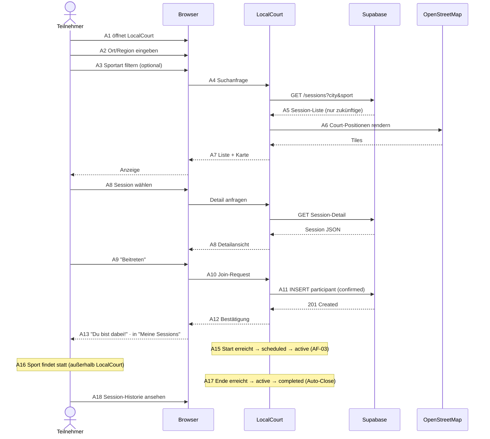
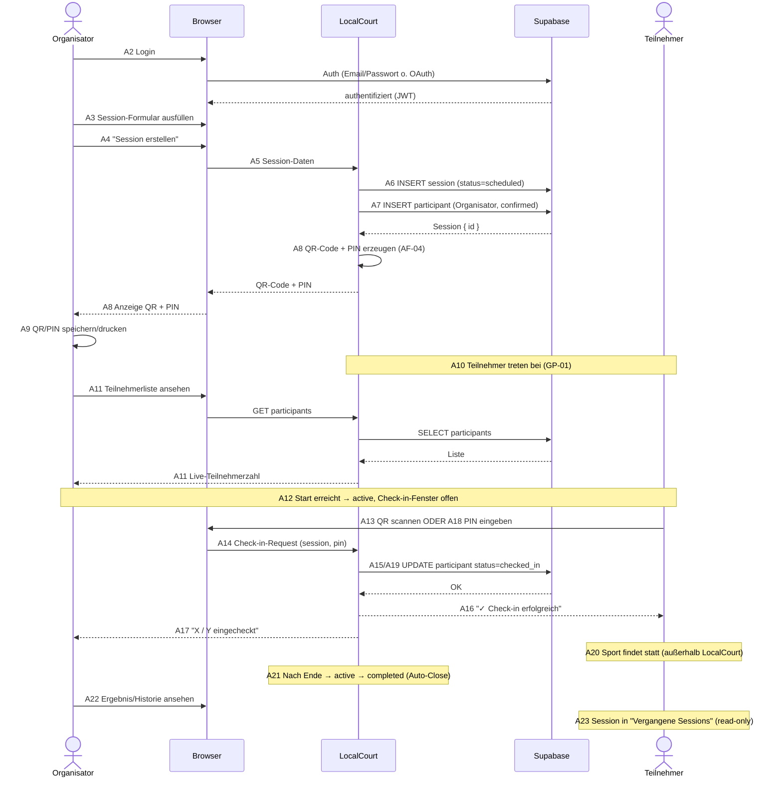

# F1 — Geschäftsprozesse

Reale (IT-unabhängige) Workflows, an denen LocalCourt teilnimmt. Nach Siedersleben (Kapitel 4.3): Ein Geschäftsprozess ist eine zeitliche und logische Folge von Arbeitsschritten (Aktivitäten), durchgeführt von Akteuren (Menschen & IT-Systeme). Ein Prozess kann ganz, teilweise oder gar nicht von IT-Systemen unterstützt werden.

LocalCourt unterstützt **zwei Hauptprozesse** und eine **Variante**:

1. **GP-01**: Spontan Sportaktivitäten in der Nähe finden (Participant)
2. **GP-02**: Regelmäßige Treffen / Club organisieren (Organizer)
3. **GP-03**: Neue Sportarten entdecken (Participant, Variant von GP-01)

Diese Prozesse existieren mit oder ohne LocalCourt. LocalCourt ist der **IT-Unterstützer für die Koordinationsphase** — aber der Sport selbst findet außerhalb statt.

---

## F1.1 Geschäftsprozess: Spontan Sportaktivitäten finden (GP-01)

Ein Teilnehmer möchte spontan wissen, welche Sportaktivitäten es in der Nähe gibt, und teilnehmen.

### F1.1.1 Akteure

| Akteur | Typ | Rolle |
|--------|-----|-------|
| **Teilnehmer (Participant)** | Mensch | Initiiert den Prozess; sucht, entscheidet, tritt bei. |
| **Browser / React-Frontend** | IT-System (Client) | Rendert UI, erfasst Nutzer-Input (Ort, Sportart), zeigt Ergebnisse. |
| **LocalCourt** | IT-System | Orchestriert die Suche, verwaltet Session-Daten. |
| **Supabase PostgREST** | IT-System (Third Party) | Liefert Session-Datensätze gefiltert nach Ort & Sportart. |
| **OpenStreetMap / Leaflet** | IT-System (Third Party) | Kartendarstellung, visualisiert Court-Positionen. |
| **PostgreSQL Datenbank** | IT-System (Daten-Store) | Speichert sessions, courts, participants. |

### F1.1.2 Aktivitäten

Zeitliche und logische Reihenfolge. Die **Support**-Spalte benennt, wer die Aktivität materialiter durchführt.

| # | Aktivität | Support | Notizen |
|---|-----------|---------|---------|
| A1 | Teilnehmer hat Lust auf Sport, öffnet LocalCourt | Participant, Browser | Pre-IT: Nutzer-Entscheidung, keine System-Unterstützung. |
| A2 | Teilnehmer gibt Stadt/Region ein oder wählt aktuelle Position | Browser + Participant | Nutzer-Input: Textfeld oder Geo-Lookup. Keine automatische Geolocation (Datenschutz). |
| A3 | Teilnehmer filtert nach Sportart (optional) | Browser + Participant | Dropdown-Auswahl oder Multi-Select. |
| A4 | Frontend sendet Query an LocalCourt | Browser → LocalCourt | GET /rest/v1/sessions?city=<>&sport=<> (Supabase PostgREST API). |
| A5 | Supabase filtert und gibt Session-Liste zurück | Supabase PostgREST | Filter: WHERE city=... AND sport=... AND datetime > NOW() (Nur zukünftige Sessions). |
| A6 | LocalCourt lädt Court-Positionen und rendert Kartendarstellung | LocalCourt, OpenStreetMap, Browser | Leaflet-Karte mit Pins für jeden Court. Asynchrone Karte-Rendering. |
| A7 | Teilnehmer sieht Session-Liste & Karte | Browser (UI Rendering) | List View (Title, DateTime, Participants/Max, Location) + Map View. |
| A8 | Teilnehmer wählt interessante Session aus (Click) | Participant, Browser | Zeigt Session-Detail-View (Beschreibung, Organisator, Teilnehmer-Liste). |
| A9 | Teilnehmer klickt "Beitreten" | Participant, Browser | UI-Button-Click oder auto-join. |
| A10 | Frontend sendet Join-Request an LocalCourt | Browser → LocalCourt | POST /rest/v1/participants { session_id, user_id, status: "confirmed" }. |
| A11 | LocalCourt speichert Participant-Record | LocalCourt → PostgreSQL | INSERT INTO participants (session_id, user_id, joined_at, status). |
| A12 | Teilnehmer sieht Bestätigung "Du bist dabei!" | Browser (UI Feedback) | Toast-Nachricht oder Modal mit Session-Details. |
| A13 | Session wird in "Meine Sessions" angezeigt | Browser (UI) | Frontend-State aktualisiert, Participant-Count erhöht sich. |
| A14 | Teilnehmer navigiert zur Session-Detail & wartet auf Start | Participant, LocalCourt | Session-Timeline, Organisator-Infos, andere Teilnehmer-Namen sichtbar. |
| A15 | Zum Startzeitpunkt: Session wird "aktiv" | LocalCourt (Background Job?) | Status-Transition: "scheduled" → "active". (Später: Reminder an Teilnehmer?) |
| A16 | Teilnehmer erscheint zum Event und beteiligt sich physisch | Participant (Real-World) | **Post-IT**: Sport findet statt, LocalCourt nicht mehr involviert. |
| A17 | Nach Session-Ende: Session wird auto-geschlossen | LocalCourt (Auto-Timer?) | Status-Transition: "active" → "completed". Zeit-basiert (DateTime + Duration). |
| A18 | Teilnehmer kann später Session-Historie anschauen | Participant, LocalCourt | Archivierte Session in "Vergangene Sessions", evtl. mit Stats. |

### F1.1.3 Dokumente

Konkrete Artefakte, die durch den Prozess fließen.

| Dokument | Erzeugt in | Format | Speicherort |
|----------|-----------|--------|------------|
| **Nutzer-Input (Ort, Sportart)** | A2–A3 | String, Enum | Browser Session State, nicht persistent |
| **Session-Liste (API Response)** | A5 | JSON Array (Sessions) | PostgREST Response, Browser Memory |
| **Karte (OSM Tiles + Pins)** | A6 | HTML Canvas + GeoJSON | Browser DOM (Leaflet Renderer) |
| **Session-Detail** | A8 | JSON Object (1 Session + Participants) | PostgREST Response, Browser Memory |
| **Join-Request Payload** | A10 | JSON { session_id, user_id } | HTTP Request Body |
| **Participant-Record** | A11 | Row in PostgreSQL | participants Tabelle, Persistiert |
| **Confirmation UI** | A12 | React Component | Browser DOM |
| **Session-History** | A18 | SQL Query Result | PostgreSQL (sessions, participants gefiltert) |

### F1.1.4 Daten-Stores (Information-/Datenspeicher)

| Store | Besitzer | Inhalt |
|-------|----------|--------|
| **PostgreSQL: sessions** | LocalCourt | Session-Records: id, title, sport, city, court_id, organizer_id, datetime, duration, max_participants, status (scheduled, active, completed) |
| **PostgreSQL: participants** | LocalCourt | Participant-Records: id, session_id, user_id, joined_at, status (confirmed) |
| **PostgreSQL: courts** | LocalCourt | Court/Sportplatz-Verzeichnis: id, name, city, address, coordinates (lat/lon) |
| **PostgreSQL: profiles** | LocalCourt | Nutzer-Profil: user_id, display_name, avatar_url. Sportpräferenzen separat (D1 `sport_preference`); E-Mail liegt in Supabase Auth. |
| **Browser: sessionStorage / localStorage** | Browser | Recent Searches, User Preferences (Lieblings-Sportarten, zuletzt gesuchte Stadt) |
| **OSM Tile Cache** | OpenStreetMap (Extern) | Kartenkacheln, Browser-seitig gecacht |

### F1.1.5 Ablaufdiagramm (Mermaid)

**Hinweise zum Diagramm**:
- A1, A16 sind **Pre-/Post-LocalCourt** (reale Welt), A17 ist systemautomatisch.
- A2–A14, A18 sind **LocalCourt-unterstützt**.
- Der Statuswechsel (A15/A17) ist zeitbasiert abgeleitet; die Regel steht in [F3 AF-03](F3-anwendungsfunktionen.md#f35-af-03--session-lifecycle--statusübergänge).

---

## F1.2 Geschäftsprozess: Regelmäßige Treffen / Club organisieren (GP-02)

Ein Organisator (z.B. Running-Club-Leiter) möchte regelmäßige Trainings-Sessions koordinieren.

### F1.2.1 Akteure

| Akteur | Typ | Rolle |
|--------|-----|-------|
| **Organisator (Organizer)** | Mensch | Initiiert, erstellt Sessions, macht Check-In, verwaltet. |
| **Browser / React-Frontend** | IT-System (Client) | Rendert Organisator-UI, Forms, QR-Code, Participant-Liste. |
| **LocalCourt** | IT-System | Orchestriert Session-Erstellung, Check-In, Auto-Close. |
| **Supabase PostgREST** | IT-System (Third Party) | CRUD für Sessions, Participants, Check-Ins. |
| **Supabase Auth** | IT-System (Third Party) | Authentifizierung (Organisator-Login). |
| **PostgreSQL Datenbank** | IT-System (Daten-Store) | Speichert Sessions, Participants, Check-In-Records. |
| **QR-Code-Library** (z.B. qrcode.js) | IT-System (Client) | Generiert QR-Code auf Frontend. |

### F1.2.2 Aktivitäten

Zeitliche und logische Reihenfolge.

| # | Aktivität | Support | Notizen |
|---|-----------|---------|---------|
| **Pre-Setup** | | | |
| A1 | Organisator möchte Trainings-Session organisieren (z.B. jeden Mittwoch Fußball um 19:00) | Organizer | Geschäfts-Entscheidung, keine IT. |
| A2 | Organisator öffnet LocalCourt & loggt sich ein | Organizer, Browser, Supabase Auth | Authentifizierung per Email+Passwort oder OAuth. |
| **Session-Erstellung** | | | |
| A3 | Organisator füllt Session-Form aus | Organizer, Browser | Felder: Title, Sport, Court, DateTime (Startzeitpunkt), Duration, Max Participants, Beschreibung. Validierung im Browser (Client-Side). |
| A4 | Organisator klickt "Session erstellen" | Organizer | Form Submission. |
| A5 | Frontend sendet Session-Data an LocalCourt | Browser → LocalCourt | POST /rest/v1/sessions { title, sport, court_id, datetime, duration, max_participants, organizer_id, description }. |
| A6 | LocalCourt speichert Session in PostgreSQL | LocalCourt → PostgreSQL | INSERT INTO sessions (...). Auto-generated: id, created_at, status='scheduled'. |
| A7 | LocalCourt auto-fügt Organisator als Participant hinzu | LocalCourt → PostgreSQL | INSERT INTO participants { session_id, user_id=organizer_id, status='confirmed', joined_at=NOW() }. |
| A8 | Frontend zeigt QR-Code & PIN | Browser (UI) | QR-Code generiert im Frontend (qrcode.js) mit Format: "session_<id>_pin_<pin>". 4-stellige PIN (zufällig). |
| A9 | Organisator speichert / druckt QR-Code + PIN | Organizer | Kann für physisches Sharing genutzt werden (ausdrucken für Treffpunkt). |
| **Vor Session-Start** | | | |
| A10 | Potenzielle Teilnehmer öffnen LocalCourt (GP-01: Suche & Beitreten) | Participant, Browser, LocalCourt | Sessions sind für alle sichtbar (public discovery). Participants treten bei. |
| A11 | Organisator sieht wachsende Teilnehmer-Liste in real-time | Organizer, Browser → LocalCourt | GET /rest/v1/sessions/<id>/participants (Live Update oder Poll). |
| **Session-Start (Check-In Phase)** | | | |
| A12 | Zum Startzeitpunkt: Organisator öffnet Check-In-Screen | Organizer, Browser, LocalCourt | Status sichtbar: "aktiv", QR-Code + PIN prominent angezeigt. |
| A13 | Teilnehmer scannt QR-Code mit Handy (z.B. native Camera App oder Browser-Scanner) | Participant | QR-Code enkodiert: Redirect zu LocalCourt/check-in?session=<id>&pin=<pin> (oder ähnlich). |
| A14 | QR-Code-Scan führt zu Browser-Seite mit automatischem Check-In | Browser (Participant) | LocalCourt erkennt session_id & pin aus URL. POST /rest/v1/participants/<participant_id>/check_in { status: 'checked_in', checked_in_at: NOW() }. |
| A15 | LocalCourt markiert Participant als "checked_in" | LocalCourt → PostgreSQL | UPDATE participants SET status='checked_in', checked_in_at=NOW() WHERE id=<>. |
| A16 | Participant sieht Bestätigung "✓ Check-in erfolgreich!" | Browser (UI Feedback) | Toast oder Modal mit checked_in-Status. |
| A17 | Organisator sieht in Participant-Liste: "X / Y Checked in" | Organizer, Browser | Real-time Update der Liste. Grüne Häkchen für checked_in, Grau für "joined aber nicht checked_in". |
| **Fallback: PIN-Eingabe (falls QR-Scan fehlschlägt)** | | | |
| A18 | Teilnehmer kann alternativ 4-stellige PIN manuell eingeben | Participant, Browser | Form: "Check-In PIN" → LocalCourt verifiziert PIN. |
| A19 | LocalCourt validiert PIN & markiert als checked_in | LocalCourt → PostgreSQL | SELECT sessions WHERE pin=<> AND status='active', dann CHECK-IN für Participant. |
| **Session-Laufzeit** | | | |
| A20 | Sport findet statt (physisch, außerhalb LocalCourt) | Participant, Organizer | Real-World Activity. LocalCourt inaktiv. |
| **Nach Session-Zeit** | | | |
| A21 | Nach DateTime + Duration verstrichen: LocalCourt auto-schließt Session | LocalCourt (Scheduler/Trigger) | Status-Transition: 'active' → 'completed'. Zeitgesteuert (Database Trigger oder Background Job). |
| A22 | Organisator kann Session-Ergebnis anschauen (optional) | Organizer, LocalCourt | Session-Historie: "X checked_in, Y didn't check in". Stats anschauen. |
| A23 | Teilnehmer sehen Session in "Vergangene Sessions" archiviert | Participant, LocalCourt | Session bleibt sichtbar, ist aber "read-only". |

### F1.2.3 Dokumente

| Dokument | Erzeugt in | Format | Speicherort |
|----------|-----------|--------|------------|
| **Session-Form-Input** | A3 | Form Data (Title, Sport, DateTime, etc.) | Browser State, nicht persistent |
| **Session-Record** | A6 | Row in PostgreSQL | sessions Tabelle |
| **QR-Code Image** | A8 | PNG / SVG (qrcode.js Output) | Browser Canvas / Memory, Optional: Supabase Storage (wenn Speicherung nötig) |
| **PIN** | A8 | String (4 Digits) | SessionRecord (sessions.pin Feld) |
| **Participant-List** | A11 | JSON Array | Browser Memory (fetched von Supabase) |
| **Check-In-Record** | A15 | Row in PostgreSQL (participants.check_in_at) | participants Tabelle |
| **Check-In-Bestätigung** | A16 | UI Toast/Modal | Browser DOM |
| **PIN-Input-Form** | A18 | HTML Form | Browser DOM |
| **Session-Ergebnis-Report** | A22 | JSON (Check-In Stats) | Browser Memory, Optional: Persistiert in reports-Tabelle (Out-of-Scope Admin-Feature) |

### F1.2.4 Daten-Stores

| Store | Besitzer | Inhalt |
|-------|----------|--------|
| **PostgreSQL: sessions** | LocalCourt | Session-Records: id, title, sport, court_id, organizer_id, datetime, duration, max_participants, status, created_at, pin (4-digit string, nullable), qr_code (nullable) |
| **PostgreSQL: participants** | LocalCourt | Participant-Records: id, session_id, user_id, joined_at, status (confirmed, checked_in), checked_in_at (nullable) |
| **PostgreSQL: courts** | LocalCourt | Court-Verzeichnis: id, name, city, coordinates |
| **PostgreSQL: profiles** | LocalCourt | Nutzer-Profil: user_id, display_name, avatar_url. **Keine** Rollenspalte — die Rolle ergibt sich aus der Aktion (Organisator = wer erstellt); vgl. D1 / UC-01. |
| **Browser: sessionStorage** | Browser | Aktuelle Session-ID, Organizer-Mode Flag, aktuelle PIN (während Session aktiv) |

### F1.2.5 Ablaufdiagramm (Mermaid)

**Hinweise zum Diagramm**:
- A1, A20 sind **Pre-/Post-LocalCourt** (reale Welt); A21 ist systemautomatisch (Auto-Close, AF-03).
- Check-in hat zwei gleichwertige Pfade: QR-Scan (A13–A16) oder PIN-Eingabe (A18–A19); die Prüfung ist in [F3 AF-02](F3-anwendungsfunktionen.md#f34-af-02--check-in-validierung) spezifiziert.

---

## F1.3 Geschäftsprozess: Neue Sportarten entdecken (GP-03)

**Variant von GP-01**: Ein Teilnehmer möchte nicht nur in favorisierten Sportarten suchen, sondern auch neue Sportarten entdecken.

### F1.3.1 Aktivitäten (Kurz)

| Schritt | Beschreibung |
|---------|-------------|
| A1–A3 | Teilnehmer öffnet LocalCourt, gibt Stadt ein, aber wählt **"Alle Sportarten"** statt einzelne Auswahl. |
| A4–A7 | LocalCourt liefert Ergebnisse für **alle** Sportarten in der Stadt. Karte zeigt bunte Pins pro Sportart-Kategorie (z.B. Rot=Fußball, Blau=Schwimmen, Grün=Tennis). |
| A8–A13 | Teilnehmer browsed die Liste, sieht eine unbekannte Sportart (z.B. "Pickleball"), klickt, beitreten. |
| A14+ | Wie GP-01: Session-Detail, Beitreten, Check-In. |

**Differenziator zu GP-01**: Nur die **Filterung ist anders** (kein Sportart-Filter = Alle). Der technische Ablauf ist identisch.

---

## F1.4 Grenzen (Boundaries) — Was NICHT modelliert wird

### Explizit Ausgeschlossen

| Concern | Grund | Referenz |
|---------|-------|----------|
| **Benachrichtigungen** | Out-of-Scope. MVP hat keine Email/SMS/Push-Notifications. Nutzer muss self-aktiv sein. | P1 NG-02, CON-T-05; F2.6 |
| **Wartelisten** | Ohne Benachrichtigungskanal ("Platz frei") fachlich nicht sinnvoll; Kapazität ist harte Grenze. | P1 NG-10; F3 AF-01 |
| **Nutzer-Bewertungen / Ratings** | Nicht modelliert. Keine 5-Sterne-Ratings oder Review-System. | P1 NG-04 |
| **Admin-Reports** | Admin-Funktionen sind Out-of-Scope. Historie bleibt read-only, kein Reporting. | F2.6; UC-11 |
| **Session-Modifikation nach Erstellung** | Vereinfacht: Organisator kann **nicht** Startzeit/Court/Teilnehmerlimit nach Erstellung ändern (würde Komplexität für MVP erhöhen). | F2.6 (Scope-Vereinfachung) |
| **Messaging zwischen Organisator & Participant** | Kein Direct Chat. Koordination läuft extern (WhatsApp, Signal, etc.). | P1 NG-02 |
| **Cross-Process Coordination** | Keine "Threads" von Sessions, keine Session-Serien-Verwaltung. Jede Session ist unabhängig. | F2.6 (Session-Serien) |
| **Auszahlung / Spendensystem** | Kein Geld. LocalCourt kostenlos. | P1 NG-01 |

### Post-LocalCourt (Nicht in Modellierung, aber erwähnt)

- **Organisator-Planung** (A1 in GP-02): "Wann soll das Training sein?" — Geschäftsentscheidung, nicht IT.
- **Sportevent** (A20 in GP-02): Der eigentliche Sport. LocalCourt hat keine Rolle.
- **Post-Event Feedback** (A22 in GP-02): "War gut, nächstes Mal mehr Leute" — Optionales Feedback, nicht modelliert.

---

## F1.5 Konsistenz mit P1, P2 & S1

### Akteure in F1 ↔ Stakeholder in P1

| F1 Akteur | P1 Stakeholder | Mapping |
|-----------|----------------|---------|
| Teilnehmer | Primäre Nutzer (18–30) | ✅ Match |
| Organisator | Trainer-/Verein-Gruppen | ✅ Match (Subset von primären Nutzern) |
| LocalCourt (System) | Operator-Team | ✅ Match (wir bauen es) |
| Supabase, OpenStreetMap | Cloud-Provider, Externe APIs | ✅ Match (P2 NB-02, NB-03, NB-04) |

### Nachbarsysteme in F1 ↔ P2

| F1-Bezug | P2 System | Mapping |
|----------|-----------|---------|
| Browser-UI, User Interaction | NB-01: Browser | ✅ Match |
| Authentifizierung (A2 in GP-02) | NB-02: Supabase Auth | ✅ Match |
| Session/Participant Queries, CRUD | NB-03: Supabase PostgREST | ✅ Match |
| Karte, Kartendarstellung | NB-04: OpenStreetMap/Leaflet | ✅ Match |

### Constraints in F1 ↔ P1

| Constraint | F1 Implikation | Referenz |
|-----------|----------------|----------|
| Free-Tier Budget | Keine Push-Notifications, keine Email-Service. Wartelisten entfernt (NG-10). | P1 CON-T-02, CON-T-05 |
| Rollen durch Aktion | Nur Teilnehmer & Organisator; Rolle ergibt sich aus der Aktion, kein Admin-Tier im MVP. | P1 P1.3; UC-01 |
| Responsive Web UI | F1-Prozesse laufen auf Mobile & Desktop (z.B. A13 QR-Scan auf Smartphone). | P1 CON-T-04 |

---

## Zusammenfassung

LocalCourt unterstützt **zwei Haupt-Geschäftsprozesse** und **eine Variante**:

1. **GP-01: Spontan Sportaktivitäten finden** — Participant-Centric Discovery & Joining
2. **GP-02: Regelmäßige Treffen organisieren** — Organizer-Centric Creation, Check-In, Auto-Close
3. **GP-03: Neue Sportarten entdecken** — Variant von GP-01 (Filterung ändert sich)

Jeder Prozess besteht aus **Akteuren** (Mensch & IT), **Aktivitäten** (zeitliche Folge), **Dokumenten** (Artefakte), und **Daten-Stores** (Persistierung). Die Prozesse sind **IT-unabhängig modelliert**, aber LocalCourt unterstützt den Koordinations- und Verwaltungsteil.

**Bewusste Ausschlüsse** (Grenzen): Keine Benachrichtigungen, Wartelisten, Ratings, Admin, Messaging, oder Cross-Process-Serien. Dies vereinfacht den MVP und entspricht P1.

---

## Referenzen

- **P1 — Ziele und Rahmenbedingungen**: `P1-ziele-rahmenbedingungen.md`
- **P2 — Architekturüberblick**: `P2-architekturueberblick.md`
- **S1 — Nachbarsysteme**: `S1-nachbarsysteme.md` (Schnittstellen-Details)
- **Siedersleben-Schema**: Kapitel 4.3 (Geschäftsprozesse)
- **Herold F1 Reference** (English): [GitHub](https://github.com/carstenlucke/herold/blob/main/docs/spec/F1-geschaeftsprozesse.md)
