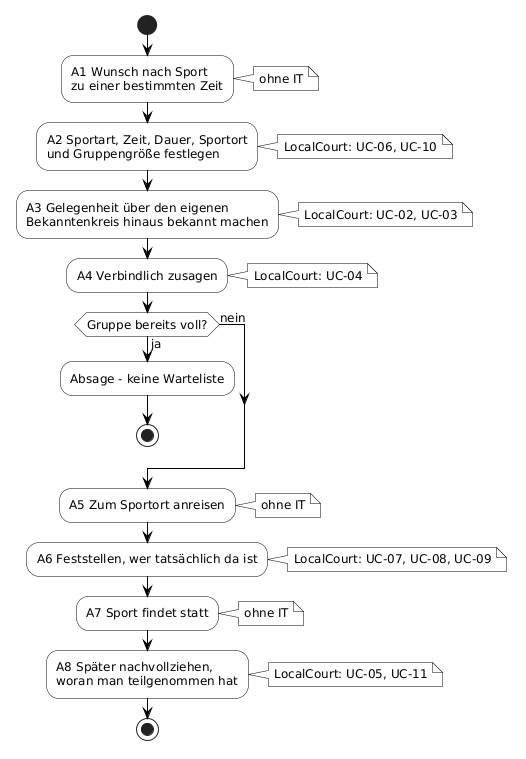

# F1 — Geschäftsprozesse

Ein Geschäftsprozess ist nach Siedersleben eine zeitlich und logisch geordnete Folge von Aktivitäten, die von Akteuren ausgeführt wird und **unabhängig von jedem IT-System** existiert. F1 beschreibt daher, was fachlich geschieht — nicht, wie Nutzer mit LocalCourt interagieren. Letzteres ist Gegenstand von [F2](F2-anwendungsfaelle.md).

LocalCourt unterstützt **einen** Geschäftsprozess: Menschen finden zu einer gemeinsamen Sportgelegenheit zusammen. Dieser Prozess läuft heute ohne Software ab — über Bekanntenkreis, Gruppenchats oder das Glück, am Platz genug Leute anzutreffen. LocalCourt unterstützt drei Schritte darin; die übrigen bleiben außerhalb.

---

## F1.1 Geschäftsprozess: Sportgelegenheit zustande bringen (GP-01)

### F1.1.1 Akteure

| Akteur | Typ | Rolle im Prozess |
|---|---|---|
| **Organisator** | Mensch | Legt Sportart, Zeit und Sportort fest und macht die Gelegenheit bekannt. Die Rolle entsteht durch die Handlung, nicht durch eine Berechtigung. |
| **Teilnehmer** | Mensch | Sagt zu, erscheint am Sportort und treibt Sport. Der Organisator ist zugleich Teilnehmer seiner eigenen Gelegenheit. |
| **LocalCourt** | IT-System | Unterstützt die Koordinationsphase: bekannt machen, zusagen, Anwesenheit feststellen. |

Bewusst **nicht** als Akteure geführt sind Browser, Datenbank und Kartendienste. Sie sind technische Mittel und stehen als Nachbarsysteme in [P2.2](P2-architekturueberblick.md#p22-nachbarsysteme).

### F1.1.2 Aktivitäten

| # | Aktivität | Akteur | Unterstützung durch LocalCourt |
|---|---|---|---|
| A1 | Wunsch nach Sport zu einer bestimmten Zeit entsteht | Organisator | keine — Entscheidung des Menschen |
| A2 | Sportart, Zeit, Dauer, Sportort und Gruppengröße festlegen | Organisator | [UC-06](F2-anwendungsfaelle.md#uc-06--session-erstellen), [UC-10](F2-anwendungsfaelle.md#uc-10--court--sportort-erfassen-oder-auswählen) |
| A3 | Gelegenheit über den eigenen Bekanntenkreis hinaus bekannt machen | Organisator, Teilnehmer | [UC-02](F2-anwendungsfaelle.md#uc-02--session-suchen), [UC-03](F2-anwendungsfaelle.md#uc-03--session-detail-ansehen) |
| A4 | Verbindlich zusagen, solange die Gruppe nicht voll ist | Teilnehmer | [UC-04](F2-anwendungsfaelle.md#uc-04--session-beitreten) |
| A5 | Zum Sportort anreisen | Teilnehmer | keine |
| A6 | Am Sportort feststellen, wer tatsächlich da ist | Organisator, Teilnehmer | [UC-08](F2-anwendungsfaelle.md#uc-08--check-in-per-qr-code-durchführen), [UC-09](F2-anwendungsfaelle.md#uc-09--check-in-per-pin-durchführen), [UC-07](F2-anwendungsfaelle.md#uc-07--teilnehmerliste-anzeigen) |
| A7 | Sport findet statt | Teilnehmer | keine |
| A8 | Später nachvollziehen, woran man teilgenommen hat | Teilnehmer, Organisator | [UC-11](F2-anwendungsfaelle.md#uc-11--session-historie-ansehen), [UC-05](F2-anwendungsfaelle.md#uc-05--eigene-sessions-anzeigen) |

Ohne Software hat dieser Prozess drei Schwachstellen, an denen LocalCourt ansetzt ([P1](P1-ziele-rahmenbedingungen.md)): A3 erreicht nur den eigenen Bekanntenkreis, in A4 weiß niemand verlässlich, wie viele kommen, und in A6 bleibt offen, wer tatsächlich erschienen ist.

Die Anmeldung eines Nutzers ([UC-01](F2-anwendungsfaelle.md#uc-01--registrieren--anmelden)) und die Pflege des Profils ([UC-12](F2-anwendungsfaelle.md#uc-12--profil-und-sportpräferenzen-verwalten)) sind keine Aktivitäten dieses Prozesses. Sie sind Voraussetzung beziehungsweise Hilfsmittel für A2 bis A4 und A6.

### F1.1.3 Dokumente

| Dokument | Entsteht in | Inhalt |
|---|---|---|
| **Ankündigung der Gelegenheit** | A2 | Sportart, Zeit, Dauer, Sportort und Gruppengröße; als Entität `session` in [D1](D1-datenmodell.md#d14-entitätstypen-im-detail) modelliert. |
| **Zusage** | A4 | Die verbindliche Teilnahme einer Person an einer Gelegenheit (`participant`). |
| **Anwesenheitsvermerk** | A6 | Feststellung, dass eine zugesagte Person vor Ort war (`participant.status`, `checked_in_at`). |

### F1.1.4 Daten-Stores

Die fachlichen Datenobjekte des Prozesses — `session`, `participant`, `court`, `profile`, `sport` — sind vollständig in [D1](D1-datenmodell.md#d14-entitätstypen-im-detail) modelliert und werden hier nicht wiederholt.

Fachlich bemerkenswert ist nur, dass der Prozess **keine Rollenzuordnung** speichert: Organisator ist, wer eine Gelegenheit festgelegt hat; Teilnehmer ist, wer zugesagt hat. Beides ergibt sich aus den Aktivitäten A2 und A4.

### F1.1.5 Aktivitätsdiagramm

Quelle: [`diagrams/F1-gp01-sportgelegenheit.puml`](diagrams/F1-gp01-sportgelegenheit.puml).

---

## F1.2 Varianten desselben Prozesses

Zwei Situationen sehen wie eigene Prozesse aus, sind aber Ausprägungen von GP-01 und werden deshalb nicht getrennt modelliert:

- **Wiederkehrende Treffen.** Eine feste Laufgruppe durchläuft denselben Ablauf wöchentlich erneut. Jede Wiederholung ist eine eigene Gelegenheit; eine Serienfunktion ist nicht Teil des MVP ([P1](P1-ziele-rahmenbedingungen.md) NG-Liste).
- **Eine neue Sportart ausprobieren.** Hier ist allein A3 anders gefärbt: Gesucht wird ohne Festlegung auf eine bestimmte Sportart. Die Aktivitätenfolge bleibt unverändert.

---

## F1.3 Grenzen

Der Prozess endet an folgenden Stellen bewusst, weil die zugehörigen Funktionen nicht zum MVP gehören:

| Nicht Teil des Prozesses | Begründung |
|---|---|
| Benachrichtigungen (E-Mail, Push, SMS) | Teilnehmer erfahren Änderungen beim nächsten Aufruf; ohne Benachrichtigungskanal ist auch keine Warteliste sinnvoll führbar. |
| Warteliste bei voller Gruppe | A4 endet mit einer Absage, sobald die Gruppe voll ist. |
| Bewertungen und Statistiken | A8 ist reines Nachschlagen, kein Reporting. |
| Absprachen innerhalb der Gruppe | Kommunikation findet außerhalb statt; LocalCourt ersetzt keinen Gruppenchat. |
| Platzbuchung und Bezahlung | Der Sportort wird benannt, nicht reserviert oder abgerechnet. |

Die zugehörigen Nicht-Ziele sind in [P1](P1-ziele-rahmenbedingungen.md) als NG-nn geführt.

---

## F1.4 Querverweise

| Baustein | Bezug |
|---|---|
| [F2](F2-anwendungsfaelle.md) | Zerlegt die unterstützten Aktivitäten A2, A3, A4, A6 und A8 in die Anwendungsfälle UC-01 bis UC-12. |
| [F3](F3-anwendungsfunktionen.md) | Hält die fachlichen Regeln hinter A4 (Kapazität) und A6 (Anwesenheit) fest. |
| [D1](D1-datenmodell.md) | Modelliert die in F1.1.3 genannten Dokumente als Entitätstypen. |
