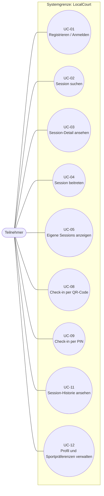
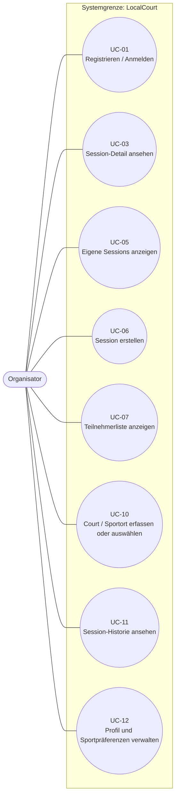

# F2 — Anwendungsfälle

## F2.1 Zweck und Einordnung

Dieser Baustein beschreibt die Anwendungsfälle von LocalCourt. Er konkretisiert die systemunterstützten Interaktionen aus [F1](F1-geschaeftsprozesse.md): Nutzer suchen Sessions, öffnen Details, treten bei, erstellen Sessions, verwalten Teilnehmer und führen Check-ins durch.

F2 beschreibt dabei die fachlich sichtbaren Nutzerziele und Systemreaktionen. Systeminterne Abläufe wie Datenbankabfragen, Komponentenlogik, API-Details, Scheduler oder konkrete Validierungsimplementierungen gehören nicht in F2, sondern in F3, D1/D2, S1, N1/N2 oder die Architekturdokumentation nach arc42.

Die UC-IDs in diesem Dokument bleiben stabil. Sie dienen später als Referenz in Architektur, Tests und Code, damit im Review nachvollziehbar bleibt: Use Case in der Spezifikation → Architekturkomponente oder Sequenz → Implementierung → Test.

## F2.2 Use-Case-Index

| UC-ID | Name | Gruppe | Primärer Akteur | Zugehöriger Geschäftsprozess aus F1 | Zugehörige F1-Aktivitäten | Kurzbeschreibung | Status |
|---|---|---|---|---|---|---|---|
| UC-01 | Registrieren / Anmelden | Zugriff | Teilnehmer, Organisator | GP-02, indirekt GP-01 | GP-02 A2 | Nutzer authentifizieren sich, damit Beitritt, Session-Erstellung, Check-in und Profilfunktionen eindeutig zugeordnet werden können. | MVP |
| UC-02 | Session suchen | Session Discovery | Teilnehmer | GP-01, GP-03 | GP-01 A2-A7, GP-03 A1-A7 | Teilnehmer suchen Sessions nach Ort und optional nach Sportart; Karte und Liste zeigen passende zukünftige Sessions. | MVP |
| UC-03 | Session-Detail ansehen | Session Discovery | Teilnehmer, Organisator | GP-01, GP-02 | GP-01 A8, GP-02 A11-A12 | Nutzer öffnen eine Session und sehen fachlich relevante Details wie Sportart, Ort, Zeit, Kapazität, Organisator und Teilnehmerstatus. | MVP |
| UC-04 | Session beitreten | Teilnahme | Teilnehmer | GP-01 | GP-01 A9-A13 | Ein angemeldeter Teilnehmer tritt einer noch offenen Session bei und erscheint danach in der Teilnehmerliste sowie unter eigenen Sessions. | MVP |
| UC-05 | Eigene Sessions anzeigen | Teilnahme / Organisation | Teilnehmer, Organisator | GP-01, GP-02 | GP-01 A13-A14, GP-02 A11, A22-A23 | Nutzer sehen Sessions, an denen sie teilnehmen oder die sie organisieren. | MVP |
| UC-06 | Session erstellen | Organisation | Organisator | GP-02 | GP-02 A3-A9 | Ein Organisator erstellt eine neue Session mit Sportart, Court/Sportort, Zeit, Dauer, Teilnehmerlimit und Beschreibung. | MVP |
| UC-07 | Teilnehmerliste anzeigen | Organisation | Organisator | GP-02 | GP-02 A11, A17, A22 | Der Organisator sieht die Liste der beigetretenen und eingecheckten Teilnehmer einer Session. | MVP |
| UC-08 | Check-in per QR-Code durchführen | Check-in | Teilnehmer | GP-02 | GP-02 A12-A17 | Ein Teilnehmer checkt über einen vom Organisator bereitgestellten QR-Code für eine Session ein. | MVP |
| UC-09 | Check-in per PIN durchführen | Check-in | Teilnehmer | GP-02 | GP-02 A18-A19 | Ein Teilnehmer checkt alternativ per PIN ein, falls QR-Scan nicht möglich ist. | MVP |
| UC-10 | Court / Sportort erfassen oder auswählen | Organisation / Datenpflege | Organisator | GP-02, indirekt GP-01 | GP-02 A3; GP-01 A6-A8 indirekt | Ein Organisator wählt einen vorhandenen Court aus oder erfasst einen neuen Sportort für eine Session. | MVP, begrenzt |
| UC-11 | Session-Historie ansehen | Historie | Teilnehmer, Organisator | GP-01, GP-02 | GP-01 A18, GP-02 A22-A23 | Nutzer sehen vergangene Sessions als read-only Historie. | MVP, einfach |
| UC-12 | Profil und Sportpräferenzen verwalten | Profil | Teilnehmer, Organisator | GP-01, GP-03 | GP-01 A2-A3, GP-03 A1-A3 | Nutzer verwalten Basisprofil und bevorzugte Sportarten, soweit dies für Suche, Anzeige und Teilnahme nötig ist. | MVP, einfach |

**Status-Legende:** `MVP` bezeichnet Use Cases, die für den ersten funktionsfähigen Produktstand vorgesehen sind. `MVP, begrenzt` bedeutet fachlich relevant, aber mit bewusst reduziertem Umfang. `MVP, einfach` bedeutet, dass nur eine schlanke, nicht erweiterte Basisversion modelliert wird.

## F2.3 Use-Case-Diagramm

### Teilnehmer-Use-Cases

### Organisator-Use-Cases

Die Diagramme zeigen jeweils den primären Akteur außerhalb der Systemgrenze sowie die zugehörigen Use Cases innerhalb der Systemgrenze „LocalCourt". Die zugehörigen Nachbarsysteme wie Supabase Auth, Supabase PostgREST/PostgreSQL und OpenStreetMap/Leaflet gehören nicht zur Systemgrenze und werden im Architekturüberblick [P2](P2-architekturueberblick.md) und in [S1](S1-nachbarsysteme.md) beschrieben.

## F2.4 Detaillierte Use-Case-Spezifikationen

### UC-01 — Registrieren / Anmelden

| Abschnitt | Inhalt |
|---|---|
| Identifier | UC-01 |
| Name | Registrieren / Anmelden |
| Gruppe | Zugriff |
| Ziel | Nutzer können eindeutig und sicher mit LocalCourt interagieren. |
| Kurzbeschreibung | Teilnehmer und Organisatoren melden sich an oder erstellen ein Konto. Erst danach können personenbezogene Aktionen wie Beitritt, Session-Erstellung, Check-in und Profilverwaltung durchgeführt werden. |
| Primärer Akteur | Teilnehmer oder Organisator |
| Unterstützende Akteure / Systeme | Browser / React-Frontend, Supabase Auth |
| Auslöser | Nutzer öffnet eine Funktion, die Anmeldung erfordert, oder wählt bewusst Anmeldung/Registrierung. |
| Vorbedingung | LocalCourt ist erreichbar; Nutzer besitzt Zugang zu einem unterstützten Anmeldeverfahren. |
| Nachbedingung bei Erfolg | Nutzer ist angemeldet und kann geschützte Use Cases ausführen. |
| Nachbedingung bei Fehler | Nutzer bleibt nicht angemeldet; geschützte Aktionen werden nicht ausgeführt. |
| Hauptszenario | 1. Nutzer öffnet Anmeldung oder Registrierung. 2. Nutzer gibt die erforderlichen Zugangsdaten ein. 3. LocalCourt prüft die Anmeldung über Supabase Auth. 4. LocalCourt zeigt den angemeldeten Zustand. 5. Nutzer wird zur zuvor gewünschten Funktion oder zur Startansicht geführt. |
| Alternative Szenarien | Nutzer hat bereits eine gültige Sitzung und wird direkt als angemeldet erkannt. |
| Ausnahmefälle | Ungültige Zugangsdaten, bereits verwendete E-Mail-Adresse, schwaches Passwort oder nicht erreichbarer Auth-Dienst werden verständlich angezeigt. |
| Fachliche Regeln | Geschützte Aktionen dürfen nur angemeldeten Nutzern zugeordnet werden. Rollen sind im MVP fachlich durch die Aktion bestimmt: Wer eine Session erstellt, ist für diese Session Organisator. |
| Bezug zu F1 | GP-02 A2; Voraussetzung für GP-01 A9-A13 und GP-02 A3-A19. |
| Bezug zu Daten | Profile, Auth-Nutzerkennung |
| Bezug zu Benutzerschnittstelle | Anmelde- und Registrierungsansicht; siehe B1. |
| Bezug zu NFR / Qualität | Sicherheit, Datenschutz, einfache Bedienbarkeit, klare Fehlermeldungen. |
| Akzeptanzkriterien | Given ein nicht angemeldeter Nutzer, When er gültige Zugangsdaten eingibt, Then ist er angemeldet. Given ungültige Zugangsdaten, When er die Anmeldung absendet, Then bleibt er abgemeldet und erhält eine verständliche Fehlermeldung. |
| Offene Punkte | Konkretes Anmeldeverfahren: E-Mail/Passwort ist naheliegend; OAuth bleibt nach P1 möglich, aber nicht final festgelegt. |

### UC-02 — Session suchen

| Abschnitt | Inhalt |
|---|---|
| Identifier | UC-02 |
| Name | Session suchen |
| Gruppe | Session Discovery |
| Ziel | Teilnehmer finden passende zukünftige Sport-Sessions in einer gewünschten Region. |
| Kurzbeschreibung | Der Teilnehmer gibt Ort/Region ein und filtert optional nach Sportart. LocalCourt zeigt passende Sessions als Liste und, wenn Kartendaten verfügbar sind, auf einer Karte. |
| Primärer Akteur | Teilnehmer |
| Unterstützende Akteure / Systeme | Browser / React-Frontend, Supabase PostgREST / PostgreSQL, OpenStreetMap / Leaflet |
| Auslöser | Teilnehmer möchte spontan Sport treiben oder neue Sportarten entdecken. |
| Vorbedingung | Es gibt erreichbare Session- und Court-Daten; Anmeldung ist für die Suche nicht zwingend erforderlich, sofern spätere Zugriffsregeln nichts anderes festlegen. |
| Nachbedingung bei Erfolg | Teilnehmer sieht eine Ergebnisliste, auch wenn sie leer ist. |
| Nachbedingung bei Fehler | Keine Suchergebnisse werden als gültig übernommen; Nutzer erhält eine Fehlermeldung oder eine textuelle Fallback-Ansicht. |
| Hauptszenario | 1. Teilnehmer öffnet die Suche. 2. Teilnehmer gibt Ort/Region ein. 3. Teilnehmer wählt optional eine Sportart oder "Alle Sportarten". 4. LocalCourt zeigt passende zukünftige Sessions. 5. LocalCourt zeigt, soweit möglich, Court-Positionen auf einer Karte. |
| Alternative Szenarien | Ohne Sportartfilter werden Sessions mehrerer Sportarten angezeigt. Bei fehlender Karte bleibt die Listenansicht nutzbar. |
| Ausnahmefälle | Ort nicht gefunden, keine Sessions vorhanden, Kartendienst nicht verfügbar oder Netzwerkfehler. |
| Fachliche Regeln | Standardmäßig werden nur zukünftige oder aktive, öffentlich auffindbare Sessions angezeigt. Abgeschlossene Sessions gehören in UC-11. |
| Bezug zu F1 | GP-01 A2-A7; GP-03 A1-A7. |
| Bezug zu Daten | Session, Court, Sportart, Participant-Zählung |
| Bezug zu Benutzerschnittstelle | Suchformular, Filter, Ergebnisliste, Kartenansicht; siehe B1. |
| Bezug zu NFR / Qualität | Performance bei Suche, mobile Nutzbarkeit, Graceful Degradation der Karte. |
| Akzeptanzkriterien | Given Sessions in einer Region, When der Teilnehmer nach dieser Region sucht, Then werden passende zukünftige Sessions angezeigt. Given keine Treffer, When die Suche abgeschlossen ist, Then erscheint eine leere Ergebnisansicht ohne Systemfehler. |
| Offene Punkte | Automatische Standortermittlung bleibt datenschutzsensibel und ist nicht als Pflichtfunktion modelliert. |

### UC-03 — Session-Detail ansehen

| Abschnitt | Inhalt |
|---|---|
| Identifier | UC-03 |
| Name | Session-Detail ansehen |
| Gruppe | Session Discovery |
| Ziel | Nutzer können beurteilen, ob eine Session für sie relevant ist. |
| Kurzbeschreibung | Aus Suche, eigener Session-Liste oder Historie öffnet ein Nutzer die Detailansicht. Angezeigt werden fachliche Details wie Sportart, Zeit, Ort, Beschreibung, Kapazität, Organisator und Teilnehmerstatus. |
| Primärer Akteur | Teilnehmer oder Organisator |
| Unterstützende Akteure / Systeme | Browser / React-Frontend, Supabase PostgREST / PostgreSQL, OpenStreetMap / Leaflet |
| Auslöser | Nutzer wählt eine Session aus einer Liste oder Karte aus. |
| Vorbedingung | Die Session existiert und ist für den Nutzer sichtbar. |
| Nachbedingung bei Erfolg | Detailinformationen sind angezeigt; mögliche Folgeaktionen sind sichtbar. |
| Nachbedingung bei Fehler | Nutzer bleibt in der vorherigen Ansicht oder sieht eine Fehlerseite ohne Änderung an Session-Daten. |
| Hauptszenario | 1. Nutzer wählt eine Session. 2. LocalCourt lädt die fachlichen Details. 3. LocalCourt zeigt Zeit, Sportart, Court/Sportort, Beschreibung, Kapazität und Status. 4. LocalCourt zeigt abhängig vom Nutzerstatus mögliche Aktionen wie Beitreten oder Check-in. |
| Alternative Szenarien | Organisator sieht zusätzliche Informationen wie Teilnehmerliste oder Check-in-Status. Abgeschlossene Sessions werden read-only angezeigt. |
| Ausnahmefälle | Session wurde gelöscht, ist nicht sichtbar oder Daten können nicht geladen werden. |
| Fachliche Regeln | Detailansicht darf keine nicht benötigten privaten Profildaten anderer Nutzer anzeigen. Aktionen richten sich nach Status, Rolle und Teilnahmezustand. |
| Bezug zu F1 | GP-01 A8, A14; GP-02 A11-A12. |
| Bezug zu Daten | Session, Court, Participant, Profile |
| Bezug zu Benutzerschnittstelle | Session-Detailansicht; siehe B1. |
| Bezug zu NFR / Qualität | Datenschutz, Verständlichkeit, mobile Bedienbarkeit. |
| Akzeptanzkriterien | Given eine sichtbare Session, When der Nutzer sie öffnet, Then werden die Kerndaten angezeigt. Given eine abgeschlossene Session, When sie geöffnet wird, Then sind keine Beitritts- oder Check-in-Aktionen verfügbar. |
| Offene Punkte | Umfang der sichtbaren Profilinformationen anderer Teilnehmer ist in D1/D2 und B1 zu konkretisieren. |

### UC-04 — Session beitreten

| Abschnitt | Inhalt |
|---|---|
| Identifier | UC-04 |
| Name | Session beitreten |
| Gruppe | Teilnahme |
| Ziel | Ein Teilnehmer reserviert seinen Platz in einer Session. |
| Kurzbeschreibung | Ein angemeldeter Teilnehmer tritt einer offenen Session bei. Nach erfolgreichem Beitritt erscheint er in der Teilnehmerliste und die Session in seinen eigenen Sessions. |
| Primärer Akteur | Teilnehmer |
| Unterstützende Akteure / Systeme | Browser / React-Frontend, Supabase Auth, Supabase PostgREST / PostgreSQL |
| Auslöser | Teilnehmer klickt in der Detailansicht auf "Beitreten". |
| Vorbedingung | Nutzer ist angemeldet; Session ist sichtbar, noch nicht abgeschlossen und nicht voll. |
| Nachbedingung bei Erfolg | Participant-Eintrag existiert; Teilnehmerstatus ist beigetreten. |
| Nachbedingung bei Fehler | Kein Participant-Eintrag wird erzeugt oder verändert; Nutzer erhält Feedback. |
| Hauptszenario | 1. Teilnehmer öffnet eine Session. 2. Teilnehmer wählt "Beitreten". 3. LocalCourt prüft Anmeldestatus, Sessionstatus und Kapazität. 4. LocalCourt trägt den Nutzer als Teilnehmer ein. 5. LocalCourt bestätigt den Beitritt. |
| Alternative Szenarien | Nutzer ist nicht angemeldet und wird zuerst zu UC-01 geführt. |
| Ausnahmefälle | Session ist voll, abgeschlossen, nicht mehr sichtbar oder Nutzer ist bereits beigetreten. |
| Fachliche Regeln | Ein Nutzer darf derselben Session nicht mehrfach beitreten. Kapazitätsgrenzen werden eingehalten. Wartelisten sind out of scope (P1 NG-10). Die vollständige Beitritts- und Kapazitätsregel ist in F3 AF-01 spezifiziert. |
| Bezug zu F1 | GP-01 A9-A13. |
| Bezug zu Daten | Session, Participant, Profile |
| Bezug zu Benutzerschnittstelle | Beitrittsaktion in der Session-Detailansicht; siehe B1. |
| Bezug zu NFR / Qualität | Konsistenz bei parallelen Beitritten, verständliche Fehler, Datenschutz. |
| Akzeptanzkriterien | Given eine offene Session mit freier Kapazität, When ein angemeldeter Teilnehmer beitritt, Then ist er Teilnehmer der Session. Given eine volle Session, When ein Teilnehmer beitreten möchte, Then wird kein Beitritt gespeichert und die Session wird als voll erklärt. |
| Offene Punkte | Verhalten bei gleichzeitigem Beitritt mehrerer Nutzer ist in F3 AF-01 fachlich präzisiert (Wer-zuerst-kommt, keine Überbuchung); die technische Umsetzung der Atomarität folgt in D2/N2. |

### UC-05 — Eigene Sessions anzeigen

| Abschnitt | Inhalt |
|---|---|
| Identifier | UC-05 |
| Name | Eigene Sessions anzeigen |
| Gruppe | Teilnahme / Organisation |
| Ziel | Nutzer behalten Überblick über Sessions, an denen sie teilnehmen oder die sie organisieren. |
| Kurzbeschreibung | LocalCourt zeigt dem angemeldeten Nutzer seine relevanten Sessions. Dazu gehören beigetretene Sessions und selbst erstellte Sessions. |
| Primärer Akteur | Teilnehmer oder Organisator |
| Unterstützende Akteure / Systeme | Browser / React-Frontend, Supabase Auth, Supabase PostgREST / PostgreSQL |
| Auslöser | Nutzer öffnet "Meine Sessions" oder kehrt nach Beitritt/Erstellung dorthin zurück. |
| Vorbedingung | Nutzer ist angemeldet. |
| Nachbedingung bei Erfolg | Eigene Sessions sind nach sinnvollen Kriterien angezeigt, z.B. bevorstehend und vergangen getrennt. |
| Nachbedingung bei Fehler | Bestehende Daten bleiben unverändert; Nutzer erhält Feedback. |
| Hauptszenario | 1. Nutzer öffnet "Meine Sessions". 2. LocalCourt ermittelt Sessions mit Teilnahme oder Organisatorrolle. 3. LocalCourt zeigt bevorstehende Sessions. 4. Nutzer kann eine Session-Detailansicht öffnen. |
| Alternative Szenarien | Wenn keine eigenen Sessions vorhanden sind, zeigt LocalCourt einen leeren Zustand. Vergangene Sessions verweisen auf UC-11. |
| Ausnahmefälle | Nutzer ist nicht angemeldet oder Daten können nicht geladen werden. |
| Fachliche Regeln | Nutzer sehen nur Sessions, zu denen sie fachlich berechtigt sind. Organisierte und beigetretene Sessions dürfen unterscheidbar sein. |
| Bezug zu F1 | GP-01 A13-A14; GP-02 A11, A22-A23. |
| Bezug zu Daten | Session, Participant, Profile |
| Bezug zu Benutzerschnittstelle | Übersicht "Meine Sessions"; siehe B1. |
| Bezug zu NFR / Qualität | Übersichtlichkeit, mobile Nutzbarkeit, Performance. |
| Akzeptanzkriterien | Given ein angemeldeter Nutzer mit beigetretenen Sessions, When er "Meine Sessions" öffnet, Then werden diese Sessions angezeigt. Given keine eigenen Sessions, Then wird ein leerer Zustand angezeigt. |
| Offene Punkte | Konkrete Sortierung und Gruppierung sind in B1 festzulegen. |

### UC-06 — Session erstellen

| Abschnitt | Inhalt |
|---|---|
| Identifier | UC-06 |
| Name | Session erstellen |
| Gruppe | Organisation |
| Ziel | Ein Organisator veröffentlicht eine neue Sport-Session. |
| Kurzbeschreibung | Der Organisator erfasst Sportart, Court/Sportort, Startzeit, Dauer, Teilnehmerlimit und Beschreibung. Nach erfolgreicher Erstellung ist die Session auffindbar und der Organisator ist der Session zugeordnet. |
| Primärer Akteur | Organisator |
| Unterstützende Akteure / Systeme | Browser / React-Frontend, Supabase Auth, Supabase PostgREST / PostgreSQL |
| Auslöser | Organisator möchte ein Training oder Treffen ankündigen. |
| Vorbedingung | Organisator ist angemeldet; notwendige Angaben sind vorhanden; ein Court wird ausgewählt oder über UC-10 erfasst. |
| Nachbedingung bei Erfolg | Neue Session existiert im Status geplant; Organisator ist zugeordnet; Session kann gefunden werden. |
| Nachbedingung bei Fehler | Keine unvollständige Session wird veröffentlicht. |
| Hauptszenario | 1. Organisator öffnet das Formular zur Session-Erstellung. 2. Organisator gibt Sessiondaten ein. 3. Organisator wählt oder erfasst den Sportort. 4. LocalCourt prüft Pflichtangaben und fachliche Grenzen. 5. LocalCourt erstellt die Session. 6. LocalCourt zeigt die Detailansicht mit Bestätigung. |
| Alternative Szenarien | Organisator bricht die Erstellung ab; es wird keine Session gespeichert. |
| Ausnahmefälle | Pflichtangaben fehlen, Zeitpunkt liegt in der Vergangenheit, Teilnehmerlimit ist ungültig, Court-Daten sind unvollständig oder Nutzer ist nicht angemeldet. |
| Fachliche Regeln | Sessions benötigen Sportart, Zeitpunkt, Dauer, Court/Sportort und Teilnehmerlimit. Session-Bearbeitung nach Erstellung ist nach F1 aktuell nicht modelliert. |
| Bezug zu F1 | GP-02 A3-A9. |
| Bezug zu Daten | Session, Court, Sportart, Participant, Profile |
| Bezug zu Benutzerschnittstelle | Session-Erstellformular; siehe B1. |
| Bezug zu NFR / Qualität | Erstellung soll mit niedriger Einstiegshürde möglich sein; P1 SC-02 nennt unter 2 Minuten als Ziel. |
| Akzeptanzkriterien | Given ein angemeldeter Organisator mit gültigen Angaben, When er die Erstellung absendet, Then existiert eine geplante Session. Given fehlende Pflichtangaben, Then wird keine Session veröffentlicht und die Eingaben werden erklärt. |
| Offene Punkte | Umgang mit Session-Serien und späterer Bearbeitung bleibt außerhalb des MVP. |

### UC-07 — Teilnehmerliste anzeigen

| Abschnitt | Inhalt |
|---|---|
| Identifier | UC-07 |
| Name | Teilnehmerliste anzeigen |
| Gruppe | Organisation |
| Ziel | Der Organisator kennt Teilnehmerzahl und Check-in-Status seiner Session. |
| Kurzbeschreibung | In der Session-Detailansicht sieht der Organisator eine Liste der beigetretenen Teilnehmer. Während der Check-in-Phase wird sichtbar, wer bereits eingecheckt ist. |
| Primärer Akteur | Organisator |
| Unterstützende Akteure / Systeme | Browser / React-Frontend, Supabase Auth, Supabase PostgREST / PostgreSQL |
| Auslöser | Organisator öffnet eine eigene Session. |
| Vorbedingung | Nutzer ist angemeldet und Organisator der Session. |
| Nachbedingung bei Erfolg | Teilnehmerliste und Statusinformationen sind angezeigt. |
| Nachbedingung bei Fehler | Keine Teilnehmerdaten werden unberechtigt angezeigt. |
| Hauptszenario | 1. Organisator öffnet eine eigene Session. 2. LocalCourt prüft die Berechtigung. 3. LocalCourt zeigt Teilnehmer und deren Teilnahme- bzw. Check-in-Status. 4. Organisator kann die Liste während der Session erneut laden oder aktualisiert sehen. |
| Alternative Szenarien | Bei keiner Teilnahme zeigt LocalCourt eine leere Liste mit Teilnehmerzahl 0. |
| Ausnahmefälle | Nutzer ist nicht Organisator, Session existiert nicht oder Daten können nicht geladen werden. |
| Fachliche Regeln | Teilnehmerlisten sind nicht als öffentliches soziales Verzeichnis zu verstehen. Sichtbarkeit folgt Datenschutz- und Berechtigungsregeln. |
| Bezug zu F1 | GP-02 A11, A17, A22. |
| Bezug zu Daten | Session, Participant, Profile |
| Bezug zu Benutzerschnittstelle | Teilnehmerliste in der Session-Detail- oder Organisatoransicht; siehe B1. |
| Bezug zu NFR / Qualität | Datenschutz, klare Statusanzeige, Aktualität. |
| Akzeptanzkriterien | Given ein Organisator mit eigener Session, When er die Teilnehmerliste öffnet, Then sieht er die beigetretenen Teilnehmer. Given ein nicht berechtigter Nutzer, Then erhält er keine Teilnehmerliste mit geschützten Daten. |
| Offene Punkte | Umfang der angezeigten Profildaten ist in D1/D2 und B1 festzulegen. |

### UC-08 — Check-in per QR-Code durchführen

| Abschnitt | Inhalt |
|---|---|
| Identifier | UC-08 |
| Name | Check-in per QR-Code durchführen |
| Gruppe | Check-in |
| Ziel | Ein Teilnehmer bestätigt seine Anwesenheit schnell vor Ort. |
| Kurzbeschreibung | Der Teilnehmer scannt einen von LocalCourt bereitgestellten QR-Code zur Session. LocalCourt prüft die Session und markiert den Teilnehmer als eingecheckt. |
| Primärer Akteur | Teilnehmer |
| Unterstützende Akteure / Systeme | Browser / React-Frontend, Supabase Auth, Supabase PostgREST / PostgreSQL |
| Auslöser | Teilnehmer scannt den QR-Code am Treffpunkt. |
| Vorbedingung | Teilnehmer ist angemeldet und der Session beigetreten; Session ist in einer Check-in-fähigen Phase; QR-Code gehört zur Session. |
| Nachbedingung bei Erfolg | Participant-Status ist eingecheckt; Organisator kann den Status sehen. |
| Nachbedingung bei Fehler | Participant-Status bleibt unverändert; Nutzer erhält Feedback. |
| Hauptszenario | 1. Organisator zeigt QR-Code für die Session. 2. Teilnehmer scannt den QR-Code. 3. LocalCourt öffnet die Check-in-Ansicht. 4. LocalCourt prüft Zugehörigkeit und Sessionstatus. 5. LocalCourt markiert den Teilnehmer als eingecheckt. 6. Teilnehmer sieht eine Bestätigung. |
| Alternative Szenarien | Falls der QR-Scan nicht funktioniert, nutzt der Teilnehmer UC-09. |
| Ausnahmefälle | QR-Code ist ungültig, Session ist nicht check-in-fähig, Teilnehmer ist nicht beigetreten, Nutzer ist nicht angemeldet oder der Check-in wurde bereits durchgeführt. |
| Fachliche Regeln | Check-in setzt Teilnahme voraus. Mehrfacher Check-in ändert den fachlichen Endzustand nicht. |
| Bezug zu F1 | GP-02 A12-A17. |
| Bezug zu Daten | Session, Participant, Check-in-Zeitpunkt |
| Bezug zu Benutzerschnittstelle | Check-in-Ansicht und Bestätigung; siehe B1. |
| Bezug zu NFR / Qualität | Schnelle mobile Bedienbarkeit, Sicherheit gegen falsche Session-Zuordnung, verständliche Fehlermeldungen. |
| Akzeptanzkriterien | Given ein beigetretener angemeldeter Teilnehmer und eine aktive Check-in-Phase, When er den gültigen QR-Code nutzt, Then ist er eingecheckt. Given ein ungültiger QR-Code, Then bleibt der Status unverändert und der Nutzer erhält eine Fehlermeldung. |
| Offene Punkte | Exakter Zeitraum der Check-in-Fähigkeit ist in F3 AF-02/AF-03 festgelegt: Check-in ist nur möglich, solange die Session im Status active ist (Start bis Start + Dauer). |

### UC-09 — Check-in per PIN durchführen

| Abschnitt | Inhalt |
|---|---|
| Identifier | UC-09 |
| Name | Check-in per PIN durchführen |
| Gruppe | Check-in |
| Ziel | Teilnehmer können auch ohne funktionierenden QR-Scan einchecken. |
| Kurzbeschreibung | Der Teilnehmer gibt eine zur Session gehörende PIN ein. LocalCourt prüft die PIN und markiert den Teilnehmer als eingecheckt, wenn alle Voraussetzungen erfüllt sind. |
| Primärer Akteur | Teilnehmer |
| Unterstützende Akteure / Systeme | Browser / React-Frontend, Supabase Auth, Supabase PostgREST / PostgreSQL |
| Auslöser | QR-Scan ist nicht möglich oder der Teilnehmer wählt manuelle PIN-Eingabe. |
| Vorbedingung | Teilnehmer ist angemeldet und der Session beigetreten; Session ist check-in-fähig; Organisator stellt die PIN bereit. |
| Nachbedingung bei Erfolg | Participant-Status ist eingecheckt. |
| Nachbedingung bei Fehler | Participant-Status bleibt unverändert. |
| Hauptszenario | 1. Teilnehmer öffnet die PIN-Check-in-Ansicht. 2. Teilnehmer gibt die Session-PIN ein. 3. LocalCourt prüft PIN, Sessionstatus und Teilnahme. 4. LocalCourt markiert den Teilnehmer als eingecheckt. 5. Teilnehmer sieht eine Bestätigung. |
| Alternative Szenarien | Teilnehmer kehrt zum QR-Code-Check-in zurück. |
| Ausnahmefälle | PIN ist falsch, Session ist nicht check-in-fähig, Teilnehmer ist nicht beigetreten oder Nutzer ist nicht angemeldet. |
| Fachliche Regeln | PIN-Check-in ist fachlich gleichwertig zum QR-Check-in. Falsche PINs dürfen keinen Check-in erzeugen. |
| Bezug zu F1 | GP-02 A18-A19. |
| Bezug zu Daten | Session, Participant, Check-in-Zeitpunkt |
| Bezug zu Benutzerschnittstelle | PIN-Eingabe und Bestätigung; siehe B1. |
| Bezug zu NFR / Qualität | Usability als Fallback, Sicherheit, klare Fehlertexte. |
| Akzeptanzkriterien | Given ein beigetretener angemeldeter Teilnehmer und eine gültige PIN, When er die PIN eingibt, Then ist er eingecheckt. Given eine falsche PIN, Then bleibt der Teilnehmer nicht eingecheckt. |
| Offene Punkte | Länge und Erzeugungsregel der PIN sind in F3 AF-04 festgelegt: 4-stellige numerische PIN, je Session zufällig erzeugt und pro Session eindeutig geprüft. |

### UC-10 — Court / Sportort erfassen oder auswählen

| Abschnitt | Inhalt |
|---|---|
| Identifier | UC-10 |
| Name | Court / Sportort erfassen oder auswählen |
| Gruppe | Organisation / Datenpflege |
| Ziel | Sessions sind einem auffindbaren Sportort zugeordnet. |
| Kurzbeschreibung | Bei der Session-Erstellung wählt der Organisator einen vorhandenen Court/Sportort aus. Falls der Sportort noch nicht vorhanden ist, kann er im begrenzten MVP-Umfang erfasst werden. |
| Primärer Akteur | Organisator |
| Unterstützende Akteure / Systeme | Browser / React-Frontend, Supabase PostgREST / PostgreSQL, OpenStreetMap / Leaflet |
| Auslöser | Organisator erstellt eine Session und benötigt einen Sportort. |
| Vorbedingung | Organisator ist angemeldet; Name und Ort des Courts sind bekannt. |
| Nachbedingung bei Erfolg | Session kann einem bestehenden oder neu erfassten Court zugeordnet werden. |
| Nachbedingung bei Fehler | Es wird kein unvollständiger Court als Grundlage einer Session verwendet. |
| Hauptszenario | 1. Organisator sucht oder öffnet die Court-Auswahl. 2. LocalCourt zeigt vorhandene passende Courts. 3. Organisator wählt einen Court aus. 4. LocalCourt übernimmt den Court in die Session-Erstellung. |
| Alternative Szenarien | Organisator erfasst einen neuen Court mit Mindestangaben. Danach steht der Court für die Session-Erstellung zur Verfügung. |
| Ausnahmefälle | Pflichtangaben fehlen, Ort ist uneindeutig, Karte kann nicht geladen werden oder ein Court existiert bereits offensichtlich doppelt. |
| Fachliche Regeln | Ein Court benötigt mindestens einen Namen und eine Ortsangabe. Koordinaten verbessern die Kartendarstellung, ersetzen aber nicht die fachliche Benennung. |
| Bezug zu F1 | GP-02 A3; indirekt relevant für GP-01 A6-A8, weil Court-Daten dort zur Anzeige und Auffindbarkeit genutzt werden. |
| Bezug zu Daten | Court, Sportart, Session |
| Bezug zu Benutzerschnittstelle | Court-Auswahl und einfache Erfassungsmaske; siehe B1. |
| Bezug zu NFR / Qualität | Datenqualität, einfache Bedienbarkeit, Fallback ohne Karte. |
| Akzeptanzkriterien | Given ein vorhandener Court, When ein Organisator ihn auswählt, Then kann die Session mit diesem Court erstellt werden. Given gültige neue Court-Daten, When der Organisator sie erfasst, Then ist der Court für die Session auswählbar. |
| Offene Punkte | Dublettenprüfung und Geocoding-Genauigkeit sind später zu konkretisieren. |

### UC-11 — Session-Historie ansehen

| Abschnitt | Inhalt |
|---|---|
| Identifier | UC-11 |
| Name | Session-Historie ansehen |
| Gruppe | Historie |
| Ziel | Nutzer können vergangene eigene Sessions nachvollziehen. |
| Kurzbeschreibung | Teilnehmer und Organisatoren sehen vergangene Sessions, an denen sie beteiligt waren. Die Historie ist im MVP read-only und dient nicht als Reporting- oder Bewertungssystem. |
| Primärer Akteur | Teilnehmer oder Organisator |
| Unterstützende Akteure / Systeme | Browser / React-Frontend, Supabase Auth, Supabase PostgREST / PostgreSQL |
| Auslöser | Nutzer öffnet die Historie oder den Bereich vergangener Sessions. |
| Vorbedingung | Nutzer ist angemeldet; es existieren abgeschlossene eigene Sessions oder ein leerer Zustand ist möglich. |
| Nachbedingung bei Erfolg | Vergangene Sessions werden angezeigt oder ein leerer Zustand wird erklärt. |
| Nachbedingung bei Fehler | Keine Daten werden verändert; Nutzer erhält Feedback. |
| Hauptszenario | 1. Nutzer öffnet die Historie. 2. LocalCourt lädt vergangene Sessions mit Bezug zum Nutzer. 3. LocalCourt zeigt die Sessions in einer read-only Übersicht. 4. Nutzer kann eine Detailansicht öffnen. |
| Alternative Szenarien | Organisator sieht einfache Check-in-Informationen zu eigenen vergangenen Sessions, sofern sie bereits in F1 vorgesehen sind. |
| Ausnahmefälle | Nutzer ist nicht angemeldet oder Daten können nicht geladen werden. |
| Fachliche Regeln | Historie ist kein Admin-Report, kein Rating und keine Statistikplattform. |
| Bezug zu F1 | GP-01 A18; GP-02 A22-A23. |
| Bezug zu Daten | Session, Participant, Check-in-Zeitpunkt |
| Bezug zu Benutzerschnittstelle | Historienübersicht und read-only Detailansicht; siehe B1. |
| Bezug zu NFR / Qualität | Datenschutz, Übersichtlichkeit, Nachvollziehbarkeit. |
| Akzeptanzkriterien | Given abgeschlossene eigene Sessions, When der Nutzer die Historie öffnet, Then werden diese angezeigt. Given keine Historie, Then erscheint ein leerer Zustand ohne Fehler. |
| Offene Punkte | Umfang einfacher Organisator-Ergebnisdaten ist von Admin-Reports abzugrenzen. |

### UC-12 — Profil und Sportpräferenzen verwalten

| Abschnitt | Inhalt |
|---|---|
| Identifier | UC-12 |
| Name | Profil und Sportpräferenzen verwalten |
| Gruppe | Profil |
| Ziel | Nutzer verwalten Basisinformationen, die für Anzeige und Sportsuche relevant sind. |
| Kurzbeschreibung | Nutzer können ihren Anzeigenamen und bevorzugte Sportarten verwalten. Das Profil bleibt auf MVP-relevante Angaben begrenzt. |
| Primärer Akteur | Teilnehmer oder Organisator |
| Unterstützende Akteure / Systeme | Browser / React-Frontend, Supabase Auth, Supabase PostgREST / PostgreSQL |
| Auslöser | Nutzer öffnet seine Profileinstellungen. |
| Vorbedingung | Nutzer ist angemeldet. |
| Nachbedingung bei Erfolg | Geänderte Profilinformationen und Sportpräferenzen sind gespeichert. |
| Nachbedingung bei Fehler | Vorherige Profilinformationen bleiben erhalten. |
| Hauptszenario | 1. Nutzer öffnet das Profil. 2. LocalCourt zeigt aktuelle Basisdaten und Sportpräferenzen. 3. Nutzer ändert zulässige Angaben. 4. LocalCourt prüft Pflichtfelder und speichert Änderungen. 5. LocalCourt zeigt die aktualisierten Daten. |
| Alternative Szenarien | Nutzer bricht die Bearbeitung ab; es werden keine Änderungen gespeichert. |
| Ausnahmefälle | Pflichtangaben fehlen, Datenformat ist ungültig oder Speichern schlägt fehl. |
| Fachliche Regeln | Profilinformationen werden auf notwendige Basisdaten begrenzt. Sportpräferenzen dürfen die Suche unterstützen, ersetzen aber nicht die manuelle Filterung. |
| Bezug zu F1 | GP-01 A2-A3; GP-03 A1-A3. |
| Bezug zu Daten | Profile, Sportart |
| Bezug zu Benutzerschnittstelle | Profileinstellungen; siehe B1. |
| Bezug zu NFR / Qualität | Datenschutz, einfache Bedienbarkeit, Datenminimierung. |
| Akzeptanzkriterien | Given ein angemeldeter Nutzer, When er gültige Profiländerungen speichert, Then werden diese beim erneuten Öffnen angezeigt. Given ungültige Angaben, Then bleibt das bestehende Profil erhalten und der Fehler wird erklärt. |
| Offene Punkte | Profilbild ist in P1 erwähnt, aber für F1 nicht zentral; MVP-Umfang ist im Team zu bestätigen. |

## F2.5 Konsistenzprüfung mit F1, P1 und P2

| Use Case | Geschäftsprozess aus F1 | P1-Ziel oder Scope-Bezug | P2-Nachbarsysteme | Bemerkung zur Konsistenz |
|---|---|---|---|---|
| UC-01 | GP-02 A2; Voraussetzung für geschützte Aktionen | Authentifizierung, Profile, DSGVO | NB-01, NB-02 | Passt zu Supabase Auth und Web-UI. |
| UC-02 | GP-01 A2-A7, GP-03 A1-A7 | G-02, G-03, Session-Discovery | NB-01, NB-03, NB-04 | Kernfunktion für Finden lokaler Sportaktivitäten. |
| UC-03 | GP-01 A8, GP-02 A11-A12 | Web-UI für Session-Verwaltung | NB-01, NB-03, NB-04 | Detailansicht verbindet Suche, Beitritt und Organisation. |
| UC-04 | GP-01 A9-A13 | Teilnehmer-Verwaltung, Kapazität | NB-01, NB-02, NB-03 | Kapazität ist harte Grenze ohne Warteliste (P1 NG-10). Beitritts- und Kapazitätslogik ist in F3 AF-01 präzisiert. |
| UC-05 | GP-01 A13-A14, GP-02 A11, A22-A23 | Session-Verwaltung, Nutzerübersicht | NB-01, NB-03 | Unterstützt Orientierung nach Beitritt und Erstellung. |
| UC-06 | GP-02 A3-A9 | Session-Erstellung, SC-02 | NB-01, NB-02, NB-03 | Kernfunktion des Organisators. |
| UC-07 | GP-02 A11, A17, A22 | Teilnehmer-Verwaltung, Check-in | NB-01, NB-03 | Keine Admin-Reports; nur Session-bezogene Liste. |
| UC-08 | GP-02 A12-A17 | Check-in | NB-01, NB-02, NB-03 | QR-Code-Library ist clientseitige Hilfsfunktion, kein eigenes Nachbarsystem in P2. |
| UC-09 | GP-02 A18-A19 | Check-in-Fallback | NB-01, NB-02, NB-03 | Fallback für mobile Nutzbarkeit. |
| UC-10 | GP-02 A3; indirekt relevant für GP-01 A6-A8 | Court-/Sportplatz-Verzeichnis | NB-01, NB-03, NB-04 | Primär Teil der Session-Erstellung; GP-01 nutzt Court-Daten nur für Anzeige und Auffindbarkeit. |
| UC-11 | GP-01 A18, GP-02 A22-A23 | Session-Historie, keine Reports | NB-01, NB-03 | Read-only Historie, kein Bewertungs- oder Reportingmodul. |
| UC-12 | GP-01 A2-A3, GP-03 A1-A3 | Nutzer-Profile, Sportpräferenzen | NB-01, NB-02, NB-03 | Beschränkt auf MVP-relevante Profilangaben. |

## F2.6 Nicht als Use Case modelliert

| Thema | Begründung |
|---|---|
| Benachrichtigungen | In F1 ausdrücklich ausgeschlossen; würde zusätzliche E-Mail-, SMS- oder Push-Systeme erfordern. |
| Messaging | Direct Messaging ist nach P1/F1 out of scope und würde Moderation, Datenschutz und Missbrauchsbehandlung erhöhen. |
| Ratings / Reviews | Nach P1/F1 ausgeschlossen; nicht nötig für die Koordination des MVP. |
| Zahlung | Keine monetären Transaktionen; LocalCourt ist keine Zahlungs- oder Buchungsplattform. |
| Admin-Reports | F1 schließt Admin-Funktionen aus; UC-11 bleibt read-only Nutzerhistorie. |
| Native Mobile App | P1 setzt auf responsive Web-UI statt nativer Apps. |
| KI-Features | P1/P2 schließen KI-Integration aus; Discovery erfolgt über Filter und Karte. |
| Kommerzielle Court-Buchung | LocalCourt koordiniert informelle Sport-Sessions, keine verbindlichen kommerziellen Reservierungen. |
| Wartelisten | Nach P1-Anpassung explizit out of scope (P1 NG-10). Ohne Benachrichtigungskanal fachlich nicht sinnvoll; Kapazität ist eine harte Grenze (F3 AF-01). Der frühere Scope-Konflikt zwischen P1 und F1/F2 ist damit aufgelöst. |
| Session-Serien | F1 modelliert keine Cross-Process-Serien. Jede Session ist im MVP unabhängig. |
| Session-Bearbeitung nach Erstellung | F1 schließt Modifikation nach Erstellung als MVP-Vereinfachung aus. |
| Session-Kommentare | P1 erwähnt externe Koordination bzw. Kommentare nur indirekt im Out-of-Scope-Kontext; F1 modelliert keinen Kommentarprozess. |

## F2.7 Cross-References / Weiterverwendung

| Block | Relevanz für F2 |
|---|---|
| [F1](F1-geschaeftsprozesse.md) | Grundlage der Geschäftsprozesse, Aktivitäten, Akteure und bewussten Ausschlüsse. |
| [F3](F3-anwendungsfunktionen.md) | Konkretisiert funktionale Detailanforderungen, Validierungsregeln, Statusübergänge und systeminterne fachliche Regeln. |
| [D1](D1-datenmodell.md) | Konkretisiert fachliche Datenobjekte wie `session`, `court`, `participant`, `profile`, `sport` und `sport_preference`. |
| [D2](D2-datentypen.md) | Definiert Datentypen, Wertebereiche, Statuswerte und Validierungsregeln. |
| [B1](B1-dialogspezifikation.md) | Konkretisiert die Dialoge für Suche, Detailansicht, Erstellung, Check-in, Profil und Historie. |
| [S1](S1-nachbarsysteme.md) | Nachbarsysteme und Schnittstellendetails zu Browser, Supabase Auth, Supabase PostgREST und OpenStreetMap/Leaflet. |
| [N1](N1-nichtfunktionale-anforderungen.md) | Konkretisiert Qualitätsanforderungen wie Usability, Datenschutz, Performance, Sicherheit und Free-/Student-Tier-Betrieb. |
| N2 | Geplant: technische Umsetzung der nichtfunktionalen Anforderungen, Tests, Monitoring und Sicherheitsmaßnahmen. |
| E2 | Geplant: Glossar und Begriffsklärungen, insbesondere konsistente Begriffe wie Session, Court/Sportort, Participant/Teilnehmer, Profile/Profil und Check-in. |

## F2.8 Zusammenfassung

F2 deckt die wichtigsten Nutzerziele des MVP ab: anmelden, Sessions suchen, Details ansehen, Sessions beitreten, eigene Sessions überblicken, Sessions erstellen, Teilnehmer verwalten, Check-ins durchführen, Sportorte nutzen, Historie ansehen und Basisprofil pflegen.

Für MVP und Review besonders wichtig sind UC-02, UC-03, UC-04, UC-06, UC-07, UC-08 und UC-09, weil sie die Kernprozesse aus F1 direkt tragen. UC-01, UC-05, UC-10, UC-11 und UC-12 sind unterstützend, aber für einen konsistenten End-to-End-Ablauf ebenfalls relevant.

Die stabilen IDs UC-01 bis UC-12 müssen später in Architektur, Tests und Code wiederzufinden sein. Besonders die Kette UC-02 → UC-03 → UC-04 sowie UC-06 → UC-07 → UC-08/UC-09 sollte im Review als durchgängiger Pfad nachweisbar sein.

## F2.9 Eingesetzte KI-Werkzeuge

| Aspekt | Inhalt |
|---|---|
| Werkzeug | Codex / ChatGPT |
| Verwendung | Entwurf, Strukturierung, Formulierung prüfbarer Akzeptanzkriterien und Konsistenzprüfung. |
| Prüfung | Inhalte wurden gegen [P1](P1-ziele-rahmenbedingungen.md), [P2](P2-architekturueberblick.md), [F1](F1-geschaeftsprozesse.md), [F3](F3-anwendungsfunktionen.md), [D1](D1-datenmodell.md), [D2](D2-datentypen.md), [B1](B1-dialogspezifikation.md), [S1](S1-nachbarsysteme.md), [N1](N1-nichtfunktionale-anforderungen.md), Repository-Vorgaben und Teamentscheidungen geprüft und manuell überarbeitet. |
| Fachliche Verantwortung | Bleibt beim Team. |
