# F2 — Anwendungsfälle

## F2.1 Zweck und Einordnung

Dieser Baustein beschreibt die Anwendungsfälle von LocalCourt. Er konkretisiert die systemunterstützten Interaktionen aus [F1](F1-geschaeftsprozesse.md): Nutzer suchen Sessions, öffnen Details, treten bei, erstellen Sessions, verwalten Teilnehmer und führen Check-ins durch.

F2 beschreibt dabei die fachlich sichtbaren Nutzerziele und Systemreaktionen. Systeminterne Abläufe wie Datenbankabfragen, Komponentenlogik, API-Details, Scheduler oder konkrete Validierungsimplementierungen gehören nicht in F2, sondern in F3, D1/D2, S1, N1/N2 oder die Architekturdokumentation nach arc42.

Die Akzeptanzkriterien je Use Case dienen als manuelle Prüfgrundlage (Festlegung in [N1.3](N1-nichtfunktionale-anforderungen.md#n13-bewusst-nicht-verfolgte-qualitätsziele)) und werden durch die nichtfunktionalen Prüfkriterien in [N1.2](N1-nichtfunktionale-anforderungen.md#n12-qualitätsziele) ergänzt.

Die UC-IDs in diesem Dokument bleiben stabil. Sie dienen später als Referenz in Architektur, Tests und Code, damit im Review nachvollziehbar bleibt: Use Case in der Spezifikation → Architekturkomponente oder Sequenz → Implementierung → Test.

## F2.2 Use-Case-Übersicht

Das Diagramm zeigt eine einzige Systemgrenze „LocalCourt" mit beiden Akteuren außerhalb: Teilnehmer und Organisator. Jeder Use Case erscheint genau einmal; gemeinsam genutzte Use Cases (UC-01, UC-03, UC-05, UC-11, UC-12) sind mit beiden Akteuren verbunden, die übrigen jeweils nur mit ihrem primären Akteur. Die zugehörigen Nachbarsysteme wie Supabase Auth, Supabase PostgREST/PostgreSQL und OpenStreetMap/Leaflet gehören nicht zur Systemgrenze und werden im Architekturüberblick [P2](P2-architekturueberblick.md) und in [S1](S1-nachbarsysteme.md) beschrieben. Die PlantUML-Quelle liegt unter [`diagrams/F2-use-cases.puml`](diagrams/F2-use-cases.puml).

## F2.3 Use-Case-Index

| UC-ID | Name | Gruppe | Primärer Akteur | Zugehöriger Geschäftsprozess aus F1 | Zugehörige F1-Aktivitäten | Kurzbeschreibung | Status |
|---|---|---|---|---|---|---|---|
| UC-01 | Registrieren / Anmelden | Zugriff | Teilnehmer, Organisator | [GP-01](F1-geschaeftsprozesse.md#f11-geschäftsprozess-sportgelegenheit-zustande-bringen-gp-01) | keine eigene Aktivität | Nutzer authentifizieren sich, damit Beitritt, Session-Erstellung, Check-in und Profilfunktionen eindeutig zugeordnet werden können. | MVP |
| UC-02 | Session suchen | Session Discovery | Teilnehmer | [GP-01](F1-geschaeftsprozesse.md#f11-geschäftsprozess-sportgelegenheit-zustande-bringen-gp-01) | A3 | Teilnehmer suchen Sessions nach Ort und optional nach Sportart; Karte und Liste zeigen passende zukünftige Sessions. | MVP |
| UC-03 | Session-Detail ansehen | Session Discovery | Teilnehmer, Organisator | [GP-01](F1-geschaeftsprozesse.md#f11-geschäftsprozess-sportgelegenheit-zustande-bringen-gp-01) | A3 | Nutzer öffnen eine Session und sehen fachlich relevante Details wie Sportart, Ort, Zeit, Kapazität, Organisator und Teilnehmerstatus. | MVP |
| UC-04 | Session beitreten | Teilnahme | Teilnehmer | [GP-01](F1-geschaeftsprozesse.md#f11-geschäftsprozess-sportgelegenheit-zustande-bringen-gp-01) | A4 | Ein angemeldeter Teilnehmer tritt einer noch offenen Session bei und erscheint danach in der Teilnehmerliste sowie unter eigenen Sessions. | MVP |
| UC-05 | Eigene Sessions anzeigen | Teilnahme / Organisation | Teilnehmer, Organisator | [GP-01](F1-geschaeftsprozesse.md#f11-geschäftsprozess-sportgelegenheit-zustande-bringen-gp-01) | A4, A8 | Nutzer sehen Sessions, an denen sie teilnehmen oder die sie organisieren. | MVP |
| UC-06 | Session erstellen | Organisation | Organisator | [GP-01](F1-geschaeftsprozesse.md#f11-geschäftsprozess-sportgelegenheit-zustande-bringen-gp-01) | A2 | Ein Organisator erstellt eine neue Session mit Sportart, Court/Sportort, Zeit, Dauer, Teilnehmerlimit und Beschreibung. | MVP |
| UC-07 | Teilnehmerliste anzeigen | Organisation | Organisator | [GP-01](F1-geschaeftsprozesse.md#f11-geschäftsprozess-sportgelegenheit-zustande-bringen-gp-01) | A4, A6 | Der Organisator sieht die Liste der beigetretenen und eingecheckten Teilnehmer einer Session. | MVP |
| UC-08 | Check-in per QR-Code durchführen | Check-in | Teilnehmer | [GP-01](F1-geschaeftsprozesse.md#f11-geschäftsprozess-sportgelegenheit-zustande-bringen-gp-01) | A6 | Ein Teilnehmer checkt über einen vom Organisator bereitgestellten QR-Code für eine Session ein. | MVP |
| UC-09 | Check-in per PIN durchführen | Check-in | Teilnehmer | [GP-01](F1-geschaeftsprozesse.md#f11-geschäftsprozess-sportgelegenheit-zustande-bringen-gp-01) | A6 | Ein Teilnehmer checkt alternativ per PIN ein, falls QR-Scan nicht möglich ist. | MVP |
| UC-10 | Court / Sportort erfassen oder auswählen | Organisation / Datenpflege | Organisator | [GP-01](F1-geschaeftsprozesse.md#f11-geschäftsprozess-sportgelegenheit-zustande-bringen-gp-01) | A2 | Ein Organisator wählt einen vorhandenen Court aus oder erfasst einen neuen Sportort für eine Session. | MVP, begrenzt |
| UC-11 | Session-Historie ansehen | Historie | Teilnehmer, Organisator | [GP-01](F1-geschaeftsprozesse.md#f11-geschäftsprozess-sportgelegenheit-zustande-bringen-gp-01) | A8 | Nutzer sehen vergangene Sessions als read-only Historie. | MVP, einfach |
| UC-12 | Profil und Sportpräferenzen verwalten | Profil | Teilnehmer, Organisator | [GP-01](F1-geschaeftsprozesse.md#f11-geschäftsprozess-sportgelegenheit-zustande-bringen-gp-01) | keine eigene Aktivität | Nutzer verwalten Basisprofil und bevorzugte Sportarten, soweit dies für Suche, Anzeige und Teilnahme nötig ist. | MVP, einfach |

**Status-Legende:** `MVP` bezeichnet Use Cases, die für den ersten funktionsfähigen Produktstand vorgesehen sind. `MVP, begrenzt` bedeutet fachlich relevant, aber mit bewusst reduziertem Umfang. `MVP, einfach` bedeutet, dass nur eine schlanke, nicht erweiterte Basisversion modelliert wird.

## F2.4 Detaillierte Use-Case-Spezifikationen

### UC-01 — Registrieren / Anmelden

| Abschnitt | Inhalt |
|---|---|
| Identifier | UC-01 |
| Name | Registrieren / Anmelden |
| Beschreibung | Teilnehmer und Organisatoren melden sich an oder erstellen ein Konto, damit personenbezogene Aktionen wie Beitritt, Session-Erstellung, Check-in und Profilverwaltung eindeutig zugeordnet werden können. Rollen sind im MVP fachlich durch die Aktion bestimmt: Wer eine Session erstellt, ist für diese Session Organisator. Das Anmeldeverfahren verwendet E-Mail und Passwort ohne OAuth, E-Mail-Bestätigung oder Passwort-Zurücksetzen (siehe [S1.3](S1-nachbarsysteme.md#s13-nb-02--supabase-auth)). |
| Auslöser | Nutzer öffnet eine Funktion, die Anmeldung erfordert, oder wählt bewusst Anmeldung/Registrierung. |
| Akteure | Teilnehmer oder Organisator (primär); Browser / React-Frontend, Supabase Auth (unterstützend). |
| Vorbedingung | LocalCourt ist erreichbar; Nutzer besitzt Zugang zu einem unterstützten Anmeldeverfahren. |
| Nachbedingung | Nutzer ist angemeldet (Profile und Auth-Nutzerkennung verknüpft) und kann geschützte Aktionen ausführen; diese dürfen ausschließlich angemeldeten Nutzern zugeordnet werden. |
| Hauptszenario | 1. Nutzer öffnet Anmeldung oder Registrierung. 2. Nutzer gibt die erforderlichen Zugangsdaten ein. 3. LocalCourt prüft die Anmeldung über Supabase Auth. 4. LocalCourt zeigt den angemeldeten Zustand. 5. Nutzer wird zur zuvor gewünschten Funktion oder zur Startansicht geführt.  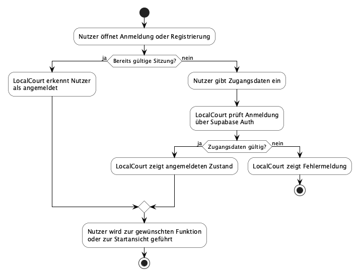 |
| Alternative Szenarien | Nutzer hat bereits eine gültige Sitzung und wird direkt als angemeldet erkannt. |
| Ausnahmefälle | Ungültige Zugangsdaten, bereits verwendete E-Mail-Adresse, schwaches Passwort oder nicht erreichbarer Auth-Dienst werden verständlich angezeigt; der Nutzer bleibt nicht angemeldet und geschützte Aktionen werden nicht ausgeführt. |
| Akzeptanzkriterien | **Given** einen nicht angemeldeten Nutzer mit gültigen Zugangsdaten bzw. gültigen Registrierungsangaben (Anzeigename, E-Mail, Passwort), **When** er in DLG-01 „Anmelden“ bzw. „Konto erstellen“ wählt, **Then** ist er angemeldet und wird zur zuvor gewünschten Funktion geführt, sonst zu DLG-02.  **Given** ungültige Zugangsdaten, **When** der Nutzer sich anmeldet, **Then** erscheint die Meldung „E-Mail-Adresse oder Passwort stimmt nicht.“ ohne Hinweis auf das falsche Feld, der Nutzer bleibt abgemeldet und eine geschützte Aktion wird nicht ausgeführt. |
| Qualität | Sicherheit, Datenschutz, einfache Bedienbarkeit, klare Fehlermeldungen. |

### UC-02 — Session suchen

| Abschnitt | Inhalt |
|---|---|
| Identifier | UC-02 |
| Name | Session suchen |
| Beschreibung | Der Teilnehmer gibt Ort/Region ein und filtert optional nach Sportart; LocalCourt zeigt passende zukünftige Sessions als Liste und, soweit Kartendaten verfügbar sind, auf einer Karte. Standardmäßig werden nur zukünftige oder aktive Sessions angezeigt — abgeschlossene Sessions gehören in UC-11. Die Ortssuche erfolgt über eine Eingabe des Nutzers, vorbelegt aus `profile.city`; eine automatische Standortermittlung wird bewusst nicht genutzt (S1.7). Laufende Sessions werden vor bevorstehenden angezeigt, innerhalb derselben Statusgruppe nach `start_at` aufsteigend und bei Gleichstand nach Titel sortiert. |
| Auslöser | Teilnehmer möchte spontan Sport treiben oder neue Sportarten entdecken. |
| Akteure | Teilnehmer (primär); Browser / React-Frontend, Supabase PostgREST / PostgreSQL, OpenStreetMap / Leaflet (unterstützend). |
| Vorbedingung | Es gibt erreichbare Session- und Court-Daten; Anmeldung ist für die Suche nicht zwingend erforderlich. |
| Nachbedingung | Teilnehmer sieht eine Ergebnisliste, auch wenn sie leer ist. |
| Hauptszenario | 1. Teilnehmer öffnet die Suche. 2. Teilnehmer gibt Ort/Region ein. 3. Teilnehmer wählt optional eine Sportart oder "Alle Sportarten". 4. LocalCourt zeigt passende zukünftige Sessions. 5. LocalCourt zeigt, soweit möglich, Court-Positionen auf einer Karte.  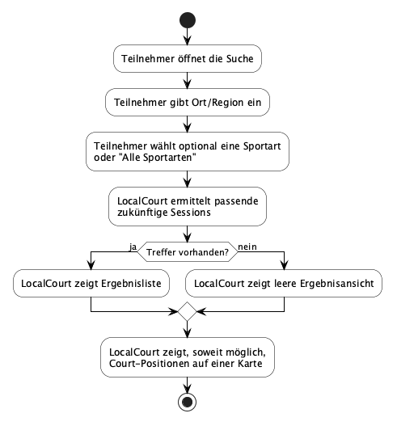 |
| Alternative Szenarien | Ohne Sportartfilter werden Sessions mehrerer Sportarten angezeigt. Bei fehlender Karte bleibt die Listenansicht nutzbar. |
| Ausnahmefälle | Keine passenden Sessions vorhanden, Kartendienst nicht verfügbar oder Netzwerkfehler — es werden keine ungültigen Suchergebnisse übernommen und der Nutzer erhält eine Fehlermeldung oder eine textuelle Fallback-Ansicht. |
| Akzeptanzkriterien | **Given** Sessions mit den Status `scheduled`, `active` und `completed`, **When** der Teilnehmer einen Ort eingibt und optional eine Sportart wählt, **Then** erscheinen nur passende Sessions mit Status `scheduled` oder `active`, laufende vor bevorstehenden, je Gruppe nach `start_at` aufsteigend und bei Gleichstand nach Titel; abgeschlossene Sessions erscheinen nicht.  **Given** eine Suche ohne passende Session, **When** das Ergebnis angezeigt wird, **Then** zeigt LocalCourt einen erklärenden Leerzustand mit Folgeaktion „Session erstellen“; das ist ein gültiges Ergebnis und kein Fehler.  **Given** einen nicht erreichbaren Kartendienst, **When** der Teilnehmer die Suche nutzt, **Then** bleibt die Listenansicht bedienbar und die Kartenansicht verweist mit einem Hinweis auf sie. |
| Qualität | Performance bei Suche, mobile Nutzbarkeit, Graceful Degradation der Karte. |

### UC-03 — Session-Detail ansehen

| Abschnitt | Inhalt |
|---|---|
| Identifier | UC-03 |
| Name | Session-Detail ansehen |
| Beschreibung | Aus Suche, eigener Session-Liste oder Historie öffnet ein Nutzer die Detailansicht einer Session und sieht fachlich relevante Details wie Sportart, Zeit, Ort, Beschreibung, Kapazität, Organisator und Teilnehmerstatus, damit er beurteilen kann, ob die Session für ihn relevant ist. Die Belegung („x von max") sieht jeder; fremde Teilnahmen werden nur dem Organisator angezeigt (UC-07), ein beigetretener Teilnehmer sieht lediglich seine eigene. Wo Profildaten erscheinen — beim Organisator und in der Teilnehmerliste —, sind es ausschließlich Anzeigename und optionales Profilbild; weitere Profil- oder Authentifizierungsdaten bleiben verborgen. |
| Auslöser | Nutzer wählt eine Session aus einer Liste oder Karte aus. |
| Akteure | Teilnehmer oder Organisator (primär); Browser / React-Frontend, Supabase PostgREST / PostgreSQL, OpenStreetMap / Leaflet (unterstützend). |
| Vorbedingung | Die Session existiert und ist für den Nutzer sichtbar. |
| Nachbedingung | Detailinformationen sind angezeigt; mögliche Folgeaktionen sind je nach Status, Rolle und Teilnahmezustand sichtbar. |
| Hauptszenario | 1. Nutzer wählt eine Session. 2. LocalCourt lädt die fachlichen Details. 3. LocalCourt zeigt Zeit, Sportart, Court/Sportort, Beschreibung, Kapazität und Status. 4. LocalCourt zeigt abhängig vom Nutzerstatus mögliche Aktionen wie Beitreten oder Check-in.  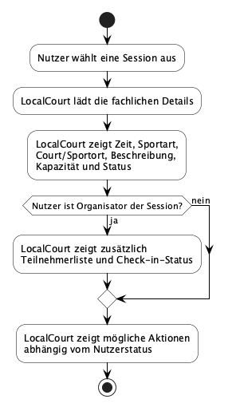 |
| Alternative Szenarien | Organisator sieht zusätzliche Informationen wie Teilnehmerliste oder Check-in-Status. Abgeschlossene Sessions werden read-only angezeigt. |
| Ausnahmefälle | Session existiert nicht, ist nicht zugreifbar oder Daten können nicht geladen werden — der Nutzer bleibt in der vorherigen Ansicht oder sieht eine Fehlerseite ohne Änderung an Session-Daten. |
| Akzeptanzkriterien | **Given** eine sichtbare Session und einen Nutzer, auch ohne Anmeldung, **When** er die Detailansicht öffnet, **Then** sieht er Titel, Sportart, Status, Datum, Uhrzeit, Dauer, Sportort, Beschreibung (sofern vorhanden), Organisator (Anzeigename) und die Belegung „x von max“; fremde Teilnahmen sieht nur der Organisator ([UC-07](#uc-07--teilnehmerliste-anzeigen)).  **Given** eine abgeschlossene Session, **When** ein Nutzer sie öffnet, **Then** wird sie read-only angezeigt, ohne die Aktionen „Beitreten“ und „Zum Check-in“.  **Given** eine nicht existierende oder nicht mehr verfügbare Session-Kennung, **When** der Nutzer die Detailansicht aufruft, **Then** erscheint „Session nicht gefunden“ mit Rücksprung zum Entdecken und es werden keine Session-Daten verändert. |
| Qualität | Datenschutz, Verständlichkeit, mobile Bedienbarkeit. |

### UC-04 — Session beitreten

| Abschnitt | Inhalt |
|---|---|
| Identifier | UC-04 |
| Name | Session beitreten |
| Beschreibung | Ein angemeldeter Teilnehmer reserviert seinen Platz, indem er einer noch offenen Session beitritt; nach erfolgreichem Beitritt erscheint er in der Teilnehmerliste und die Session unter seinen eigenen Sessions. Ein Nutzer darf derselben Session nicht mehrfach beitreten, Kapazitätsgrenzen werden eingehalten und Wartelisten sind out of scope (P1 NG-10). Das Verhalten bei gleichzeitigem Beitritt (wer zuerst kommt, keine Überbuchung) ist in [F3 AF-01](F3-anwendungsfunktionen.md#af-01--beitritts--und-kapazitätsregel) fachlich präzisiert und in [S1.4](S1-nachbarsysteme.md#s14-nb-03--supabase-postgrest) als atomare Operation `join_session` umgesetzt. |
| Auslöser | Teilnehmer klickt in der Detailansicht auf "Beitreten". |
| Akteure | Teilnehmer (primär); Browser / React-Frontend, Supabase Auth, Supabase PostgREST / PostgreSQL (unterstützend). |
| Vorbedingung | Nutzer ist angemeldet; Session ist sichtbar, noch nicht abgeschlossen und nicht voll. |
| Nachbedingung | Participant-Eintrag existiert; Teilnehmerstatus ist beigetreten. |
| Hauptszenario | 1. Teilnehmer öffnet eine Session. 2. Teilnehmer wählt "Beitreten". 3. LocalCourt prüft Anmeldestatus, Sessionstatus und Kapazität. 4. LocalCourt trägt den Nutzer als Teilnehmer ein. 5. LocalCourt bestätigt den Beitritt.  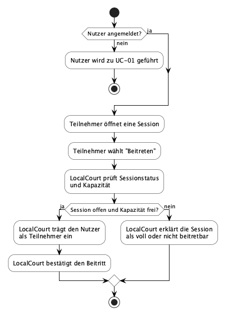 |
| Alternative Szenarien | Nutzer ist nicht angemeldet und wird zuerst zu UC-01 geführt. |
| Ausnahmefälle | Session ist voll, abgeschlossen, nicht mehr sichtbar oder Nutzer ist bereits beigetreten — es wird kein Participant-Eintrag erzeugt oder verändert und der Nutzer erhält entsprechendes Feedback. |
| Akzeptanzkriterien | **Given** eine Session mit Status `scheduled` oder `active` und freiem Platz sowie einen angemeldeten Nutzer ohne Teilnahme, **When** er „Beitreten“ wählt, **Then** wird er mit Status `confirmed` eingetragen, die Belegung steigt um 1 und die Meldung „Du bist der Session beigetreten.“ erscheint (`OK`); die Session erscheint unter seinen eigenen Sessions.  **Given** einen angemeldeten Nutzer, der der Session bereits beigetreten ist, **When** der Beitritt erneut ausgelöst wird, **Then** entsteht kein zweiter Participant-Eintrag und das Ergebnis lautet `ALREADY_JOINED` („Du bist dieser Session bereits beigetreten.“); der Organisator zählt ab Erstellung als Teilnehmer und erhält keine Beitrittsaktion.  **Given** eine Session, deren bestätigte Teilnehmer das Teilnehmerlimit erreicht haben, **When** ein angemeldeter Nutzer ohne Teilnahme beitreten will, **Then** bietet der Dialog keinen Beitritt an („Session ist voll“); wird der Beitritt dennoch gestellt, bleibt der Bestand unverändert und das Ergebnis lautet `SESSION_FULL` („Die Session ist bereits voll.“); es gibt keine Warteliste. Gleichzeitige Beitritte auf den letzten Platz prüft [N1-QA-01](N1-nichtfunktionale-anforderungen.md#n1-qa-01--konsistenz-von-beitritt-und-check-in).  **Given** eine abgeschlossene Session, **When** ein angemeldeter Nutzer beitreten will, **Then** bietet der Dialog keinen Beitritt an; wird der Beitritt dennoch gestellt, bleibt der Bestand unverändert und das Ergebnis lautet `SESSION_NOT_JOINABLE` („Dieser Session kannst du nicht mehr beitreten.“).  **Given** einen nicht angemeldeten Nutzer, **When** er „Beitreten“ wählt, **Then** wird er zu DLG-01 geführt und danach zur Session zurück; wird der Beitritt ohne Anmeldung an die Datenbank gestellt, lautet das Ergebnis `NOT_AUTHENTICATED` und es entsteht kein Participant-Eintrag. |
| Qualität | Konsistenz bei parallelen Beitritten, verständliche Fehlermeldungen, Datenschutz. |

### UC-05 — Eigene Sessions anzeigen

| Abschnitt | Inhalt |
|---|---|
| Identifier | UC-05 |
| Name | Eigene Sessions anzeigen |
| Beschreibung | LocalCourt zeigt dem angemeldeten Nutzer seine relevanten Sessions — beigetretene und selbst erstellte —, damit er den Überblick behält; organisierte und beigetretene Sessions sind dabei unterscheidbar. Bevorstehende eigene Sessions werden nach `start_at` aufsteigend angezeigt, ohne weitere Gruppierung nach Sportart, Ort oder Rolle. Vergangene Sessions verweisen auf UC-11. |
| Auslöser | Nutzer öffnet "Meine Sessions" oder kehrt nach Beitritt/Erstellung dorthin zurück. |
| Akteure | Teilnehmer oder Organisator (primär); Browser / React-Frontend, Supabase Auth, Supabase PostgREST / PostgreSQL (unterstützend). |
| Vorbedingung | Nutzer ist angemeldet. |
| Nachbedingung | Eigene Sessions sind nach sinnvollen Kriterien angezeigt, z. B. bevorstehend und vergangen getrennt; Nutzer sehen dabei nur Sessions, zu denen sie fachlich berechtigt sind. |
| Hauptszenario | 1. Nutzer öffnet "Meine Sessions". 2. LocalCourt ermittelt Sessions mit Teilnahme oder Organisatorrolle. 3. LocalCourt zeigt bevorstehende Sessions. 4. Nutzer kann eine Session-Detailansicht öffnen.  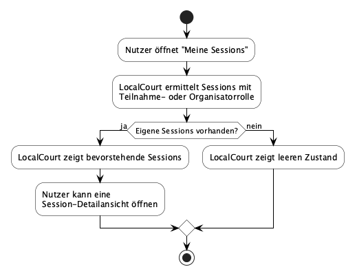 |
| Alternative Szenarien | Wenn keine eigenen Sessions vorhanden sind, zeigt LocalCourt einen leeren Zustand. |
| Ausnahmefälle | Nutzer ist nicht angemeldet oder Daten können nicht geladen werden — bestehende Daten bleiben unverändert und der Nutzer erhält Feedback. |
| Akzeptanzkriterien | **Given** einen angemeldeten Nutzer mit bevorstehenden Sessions, an denen er teilnimmt oder die er organisiert, **When** er „Meine Sessions“ im Tab „Bevorstehend“ öffnet, **Then** erscheinen genau diese Sessions mit Status `scheduled` oder `active`, nach `start_at` aufsteigend, die Rolle (Organisator bzw. Teilnehmer) ist unterscheidbar und fremde Sessions erscheinen nicht.  **Given** einen angemeldeten Nutzer ohne bevorstehende eigene Sessions, **When** er den Tab „Bevorstehend“ öffnet, **Then** zeigt LocalCourt den erklärenden Leerzustand „Keine bevorstehenden Sessions“; das ist ein gültiges Ergebnis und kein Fehler.  **Given** einen nicht angemeldeten Nutzer, **When** er „Meine Sessions“ aufruft, **Then** wird er zu DLG-01 geführt und es werden keine Session-Daten angezeigt. |
| Qualität | Übersichtlichkeit, mobile Nutzbarkeit, Performance. |

### UC-06 — Session erstellen

| Abschnitt | Inhalt |
|---|---|
| Identifier | UC-06 |
| Name | Session erstellen |
| Beschreibung | Der Organisator erfasst Sportart, Court/Sportort (ausgewählt oder über UC-10 erfasst), Startzeit, Dauer, Teilnehmerlimit und Beschreibung; nach erfolgreicher Erstellung ist die Session auffindbar und der Organisator ihr zugeordnet. Bearbeiten, Absagen, Löschen sowie Session-Serien liegen außerhalb des MVP (P1 NG-11). |
| Auslöser | Organisator möchte ein Training oder Treffen ankündigen. |
| Akteure | Organisator (primär); Browser / React-Frontend, Supabase Auth, Supabase PostgREST / PostgreSQL (unterstützend). |
| Vorbedingung | Organisator ist angemeldet; notwendige Angaben sind vorhanden. |
| Nachbedingung | Neue Session existiert im Status geplant, dem Organisator zugeordnet und auffindbar; Sessions benötigen dafür stets Sportart, Zeitpunkt, Dauer, Court/Sportort und Teilnehmerlimit. |
| Hauptszenario | 1. Organisator öffnet das Formular zur Session-Erstellung. 2. Organisator gibt Sessiondaten ein. 3. Organisator wählt oder erfasst den Sportort. 4. LocalCourt prüft Pflichtangaben und fachliche Grenzen. 5. LocalCourt erstellt die Session. 6. LocalCourt zeigt die Detailansicht mit Bestätigung.  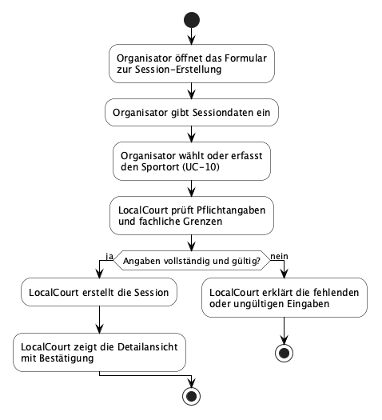 |
| Alternative Szenarien | Organisator bricht die Erstellung ab; es wird keine Session gespeichert. |
| Ausnahmefälle | Pflichtangaben fehlen, Zeitpunkt liegt in der Vergangenheit, Teilnehmerlimit ist ungültig, Court-Daten sind unvollständig oder Nutzer ist nicht angemeldet — es wird keine unvollständige Session veröffentlicht. |
| Akzeptanzkriterien | **Given** einen angemeldeten Organisator, der alle Pflichtangaben gültig ausgefüllt hat (Titel, Sportart, Datum und Uhrzeit in der Zukunft, Dauer, Teilnehmerlimit, Sportort), **When** er „Session erstellen“ wählt, **Then** existiert die Session mit Status `scheduled`, einer erzeugten vierstelligen PIN und dem zugehörigen QR-Inhalt, der Organisator ist ihr zugeordnet und als bestätigter Teilnehmer erfasst (er belegt einen Platz), und LocalCourt wechselt mit Bestätigung zur Detailansicht im Organisator-Zustand.  **Given** fehlende Pflichtangaben, **When** der Organisator „Session erstellen“ wählt, **Then** erscheinen feldbezogen die Meldungen „Bitte gib einen Titel ein.“, „Bitte wähle ein Datum aus.“, „Bitte wähle eine Uhrzeit aus.“ bzw. „Bitte wähle einen Sportort aus.“ (bei Neuerfassung zusätzlich „Bitte gib einen Namen für den Sportort ein.“ bzw. „Bitte setze einen Kartenpin und warte auf die Ortsbestimmung.“) und es wird keine Session gespeichert.  **Given** einen Startzeitpunkt in der Vergangenheit, **When** der Organisator „Session erstellen“ wählt, **Then** erscheint am Datumsfeld die Meldung „Der Zeitpunkt muss in der Zukunft liegen.“ (bei serverseitiger Ablehnung „Der Startzeitpunkt muss in der Zukunft liegen.“) und es wird keine Session gespeichert.  **Given** einen nicht angemeldeten Nutzer, **When** er das Formular zur Session-Erstellung aufruft, **Then** wird er zu DLG-01 geführt und es wird keine Session erstellt.  **Given** ein teilweise ausgefülltes Formular, **When** der Organisator die Erstellung abbricht (Zurück-Navigation), **Then** wird keine Session gespeichert und die Eingaben gehen verloren. |
| Qualität | Niedrige Einstiegshürde angestrebt (P1 SC-02: unter 2 Minuten). |

### UC-07 — Teilnehmerliste anzeigen

| Abschnitt | Inhalt |
|---|---|
| Identifier | UC-07 |
| Name | Teilnehmerliste anzeigen |
| Beschreibung | In der Session-Detailansicht sieht der Organisator eine Liste der beigetretenen Teilnehmer, damit er Teilnehmerzahl und Check-in-Status seiner Session kennt; während der Check-in-Phase wird sichtbar, wer bereits eingecheckt ist. Die Liste zeigt als Profildaten ausschließlich Anzeigename und optionales Profilbild und ist nicht als öffentliches soziales Verzeichnis zu verstehen; den Check-in-Status aller Teilnehmer sieht nur der Organisator. |
| Auslöser | Organisator öffnet eine eigene Session. |
| Akteure | Organisator (primär); Browser / React-Frontend, Supabase Auth, Supabase PostgREST / PostgreSQL (unterstützend). |
| Vorbedingung | Nutzer ist angemeldet und Organisator der Session. |
| Nachbedingung | Teilnehmerliste und Statusinformationen sind angezeigt; keine Teilnehmerdaten werden unberechtigt offengelegt. |
| Hauptszenario | 1. Organisator öffnet eine eigene Session. 2. LocalCourt prüft die Berechtigung. 3. LocalCourt zeigt Teilnehmer und deren Teilnahme- bzw. Check-in-Status. 4. Organisator kann die Liste während der Session erneut laden oder aktualisiert sehen.  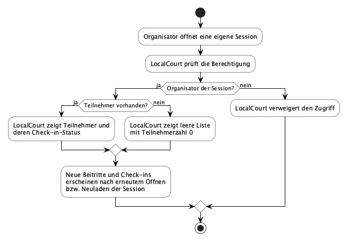 |
| Alternative Szenarien | Bei keiner Teilnahme zeigt LocalCourt eine leere Liste mit Teilnehmerzahl 0. |
| Ausnahmefälle | Nutzer ist nicht Organisator, Session existiert nicht oder Daten können nicht geladen werden. |
| Akzeptanzkriterien | **Given** den angemeldeten Organisator einer Session mit Teilnahmen, **When** er die Detailansicht seiner Session öffnet, **Then** zeigt LocalCourt je Teilnehmer ausschließlich Anzeigename, optionales Profilbild und den Status (bestätigt bzw. eingecheckt).  **Given** einen Teilnehmer, der sich zu einer laufenden Session eingecheckt hat ([UC-08](#uc-08--check-in-per-qr-code-durchführen) oder [UC-09](#uc-09--check-in-per-pin-durchführen)), **When** der Organisator die Detailansicht erneut lädt, **Then** zeigt die Teilnehmerliste diesen Teilnehmer mit Status „eingecheckt“.  **Given** einen angemeldeten Nutzer, der die Session nicht organisiert, oder einen Gast, **When** er die Detailansicht öffnet, **Then** sieht er keine Teilnehmerliste, sondern nur die Belegung und, falls beigetreten, seine eigene Teilnahme; QR-Code und PIN sind nicht sichtbar. |
| Qualität | Datenschutz, klare Statusanzeige, Aktualität. |

### UC-08 — Check-in per QR-Code durchführen

| Abschnitt | Inhalt |
|---|---|
| Identifier | UC-08 |
| Name | Check-in per QR-Code durchführen |
| Beschreibung | Der Teilnehmer scannt einen von LocalCourt bereitgestellten QR-Code zur Session; LocalCourt prüft die Zugehörigkeit und markiert ihn als eingecheckt, damit er seine Anwesenheit schnell vor Ort bestätigen kann. Check-in setzt Teilnahme voraus, ein mehrfacher Check-in ändert den fachlichen Endzustand nicht. Der Zeitraum der Check-in-Fähigkeit ist in F3 AF-02/AF-03 festgelegt: Check-in ist nur möglich, solange die Session im Status `active` ist (Start bis Start + Dauer). |
| Auslöser | Teilnehmer scannt den QR-Code am Treffpunkt. |
| Akteure | Teilnehmer (primär); Browser / React-Frontend, Supabase Auth, Supabase PostgREST / PostgreSQL (unterstützend). |
| Vorbedingung | Teilnehmer ist angemeldet und der Session beigetreten; Session ist in einer Check-in-fähigen Phase; QR-Code gehört zur Session. |
| Nachbedingung | Participant-Status ist eingecheckt; der Organisator kann den Status sehen. |
| Hauptszenario | 1. Organisator zeigt QR-Code für die Session. 2. Teilnehmer scannt den QR-Code. 3. LocalCourt öffnet die Check-in-Ansicht. 4. LocalCourt prüft Zugehörigkeit und Sessionstatus. 5. LocalCourt markiert den Teilnehmer als eingecheckt. 6. Teilnehmer sieht eine Bestätigung.  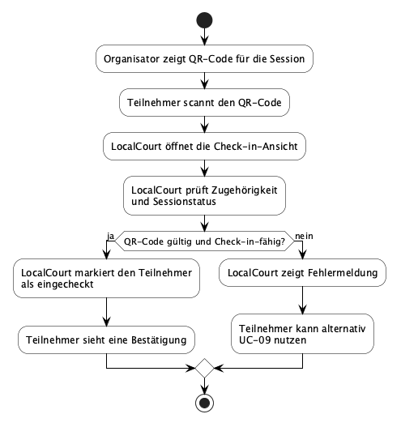 |
| Alternative Szenarien | Falls der QR-Scan nicht funktioniert, nutzt der Teilnehmer UC-09. |
| Ausnahmefälle | QR-Code ist ungültig, Session ist nicht check-in-fähig, Teilnehmer ist nicht beigetreten, Nutzer ist nicht angemeldet oder der Check-in wurde bereits durchgeführt — der Participant-Status bleibt jeweils unverändert und der Nutzer erhält Feedback. |
| Akzeptanzkriterien | **Given** einen angemeldeten, beigetretenen Teilnehmer, eine Session im Status `active` und einen Check-in-Link mit der richtigen PIN der Session (QR-Code), **When** er den Link mit der Kamera-App öffnet, **Then** startet die Prüfung ohne weitere Eingabe, sein Status wird auf `checked_in` mit Zeitpunkt gesetzt und „Check-in erfolgreich.“ erscheint (`OK`).  **Given** einen angemeldeten Nutzer ohne Teilnahme oder eine Session, die nicht `active` ist (`scheduled` oder `completed`), **When** er die Check-in-Ansicht öffnet, **Then** zeigt LocalCourt statt der Prüfung den gesperrten Zustand mit dem Text „Du bist dieser Session nicht beigetreten.“ (`NOT_JOINED`) bzw. „Der Check-in ist nur während der laufenden Session möglich.“ (`OUTSIDE_WINDOW`) und der Participant-Status bleibt unverändert; es gilt kein Toleranzfenster.  **Given** einen beigetretenen Teilnehmer, eine Session im Status `active` und einen Check-in-Link mit einer falschen PIN, **When** er den Link öffnet, **Then** erscheint „Der QR-Code oder die PIN ist für diese Session ungültig.“ (`INVALID_CREDENTIAL`) und der Participant-Status bleibt unverändert.  **Given** einen bereits eingecheckten Teilnehmer und eine Session im Status `active`, **When** er die Check-in-Ansicht erneut öffnet, **Then** erscheint „Du bist bereits eingecheckt.“ (`ALREADY_CHECKED_IN`), der Status und der Zeitpunkt des ersten Check-ins bleiben unverändert.  **Given** einen nicht angemeldeten Nutzer, **When** er den Check-in-Link öffnet, **Then** wird er zu DLG-01 und nach der Anmeldung zurück zur Check-in-Ansicht geführt; ohne Anmeldung findet kein Check-in statt. |
| Qualität | Schnelle mobile Bedienbarkeit, Sicherheit gegen falsche Session-Zuordnung, verständliche Fehlermeldungen. |

### UC-09 — Check-in per PIN durchführen

| Abschnitt | Inhalt |
|---|---|
| Identifier | UC-09 |
| Name | Check-in per PIN durchführen |
| Beschreibung | Der Teilnehmer gibt eine zur Session gehörende PIN ein, falls der QR-Scan nicht möglich ist; LocalCourt prüft die PIN und markiert ihn als eingecheckt, wenn alle Voraussetzungen erfüllt sind. Der PIN-Check-in ist fachlich gleichwertig zum QR-Check-in, falsche PINs erzeugen keinen Check-in. Länge und Erzeugungsregel der PIN sind in F3 AF-04 festgelegt: vierstellige numerische PIN, je Session zufällig erzeugt und im Kontext der Session geprüft. |
| Auslöser | QR-Scan ist nicht möglich oder der Teilnehmer wählt manuelle PIN-Eingabe. |
| Akteure | Teilnehmer (primär); Browser / React-Frontend, Supabase Auth, Supabase PostgREST / PostgreSQL (unterstützend). |
| Vorbedingung | Teilnehmer ist angemeldet und der Session beigetreten; Session ist check-in-fähig; Organisator stellt die PIN bereit. |
| Nachbedingung | Participant-Status ist eingecheckt. |
| Hauptszenario | 1. Teilnehmer öffnet die PIN-Check-in-Ansicht. 2. Teilnehmer gibt die Session-PIN ein. 3. LocalCourt prüft PIN, Sessionstatus und Teilnahme. 4. LocalCourt markiert den Teilnehmer als eingecheckt. 5. Teilnehmer sieht eine Bestätigung.  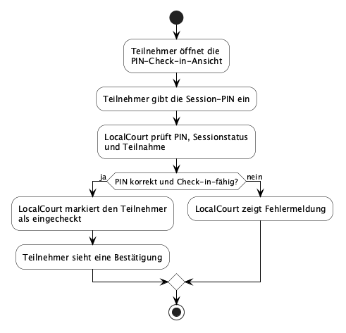 |
| Alternative Szenarien | Teilnehmer kehrt zum QR-Code-Check-in (UC-08) zurück. |
| Ausnahmefälle | PIN ist falsch, Session ist nicht check-in-fähig, Teilnehmer ist nicht beigetreten oder Nutzer ist nicht angemeldet — der Participant-Status bleibt jeweils unverändert. |
| Akzeptanzkriterien | **Given** einen angemeldeten, beigetretenen Teilnehmer, eine Session im Status `active` und die richtige vierstellige PIN der Session, **When** er „Code manuell eingeben“ wählt und die PIN absendet, **Then** ist das Ergebnis dasselbe wie beim QR-Check-in: Status `checked_in` mit Zeitpunkt und „Check-in erfolgreich.“ (`OK`).  **Given** einen beigetretenen Teilnehmer und eine Session im Status `active`, **When** er eine falsche PIN absendet, **Then** erscheint „Der QR-Code oder die PIN ist für diese Session ungültig.“ (`INVALID_CREDENTIAL`) und der Participant-Status bleibt unverändert; besteht die Eingabe nicht aus genau vier Ziffern, erscheint „Bitte gib genau 4 Ziffern ein.“.  **Given** einen angemeldeten Nutzer ohne Teilnahme oder eine Session, die nicht `active` ist, **When** er die Check-in-Ansicht öffnet, **Then** zeigt LocalCourt den gesperrten Zustand mit „Du bist dieser Session nicht beigetreten.“ (`NOT_JOINED`) bzw. „Der Check-in ist nur während der laufenden Session möglich.“ (`OUTSIDE_WINDOW`), bietet keine PIN-Eingabe an und lässt den Participant-Status unverändert.  **Given** einen bereits eingecheckten Teilnehmer und eine Session im Status `active`, **When** er die Check-in-Ansicht erneut öffnet, **Then** erscheint „Du bist bereits eingecheckt.“ (`ALREADY_CHECKED_IN`) und der Zeitpunkt des ersten Check-ins bleibt unverändert.  **Given** einen nicht angemeldeten Nutzer, **When** er die Check-in-Ansicht aufruft, **Then** wird er zu DLG-01 geführt und es findet kein Check-in statt. |
| Qualität | Usability als Fallback, Sicherheit, klare Fehlertexte. |

### UC-10 — Court / Sportort erfassen oder auswählen

| Abschnitt | Inhalt |
|---|---|
| Identifier | UC-10 |
| Name | Court / Sportort erfassen oder auswählen |
| Beschreibung | Bei der Session-Erstellung wählt der Organisator einen vorhandenen Court/Sportort aus oder erfasst im begrenzten MVP-Umfang einen neuen, damit Sessions einem auffindbaren Sportort zugeordnet sind. Ein neu erfasster Court benötigt einen Namen, ein Koordinatenpaar und den daraus per Reverse-Geocoding bestimmten Ort; die ermittelte Adresse wird gespeichert, sofern der Dienst eine liefert, und Ort und Adresse werden nicht als widersprüchliche Freitexte erfasst. Im MVP findet keine automatische Dublettenprüfung statt — vorhandene Courts werden vorrangig zur Auswahl angeboten, bei einer Neuerfassung können fachlich gleiche Courts mehrfach entstehen; Erkennung und Zusammenführung sind eine spätere Erweiterung. |
| Auslöser | Organisator erstellt eine Session und benötigt einen Sportort. |
| Akteure | Organisator (primär); Browser / React-Frontend, Supabase PostgREST / PostgreSQL, OpenStreetMap / Leaflet, Nominatim (unterstützend). |
| Vorbedingung | Organisator ist angemeldet; der Court kann auf der Karte eindeutig markiert werden. |
| Nachbedingung | Session kann einem bestehenden oder neu erfassten Court zugeordnet werden; es wird kein unvollständiger Court als Grundlage einer Session verwendet. |
| Hauptszenario | 1. Organisator sucht oder öffnet die Court-Auswahl. 2. LocalCourt zeigt vorhandene passende Courts. 3. Organisator wählt einen Court aus. 4. LocalCourt übernimmt den Court in die Session-Erstellung.  Der Ablauf verzweigt sich zwischen Auswahl eines vorhandenen Courts und Neuerfassung mit Reverse-Geocoding und möglichem Fehlerfall; das folgende Aktivitätsdiagramm ergänzt die Schritte um diese Verzweigung:   |
| Alternative Szenarien | Organisator erfasst einen neuen Court: Er vergibt einen Namen, setzt einen Pin auf der Karte und LocalCourt ermittelt Ort und Adresse per Reverse-Geocoding. Danach steht der Court für die Session-Erstellung zur Verfügung. |
| Ausnahmefälle | Name oder Kartenpin fehlen, Reverse-Geocoding liefert keine verwertbare Ortsangabe oder Karte beziehungsweise Geocoding-Dienst ist nicht erreichbar. |
| Akzeptanzkriterien | **Given** das Session-Formular mit vorhandenen Courts, **When** der Organisator einen Court aus dem Verzeichnis auswählt, **Then** wird er ohne Neuerfassung in die Session übernommen und die erstellte Session ist diesem Court zugeordnet.  **Given** die Neuerfassung („Neuen Sportort anlegen“) mit eingegebenem Namen, **When** der Organisator den Kartenpin setzt, **Then** zeigt LocalCourt den per Reverse-Geocoding ermittelten Ort und, sofern geliefert, die Adresse vor dem Speichern an und der Court wird beim Erstellen zusammen mit der Session angelegt; liefert das Geocoding keinen Ort, erscheint „Zu diesem Punkt gibt es keinen bekannten Ort. Bitte setze den Pin etwas versetzt, zum Beispiel näher an einer Straße.“ und die Erstellung ist blockiert. |
| Qualität | Datenqualität, einfache Bedienbarkeit, verständliche Fehlerbehandlung bei Karten- oder Geocoding-Ausfall. |

### UC-11 — Session-Historie ansehen

| Abschnitt | Inhalt |
|---|---|
| Identifier | UC-11 |
| Name | Session-Historie ansehen |
| Beschreibung | Teilnehmer und Organisatoren sehen vergangene Sessions, an denen sie beteiligt waren, damit sie diese nachvollziehen können; die Historie ist im MVP read-only und dient nicht als Reporting-, Rating- oder Statistikplattform — Diagramme, Exporte und sessionübergreifende Auswertungen sind ausgeschlossen. Vergangene Sessions werden nach ihrem Ende absteigend sortiert. Organisatoren sehen bei eigenen vergangenen Sessions zusätzlich Titel, Sportart, Court, Datum, Startzeit, Dauer, bestätigte Teilnehmerzahl, Check-in-Anzahl und die vorhandene Teilnehmerliste mit Check-in-Status. |
| Auslöser | Nutzer öffnet die Historie oder den Bereich vergangener Sessions. |
| Akteure | Teilnehmer oder Organisator (primär); Browser / React-Frontend, Supabase Auth, Supabase PostgREST / PostgreSQL (unterstützend). |
| Vorbedingung | Nutzer ist angemeldet; es existieren abgeschlossene eigene Sessions oder ein leerer Zustand ist möglich. |
| Nachbedingung | Vergangene Sessions werden angezeigt oder ein leerer Zustand wird erklärt. |
| Hauptszenario | 1. Nutzer öffnet die Historie. 2. LocalCourt lädt vergangene Sessions mit Bezug zum Nutzer. 3. LocalCourt zeigt die Sessions in einer read-only Übersicht. 4. Nutzer kann eine Detailansicht öffnen.  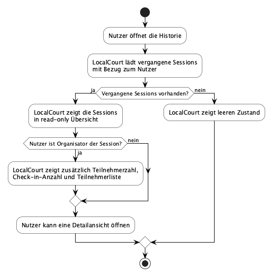 |
| Alternative Szenarien | Organisator sieht bei eigenen vergangenen Sessions die Session-Kerndaten, bestätigte Teilnehmerzahl, Check-in-Anzahl und Teilnehmerliste mit Check-in-Status. |
| Ausnahmefälle | Nutzer ist nicht angemeldet oder Daten können nicht geladen werden — keine Daten werden verändert und der Nutzer erhält Feedback. |
| Akzeptanzkriterien | **Given** einen angemeldeten Nutzer mit abgeschlossenen Sessions, an denen er teilgenommen oder die er organisiert hat, **When** er in „Meine Sessions“ den Tab „Vergangen“ öffnet, **Then** erscheinen nur Sessions mit Status `completed`, nach Ende absteigend, read-only; ein Teilnehmer sieht je Session „Du warst eingecheckt“ bzw. „Kein Check-in erfolgt“.  **Given** den Organisator einer abgeschlossenen Session, **When** er sie aus der Historie öffnet, **Then** sieht er zusätzlich die bestätigte Teilnehmerzahl, die Check-in-Anzahl und die Teilnehmerliste mit Check-in-Status, aber keine Statistiken oder Exporte.  **Given** einen angemeldeten Nutzer ohne abgeschlossene eigene Sessions, **When** er den Tab „Vergangen“ öffnet, **Then** zeigt LocalCourt den erklärenden Leerzustand „Noch keine vergangenen Sessions“; das ist ein gültiges Ergebnis und kein Fehler. |
| Qualität | Datenschutz, Übersichtlichkeit, Nachvollziehbarkeit. |

### UC-12 — Profil und Sportpräferenzen verwalten

| Abschnitt | Inhalt |
|---|---|
| Identifier | UC-12 |
| Name | Profil und Sportpräferenzen verwalten |
| Beschreibung | Nutzer verwalten Anzeigenamen, Heimatort und bevorzugte Sportarten als notwendige Basisdaten für Anzeige und Sportsuche; ein vorhandenes Profilbild wird angezeigt, aber im MVP weder hochgeladen noch bearbeitet (`avatar_url` ist ausschließlich ein optionaler Anzeigewert). Sportpräferenzen unterstützen die Suche, ersetzen aber nicht die manuelle Filterung; ein öffentliches Profilverzeichnis existiert nicht. |
| Auslöser | Nutzer öffnet seine Profileinstellungen. |
| Akteure | Teilnehmer oder Organisator (primär); Browser / React-Frontend, Supabase Auth, Supabase PostgREST / PostgreSQL (unterstützend). |
| Vorbedingung | Nutzer ist angemeldet. |
| Nachbedingung | Geänderte Profilinformationen und Sportpräferenzen sind gespeichert. |
| Hauptszenario | 1. Nutzer öffnet das Profil. 2. LocalCourt zeigt aktuelle Basisdaten und Sportpräferenzen. 3. Nutzer ändert zulässige Angaben. 4. LocalCourt prüft Pflichtfelder und speichert Änderungen. 5. LocalCourt zeigt die aktualisierten Daten.  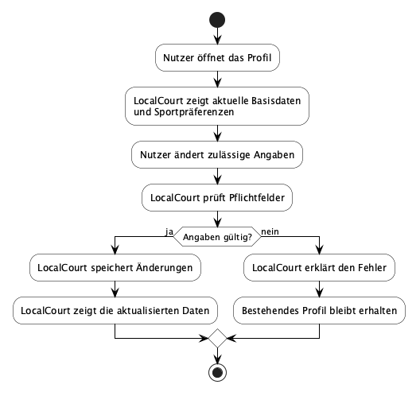 |
| Alternative Szenarien | Nutzer bricht die Bearbeitung ab; es werden keine Änderungen gespeichert. |
| Ausnahmefälle | Pflichtangaben fehlen, Datenformat ist ungültig oder Speichern schlägt fehl — das bestehende Profil bleibt jeweils erhalten. |
| Akzeptanzkriterien | **Given** einen angemeldeten Nutzer im Zustand „Bearbeiten“, **When** er Anzeigename, Ort und bevorzugte Sportarten ändert und „Speichern“ wählt, **Then** sind die Änderungen gespeichert und die Ansicht zeigt die aktualisierten Daten.  **Given** einen leeren Anzeigenamen, **When** der Nutzer „Speichern“ wählt, **Then** erscheint „Bitte gib einen Anzeigenamen ein.“ und das bestehende Profil bleibt unverändert. |
| Qualität | Datenschutz, einfache Bedienbarkeit, Datenminimierung. |

## F2.5 Nicht als Use Case modelliert

| Thema | Begründung |
|---|---|
| Benachrichtigungen | In F1 ausdrücklich ausgeschlossen; würde zusätzliche E-Mail-, SMS- oder Push-Systeme erfordern. |
| Messaging | Direct Messaging ist nach P1/F1 out of scope und würde Moderation, Datenschutz und Missbrauchsbehandlung erhöhen. |
| Ratings / Reviews | Nach P1/F1 ausgeschlossen; nicht nötig für die Koordination des MVP. |
| Zahlung | Keine monetären Transaktionen; LocalCourt ist keine Zahlungs- oder Buchungsplattform. |
| Admin-Reports | F1 schließt Admin-Funktionen aus; UC-11 bleibt read-only Nutzerhistorie. |
| Native Mobile App | P1 setzt auf responsive Web-UI statt nativer Apps. |
| KI-Features | P1/P2 schließen KI-Integration aus; Discovery erfolgt über Filter und Karte. |
| Kommerzielle Court-Buchung | LocalCourt koordiniert informelle Sport-Sessions, keine verbindlichen kommerziellen Reservierungen. |
| Wartelisten | Nach P1-Anpassung explizit out of scope (P1 NG-10). Ohne Benachrichtigungskanal fachlich nicht sinnvoll; Kapazität ist eine harte Grenze (F3 AF-01). Der frühere Scope-Konflikt zwischen P1 und F1/F2 ist damit aufgelöst. |
| Session-Serien | F1 modelliert keine Cross-Process-Serien. Jede Session ist im MVP unabhängig. |
| Session-Bearbeitung nach Erstellung | F1 schließt Modifikation nach Erstellung als MVP-Vereinfachung aus. |
| Session-Absage und -Löschung | P1 NG-11 schließt beide Aktionen zusammen mit der Bearbeitung bestehender Sessions aus. |
| Session-Kommentare | P1 erwähnt externe Koordination bzw. Kommentare nur indirekt im Out-of-Scope-Kontext; F1 modelliert keinen Kommentarprozess. |

## F2.6 Cross-References / Weiterverwendung

| Block | Relevanz für F2 |
|---|---|
| [F1](F1-geschaeftsprozesse.md) | Grundlage der Geschäftsprozesse, Aktivitäten, Akteure und bewussten Ausschlüsse. |
| [F3](F3-anwendungsfunktionen.md) | Konkretisiert funktionale Detailanforderungen, Validierungsregeln, Statusübergänge und systeminterne fachliche Regeln. |
| [D1](D1-datenmodell.md) | Konkretisiert fachliche Datenobjekte wie `session`, `court`, `participant`, `profile`, `sport` und `sport_preference`. |
| [D2](D2-datentypen.md) | Definiert Datentypen, Wertebereiche, Statuswerte und Validierungsregeln. |
| [B1](B1-dialogspezifikation.md) | Konkretisiert die Dialoge für Suche, Detailansicht, Erstellung, Check-in, Profil und Historie. |
| [S1](S1-nachbarsysteme.md) | Nachbarsysteme und Schnittstellendetails zu Browser, Supabase Auth, Supabase PostgREST und OpenStreetMap/Leaflet. |
| [N1](N1-nichtfunktionale-anforderungen.md) | Konkretisiert Qualitätsanforderungen wie Usability, Datenschutz, Performance, Sicherheit und Free-/Student-Tier-Betrieb. |
| [N2](N2-querschnittskonzepte.md) | Technische Umsetzung der nichtfunktionalen Anforderungen, Tests, Monitoring und Sicherheitsmaßnahmen. |
| [E2](E2-glossar.md) | Glossar und Begriffsklärungen, insbesondere konsistente Begriffe wie Session, Court/Sportort, Participant/Teilnehmer, Profile/Profil und Check-in. |
