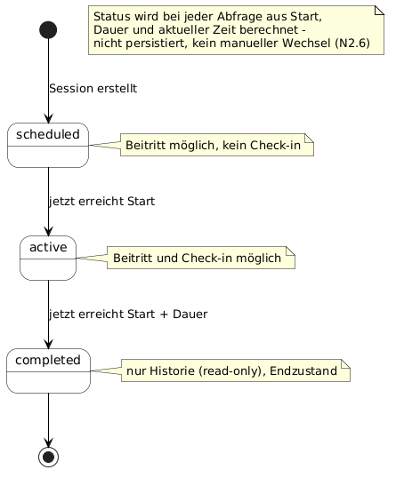

# F3 — Anwendungsfunktionen

## F3.1 Zweck und Einordnung

F3 enthält fachliche Berechnungs-, Prüf- und Entscheidungslogik, die für einen Anwendungsfall ([F2](F2-anwendungsfaelle.md)) zu umfangreich wäre. Eine Anwendungsfunktion ist ein fachlicher Algorithmus aus Sicht des Anwenders, kein Informatik-Algorithmus — Such-, Sortier- oder Speicherverfahren gehören daher **nicht** hierher (siehe [F3.8](#f38-nicht-als-anwendungsfunktion-modelliert)). Die technische Umsetzung (Transaktionen, Datenbank-Constraints, Scheduler) ist nicht Teil von F3, sondern von [D2](D2-datentypen.md) und N2.

**Begriffsklärung:** Eine fachliche `Session` ist bei LocalCourt ein geplanter Sporttermin (siehe [E2](E2-glossar.md#e23-alphabetisches-glossar)), **keine** technische Anmelde- oder Authentifizierungssitzung nach dem Login — letztere wird, wo nötig, als „Anmeldesitzung" bzw. „Auth-Session" bezeichnet.

## F3.2 Katalog der Anwendungsfunktionen

| AF-ID | Name | Algorithmischer Kern | Genutzt von (UC) | Bezug F1 |
|---|---|---|---|---|
| **AF-01** | Beitritts- und Kapazitätsregel | Freie Plätze ermitteln und Beitritt anhand der fachlichen Bedingungen entscheiden. | UC-04 | GP-01 A9-A13 |
| **AF-02** | Check-in-Validierung | Check-in anhand von Teilnahme, Merkmal, Zeitfenster und vorhandenem Check-in entscheiden. | UC-08, UC-09 | GP-02 A12-A19 |
| **AF-03** | Session-Lifecycle / Statusübergänge | Status aus Startzeit, Dauer und aktueller Zeit ableiten. | UC-02, UC-03, UC-04, UC-08, UC-09, UC-11 | GP-01 A15, A17; GP-02 A21 |
| **AF-04** | PIN- und QR-Code-Erzeugung | PIN und QR-Prüfmerkmal nach den festgelegten fachlichen Regeln erzeugen. | UC-06, UC-08, UC-09 | GP-02 A8 |

Die vier Anwendungsfunktionen greifen ineinander (AF-03 liefert den Status als Vorbedingung für AF-01/AF-02, AF-04 liefert das Prüfmerkmal für AF-02); das Zusammenspiel zeigt [F3.7](#f37-zusammenspiel-der-anwendungsfunktionen).

## F3.3 AF-01 — Beitritts- und Kapazitätsregel

| Abschnitt | Inhalt |
|---|---|
| Identifier | AF-01 |
| Name | Beitritts- und Kapazitätsregel |
| Zweck | Entscheidet für einen Beitrittswunsch, ob er zulässig ist, und reserviert bei Zulässigkeit genau einen Platz, ohne die Kapazität zu überschreiten. |
| Eingaben | Angemeldeter Nutzer (Auth-Kennung); Session mit Status, Teilnehmerlimit `max_participants` und aktueller Anzahl bestätigter Teilnehmer; vorhandene Teilnahme des Nutzers (ja/nein). |
| Ergebnis | Entweder ein neuer Participant-Eintrag mit Status `confirmed` (Beitritt erfolgreich) **oder** eine Ablehnung mit Ergebniscode; der Datenbestand bleibt bei Ablehnung unverändert. |
| Vorbedingungen | Nutzer ist angemeldet (sonst Weiterleitung zu UC-01). Session ist sichtbar. |
| Ergebniscodes | `OK`, `NOT_AUTHENTICATED`, `SESSION_NOT_JOINABLE`, `ALREADY_JOINED`, `SESSION_FULL`. |

### Regeln und Invarianten (AF-01)

**Freie Plätze** = `max_participants` − Anzahl bestätigter Teilnehmer (`confirmed_count`). Die weiteren Bedingungen (Anmeldung, beitrittsfähiger Status, kein Doppelbeitritt) stehen bereits vollständig in der Entscheidungstabelle unten.

1. **Kapazitätsinvariante:** Zu keinem Zeitpunkt darf die Anzahl bestätigter Teilnehmer `max_participants` überschreiten. Wartelisten sind out of scope (P1 NG-10); „voll" bedeutet endgültige Ablehnung. Der Organisator zählt ab Erstellung als Teilnehmer und belegt einen der Plätze (F1 GP-02 A7).
2. **Atomarität statt Reihenfolgegarantie:** Prüfung freier Plätze und Anlegen des Eintrags erfolgen als unteilbare Einheit, damit Invariante 1 auch bei gleichzeitigen Beitritten nie verletzt wird (technische Umsetzung: [N2.4](N2-querschnittskonzepte.md#n24-atomarität-des-beitritts-af-01)). Eine bestimmte Eingangsreihenfolge wird dabei **nicht** zugesichert — garantiert ist ausschließlich die Kapazitätsinvariante.
3. **Idempotenz gegen Doppelklick:** Ein wiederholter Beitrittsversuch desselben Nutzers zur selben Session erzeugt keinen zweiten Eintrag und führt zu `ALREADY_JOINED`, nicht zu einem Fehlerzustand.

### Entscheidungstabelle (AF-01)

Reihenfolge der Auswertung von oben nach unten; die erste zutreffende Regel bestimmt das Ergebnis.

| Regel | angemeldet? | Status beitrittsfähig? (scheduled/active) | bereits beigetreten? | freie Plätze (`confirmed < max`)? | Ergebnis | Ergebniscode |
|---|---|---|---|---|---|---|
| R1 | nein | – | – | – | Weiterleitung zur Anmeldung | `NOT_AUTHENTICATED` |
| R2 | ja | nein | – | – | Ablehnung | `SESSION_NOT_JOINABLE` |
| R3 | ja | ja | ja | – | Ablehnung (kein zweiter Eintrag) | `ALREADY_JOINED` |
| R4 | ja | ja | nein | nein | Ablehnung | `SESSION_FULL` |
| R5 | ja | ja | nein | ja | Beitritt wird gespeichert (`confirmed`) | `OK` |

| Abschnitt | Inhalt |
|---|---|
| Bezug zu F1 | GP-01 A9-A13 (Beitritt). |
| Bezug zu Daten | Session (`max_participants`, Status), Participant (`session_id`, `user_id`, `status`); Datentypen in D1/D2. |
| Bezug zu NFR | Konsistenz bei Parallelzugriff, verständliche Ablehnungsmeldungen, Performance der Kapazitätsprüfung. |
| Technische Umsetzung | Siehe [N2.4](N2-querschnittskonzepte.md#n24-atomarität-des-beitritts-af-01) (Atomarität) und [N2.5](N2-querschnittskonzepte.md#n25-zählstrategie-confirmedcount) (Zählstrategie). |

## F3.4 AF-02 — Check-in-Validierung

| Abschnitt | Inhalt |
|---|---|
| Identifier | AF-02 |
| Name | Check-in-Validierung |
| Zweck | Prüft für einen Check-in-Versuch (per QR-Code oder PIN), ob er gültig ist, und markiert den Teilnehmer bei Gültigkeit als eingecheckt. |
| Eingaben | Angemeldeter Nutzer; Session (Status, PIN); vorhandene Teilnahme des Nutzers (Status); vorgelegtes Merkmal (QR-Inhalt **oder** eingegebene PIN); aktuelle Zeit. |
| Ergebnis | Teilnahme-Status wird auf `checked_in` gesetzt und der Check-in-Zeitpunkt festgehalten **oder** Ablehnung mit Ergebniscode; bei Ablehnung bleibt der Status unverändert. |
| Vorbedingungen | Nutzer ist angemeldet und der Session beigetreten (`confirmed`). |
| Ergebniscodes | `OK`, `NOT_JOINED`, `INVALID_CREDENTIAL`, `OUTSIDE_WINDOW`, `ALREADY_CHECKED_IN`. |

### Regeln und Invarianten (AF-02)

Teilnahmepflicht, Merkmalsprüfung und Zeitfenster stehen bereits als Spalten in der Entscheidungstabelle unten; hier nur die darüber hinausgehenden Invarianten:

1. **Gleichwertigkeit QR/PIN:** Beide Wege lösen sich fachlich auf dieselbe Prüfung auf. Der QR-Inhalt trägt Session-Bezug und PIN (siehe AF-04); beide werden gegen die PIN der Session geprüft.
2. **Idempotenz:** Der erste erfolgreiche Check-in setzt Status und Zeitpunkt; weitere gültige Versuche lassen den ursprünglichen Zeitpunkt unverändert und melden `ALREADY_CHECKED_IN` (kein Fehlerzustand).
3. **Keine Statusrücknahme:** Ein einmal gesetzter `checked_in`-Status wird durch AF-02 nicht zurückgenommen.

### Entscheidungstabelle (AF-02)

Auswertung von oben nach unten; erste zutreffende Regel gewinnt.

| Regel | beigetreten (`confirmed`)? | Merkmal gültig? | im Fenster (`active`)? | bereits eingecheckt? | Ergebnis | Ergebniscode |
|---|---|---|---|---|---|---|
| R1 | nein | – | – | – | Ablehnung | `NOT_JOINED` |
| R2 | ja | nein | – | – | Ablehnung | `INVALID_CREDENTIAL` |
| R3 | ja | ja | nein | – | Ablehnung | `OUTSIDE_WINDOW` |
| R4 | ja | ja | ja | ja | keine Änderung, Bestätigung | `ALREADY_CHECKED_IN` |
| R5 | ja | ja | ja | nein | Status → `checked_in`, Zeitpunkt setzen | `OK` |

| Abschnitt | Inhalt |
|---|---|
| Bezug zu F1 | GP-02 A12-A17 (QR-Check-in), A18-A19 (PIN-Fallback). |
| Bezug zu Daten | Session (Status, PIN), Participant (Status, Check-in-Zeitpunkt); Datentypen in D1/D2. |
| Bezug zu NFR | Schnelle mobile Bedienung, Schutz gegen falsche Session-Zuordnung, verständliche Fehlertexte. |
| Technische Umsetzung | Siehe [N1.7](N1-nichtfunktionale-anforderungen.md#n17-bewusst-nicht-festgelegte-qualitätsanforderungen) und [N2.10](N2-querschnittskonzepte.md#n210-zeitfenster-und-zeittoleranz-beim-check-in-af-02); fachlich gilt exakt `active`, keine Toleranz. |

## F3.5 AF-03 — Session-Lifecycle / Statusübergänge

| Abschnitt | Inhalt |
|---|---|
| Identifier | AF-03 |
| Name | Session-Lifecycle / Statusübergänge |
| Zweck | Leitet den fachlichen Status einer Session zeitbasiert ab und legt fest, welche Aktionen (Beitritt, Check-in, Historie) im jeweiligen Status erlaubt sind. |
| Eingaben | Session mit geplantem Start und Dauer; aktuelle Zeit. |
| Ergebnis | Ein eindeutiger Status: `scheduled`, `active` oder `completed`. |
| Statuswerte | `scheduled` (angelegt, vor Start), `active` (laufend), `completed` (beendet, read-only). |

### Fachlicher Lebenszyklus (Zustandsdiagramm, AF-03)

PlantUML-Quelle: [`diagrams/F3-af03-session-lifecycle.puml`](diagrams/F3-af03-session-lifecycle.puml)

Das Diagramm zeigt den fachlichen Lebenszyklus, **keine** technische Zustandsmaschine: Der Status wird gemäß [N2.6](N2-querschnittskonzepte.md#n26-statuspersistenz-af-03) bei jeder Abfrage aus Zeit, Start und Dauer berechnet und nicht separat gespeichert. Es gibt keinen manuellen Statuswechsel durch den Organisator; Bearbeiten, Absagen und Löschen sind gemäß P1 NG-11 nicht Teil des MVP.

### Ableitungstabelle Status (AF-03)

| Bedingung (mit `Ende = Start + Dauer`) | Status |
|---|---|
| jetzt < Start | `scheduled` |
| Start ≤ jetzt < Ende | `active` |
| jetzt ≥ Ende | `completed` |

### Erlaubte Aktionen je Status (AF-03)

| Status | Beitritt (AF-01) | Check-in (AF-02) | Sichtbar in Suche (UC-02) | Ansicht |
|---|---|---|---|---|
| scheduled | ja | nein (außerhalb Fenster) | ja | ja |
| active | ja | ja | ja | ja |
| completed | nein | nein | nein (nur Historie UC-11) | ja (read-only) |

### Ergänzende Regeln (AF-03)

1. **Monotonie (Invariante):** Der Status bewegt sich ausschließlich vorwärts (`scheduled` → `active` → `completed`); ein Rücksprung ist unzulässig.
2. **Auto-Close:** Der Übergang `active` → `completed` erfolgt automatisch, sobald Start + Dauer erreicht ist (F1 GP-01 A17, GP-02 A21) — ohne Aktion eines Nutzers.

| Abschnitt | Inhalt |
|---|---|
| Bezug zu F1 | GP-01 A15 (aktiv), A17 (Auto-Close); GP-02 A21 (Auto-Close). |
| Bezug zu Daten | Session (Start, Dauer, abgeleiteter Status); Datentypen in D1/D2. |
| Bezug zu NFR | Verlässliche Zeitbasis, Konsistenz zwischen angezeigtem und tatsächlichem Status. |
| Technische Umsetzung | Siehe [N2.6](N2-querschnittskonzepte.md#n26-statuspersistenz-af-03). |

## F3.6 AF-04 — PIN- und QR-Code-Erzeugung

| Abschnitt | Inhalt |
|---|---|
| Identifier | AF-04 |
| Name | PIN- und QR-Code-Erzeugung |
| Zweck | Erzeugt bei der Session-Erstellung ein Check-in-Geheimnis (PIN) und einen QR-Inhalt, der eindeutig auf die Session verweist, damit AF-02 Check-ins zuordnen und prüfen kann. |
| Eingaben | Neu erstellte Session (Kennung). |
| Ergebnis | Eine der Session zugeordnete PIN und ein QR-Inhalt, der Session-Bezug und PIN kodiert. |
| Zeitpunkt | Einmalig bei Session-Erstellung (UC-06, F1 GP-02 A8). |

### Regeln und Invarianten (AF-04)

Format, Erzeugung und Eindeutigkeit von PIN und QR-Inhalt stehen bereits vollständig in der Tabelle unten; hier nur die darüber hinausgehenden Invarianten:

1. **Stabilität:** PIN und QR-Inhalt bleiben über die Lebensdauer der Session unverändert; eine Neuerzeugung ist im MVP nicht vorgesehen (keine Session-Bearbeitung nach Erstellung, F1).
2. **Sicherheitsniveau (bewusst):** Die 4-stellige PIN hat geringe Entropie (10 000 Möglichkeiten) und ist kein starkes Geheimnis. Das ist akzeptabel, weil ein Check-in zusätzlich Anmeldung und vorherigen Beitritt voraussetzt (AF-02) und die fachliche Auswirkung eines falschen Check-ins gering ist (reine Anwesenheitsmarkierung, keine Zahlung, kein Zugang).

### Eigenschaften der erzeugten Merkmale (AF-04)

| Merkmal | Format | Erzeugung | Eindeutigkeit | Prüfung durch |
|---|---|---|---|---|
| PIN | 4-stellig numerisch | zufällig bei Erstellung | je Session (nicht global) | AF-02 (UC-09) |
| QR-Inhalt | Verweis mit Session-Kennung + PIN | abgeleitet aus Session-Kennung + PIN | über Session-Kennung eindeutig | AF-02 (UC-08) |

| Abschnitt | Inhalt |
|---|---|
| Bezug zu F1 | GP-02 A8 (Erzeugung von QR-Code und PIN). |
| Bezug zu Daten | Session (PIN, optional QR-Inhalt); Datentypen in D1/D2. |
| Bezug zu NFR | Angemessenes Sicherheitsniveau (N1), einfache mobile Nutzung des QR-Wegs. |
| Technische Umsetzung | Siehe [N2.7](N2-querschnittskonzepte.md#n27-pin-erzeugung-und--speicherung-af-04) (PIN) und [N2.8](N2-querschnittskonzepte.md#n28-qr-inhalt-af-04) (QR-Inhalt). |

## F3.7 Zusammenspiel der Anwendungsfunktionen

Typische fachliche Kette einer organisierten Session:

1. Organisator erstellt Session (UC-06) → **AF-04** erzeugt PIN/QR-Inhalt, **AF-03** leitet den Status `scheduled` ab.
2. Teilnehmer treten bei (UC-04) → **AF-01** prüft Zulässigkeit und Kapazität, solange **AF-03** `scheduled`/`active` liefert.
3. Zum Start liefert **AF-03** den Status `active` → Check-in-Fenster öffnet.
4. Teilnehmer checken ein (UC-08/UC-09) → **AF-02** prüft Teilnahme (AF-01), Merkmal (AF-04) und Fenster (AF-03).
5. Zum Ende liefert **AF-03** den Status `completed` → Beitritt und Check-in sind gesperrt, nur noch Historie (UC-11).

## F3.8 Nicht als Anwendungsfunktion modelliert

| Thema | Begründung |
|---|---|
| Session-Suche / Filterung / Sortierung | Informatik-Algorithmen gehören nach Siedersleben ausdrücklich **nicht** in F3; die fachliche Sicht steht in UC-02. |
| Datenvalidierung von Formularen | Feldvalidierung ist Teil der Use Cases (UC-06) und der Datentypen (D2), kein komplexes fachliches Regelwerk. |
| Authentifizierung | Wird durch Supabase Auth erbracht (S1); fachlich nur als Vorbedingung in AF-01/AF-02 referenziert. |
| Warteliste | Out of scope (P1 NG-10); AF-01 modelliert bewusst keine Warteliste. |

## F3.9 Konsistenz und Cross-References

Nur Bausteine, die nicht bereits in den Bezugstabellen der einzelnen AFs stehen:

| Baustein | Relevanz für F3 |
|---|---|
| [P1](P1-ziele-rahmenbedingungen.md) | Kapazität als harte Grenze ohne Warteliste (NG-10) und Ausschluss nachträglicher Session-Änderungen (NG-11) sind Grundlage von AF-01 bzw. AF-03. |
| [S1](S1-nachbarsysteme.md) | Nachbarsysteme (Supabase Auth, PostgREST/PostgreSQL) erbringen die Vorbedingungen und die technische Ausführung; F3 beschreibt nur die fachlichen Regeln. |
| E2 | Glossar: einheitliche Begriffe (Session, Teilnahme/Participant, Check-in, Status) und Abgrenzung „Session" vs. Anmeldesitzung. |

## F3.10 Entscheidungsstand

Keine offenen Punkte; die technische Umsetzung ist in [N2.4–N2.10](N2-querschnittskonzepte.md#n24-atomarität-des-beitritts-af-01), die Qualitätsabgrenzung in [N1.7](N1-nichtfunktionale-anforderungen.md#n17-bewusst-nicht-festgelegte-qualitätsanforderungen) festgelegt.

## F3.11 Eingesetzte KI-Werkzeuge

| Aspekt | Inhalt |
|---|---|
| Werkzeug | Claude Code / Codex |
| Verwendung | Entwurf des F3-Bausteins, Identifikation der Anwendungsfunktionen aus den offenen Punkten von F2, Formulierung der Regeln, Entscheidungstabellen und Pseudocode-Kerne; Codex entfernte am 2026-07-29 den nicht zum MVP gehörenden Status `cancelled` und grenzte nachträgliche Session-Änderungen ab. Überarbeitung (2026-07-30, Claude Sonnet 5, Claude Code): F3 gemäß Professor-Feedback gekürzt, auf algorithmische Kerne fokussiert und um das AF-03-Zustandsdiagramm ergänzt. |
| Prüfung | Inhalte wurden gegen [P1](P1-ziele-rahmenbedingungen.md), [F1](F1-geschaeftsprozesse.md), [F2](F2-anwendungsfaelle.md), [D1](D1-datenmodell.md), [D2](D2-datentypen.md), [N1](N1-nichtfunktionale-anforderungen.md), [N2](N2-querschnittskonzepte.md), [E2](E2-glossar.md) und die Herold-Referenz (nur als Vorbild für Prägnanz/Darstellungsform, keine inhaltliche Übernahme) geprüft und manuell abgestimmt; alle vorherigen Ankerziele (F3.2–F3.6, Entscheidungstabelle AF-01) blieben stabil und wurden repositoryweit gegengeprüft. |
