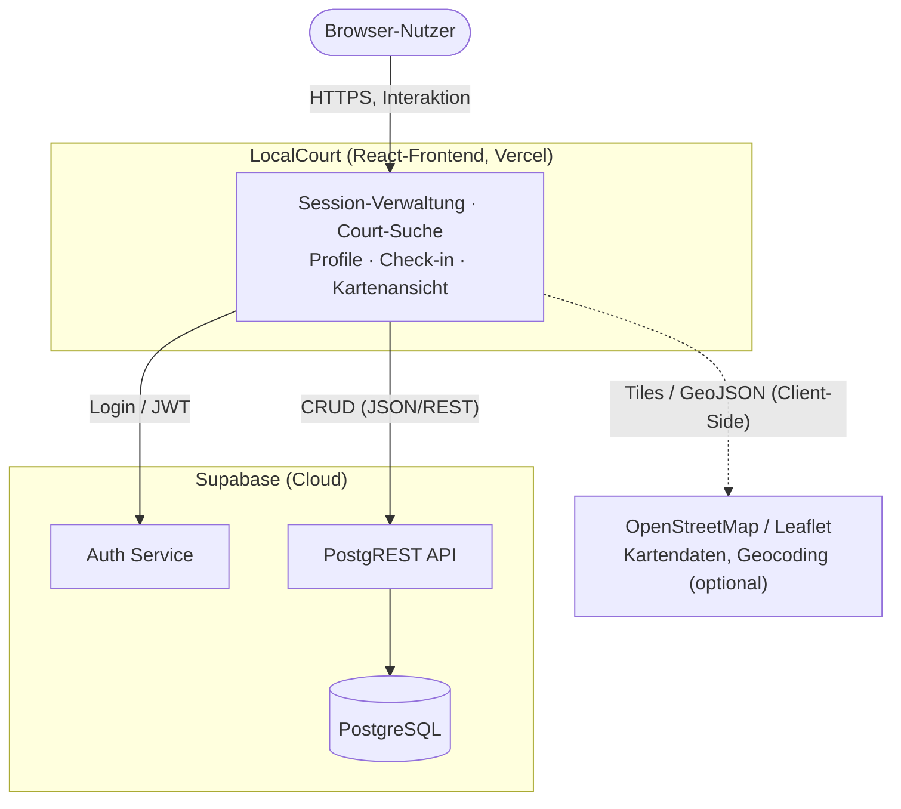
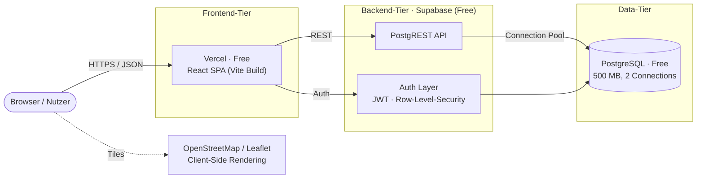
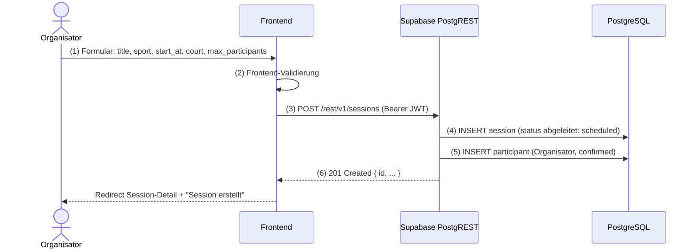
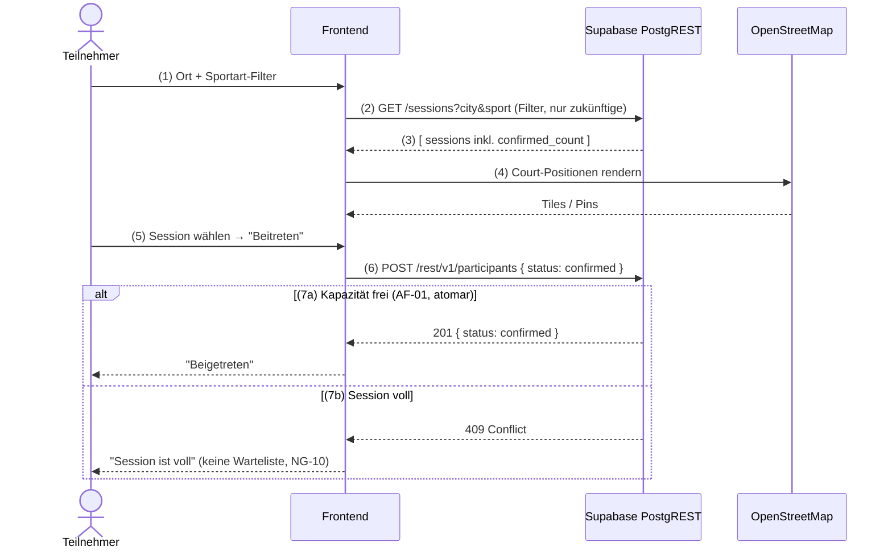

# P2 — Architekturüberblick

Beschreibt aus Anwendungssicht, wie sich LocalCourt in seine Umgebung einbettet: Welche Systeme kommunizieren mit LocalCourt, in welche Richtung der Datenaustausch läuft, und welche Partner-Systeme es gibt.

Nach Siedersleben Section 4.2: Das Ziel dieses Bausteins ist die **vollständige Aufzählung aller Nachbarsysteme** und die Datenflussbeschreibung zwischen ihnen.

**Hinweis**: Interne Architektur (Komponenten-Zerlegung, Layering, Sequence Diagrams, Deployment-Details) ist **außer Scope** und wird in M1–M2 (Fachliche & Technische Architektur) beschrieben.

---

## P2.1 Systemkontext

LocalCourt ist eine **webbasierte Anwendung** für die dezentralisierte Koordination lokaler Sportaktivitäten. Das System besteht aus einer React-Frontend-Anwendung (im Browser), die mit einer Cloud-Infrastruktur kommuniziert.

### Kontext-Diagramm (High-Level)



### Kommunikations-Kanäle

- **Inbound**: Browser-User → React-Frontend (synchrone, WebSocket optional für Echtzeit-Updates)
- **Frontend → Supabase Auth**: Authentifizierung, Session-Management (synchron, HTTPS)
- **Frontend → Supabase PostgREST API**: CRUD-Operationen auf Sessions, Courts, Participants, Profiles (synchron, REST)
- **Frontend → OpenStreetMap**: Kartendaten-Rendering, optional Geocoding (asynchron, Client-Side)

**Zusammenfassung**: Greenfield-System ohne Legacy-Integration. Alle Nachbarsysteme sind Cloud-Services via HTTPS-APIs.

---

## P2.2 Nachbarsysteme

Vollständige Aufzählung aller Systeme, mit denen LocalCourt kommuniziert:

| ID | System | Rolle | Richtung | Koppelung | Häufigkeit | Owner |
|----|--------|-------|----------|-----------|-----------|-------|
| **NB-01** | **Browser / React-Frontend** ([S1.2](S1-nachbarsysteme.md#s12--nb-01--browser-frontend)) | Einziger Nutzer-Kontaktpunkt; Session-Verwaltung, Entdeckung, Check-In | Inbound | Tight (Synchron, Request-Response) | Kontinuierlich | Nutzer |
| **NB-02** | **Supabase Authentication** ([S1.3](S1-nachbarsysteme.md#s13--nb-02--supabase-authentication)) | Nutzer-Anmeldung, Session-Verwaltung, Token-basierte Auth | Bidirektional (Request: Credentials; Response: JWT) | Tight (Synchron) | Per Login/Logout/Token-Refresh | Supabase (Third-Party) |
| **NB-03** | **Supabase PostgREST API** ([S1.4](S1-nachbarsysteme.md#s14--nb-03--supabase-postgrest-api)) | CRUD auf Sessions, Courts, Participants, Profiles, Check-ins | Bidirektional (Request: JSON Payload; Response: JSON Result) | Tight (Synchron, aber batching möglich) | Per Action (create, read, filter, update, delete) | Supabase (Third-Party) |
| **NB-04** | **OpenStreetMap / Leaflet** ([S1.5](S1-nachbarsysteme.md#s15--nb-04--openstreetmap-leaflet)) | Kartendarstellung, Visualisierung von Court-Positionen, ggf. Geocoding (Stadt → Koordinaten) | Outbound (Response nur für Rendering) | Loose (Asynchron, UI-only) | Per Map-Rendering, City-Input | OpenStreetMap Foundation (Third-Party) |

---

## P2.3 Schnittstellen-Übersicht

Detaillierte Interface-Contracts (Endpoints, Payloads, Error Handling) sind ausgelagert in **S1 — Nachbarsysteme-Schnittstellen** (eine Datei pro NB-XX). Diese Übersicht ist das **Inventar**.

| NB-ID | System | Protokoll | Format | Auth | Fehlerbehandlung | Status |
|-------|--------|-----------|--------|------|------------------|--------|
| NB-01 | Browser | HTTP(S) / WebSocket | HTML, JSON | Browser-Session | User Feedback (Modal/Toast) | ✅ |
| NB-02 | Supabase Auth | HTTPS/REST | JSON | JWT Token | 401/403 Unauthorized, Server-Error Propagation | ✅ |
| NB-03 | Supabase PostgREST | HTTPS/REST | JSON | Bearer Token (JWT) | 400/401/403/404/500, Business-Logic Error Messages | ✅ |
| NB-04 | OpenStreetMap | HTTPS/REST | GeoJSON, Tiles | (keine) | Graceful Degradation (Fallback zu Fallback-Map oder Text) | ✅ |

**Hinweise auf Schnittstellen-Details**: Siehe [S1 — Nachbarsysteme](S1-nachbarsysteme.md)

---

## P2.4 Deployment & Architektur-Topologie

### Infrastruktur-Übersicht



Hinweis: OpenStreetMap/Leaflet wird clientseitig gerendert und ist kein deploytes Tier von LocalCourt.

### Deployment-Details

| Komponente | Infrastruktur | Anbieter | Tier | Skalierung | Monitoring |
|------------|---------------|----------|------|-----------|-----------|
| **Frontend** | Vercel (CDN, Edge Functions) | Vercel Inc. | Free | Auto-Scale | Vercel Dashboard |
| **PostgREST API** | Supabase (Managed Service) | Supabase | Free | Limited (~50 req/s) | Supabase Logs |
| **Database** | PostgreSQL (Managed) | Supabase | Free | Limited (500 MB, 2 Connections) | Supabase Logs |
| **Authentication** | Supabase Auth | Supabase | Free | Unlimited Users | Supabase Logs |
| **Geo-Data** | OpenStreetMap CDN | OSM Foundation | Free/Tile-Server | Community-Scale | None |

---

## P2.5 Kritische Datenflüsse

### Szenario 1: Session erstellen (Organizer)



**Fehlerbehandlung**:
- 401 Unauthorized: JWT abgelaufen → Re-Login erforderlich
- 400 Bad Request: Validation Error (z.B. `start_at` < now) → Show Form Error
- 500 Server Error: DB Error → Show "Something went wrong" + Log UUID

---

### Szenario 2: Session finden & beitreten (Participant)



**Fehlerbehandlung**:
- 409 Conflict: Session voll → "Session ist voll" Message (harte Kapazitätsgrenze, keine Warteliste; P1 NG-10, F3 AF-01)
- 401 Unauthorized: Nicht angemeldet → Redirect zu Login
- 403 Forbidden: Nutzer darf dieser Session nicht beitreten (RLS) → Explain

---

### Szenario 3: Check-in durchführen (Teilnehmer)

Der Check-in wird vom **Teilnehmer** selbst ausgelöst — per QR-Scan (UC-08) oder PIN-Eingabe (UC-09); der Organisator stellt QR/PIN nur bereit und sieht das Ergebnis (UC-07). Die fachliche Prüfung ist in [F3 AF-02](F3-anwendungsfunktionen.md#f34-af-02--check-in-validierung) spezifiziert.

```mermaid
sequenceDiagram
    actor P as Teilnehmer
    participant FE as Frontend
    participant API as Supabase PostgREST
    participant DB as PostgreSQL

    Note over P,DB: Session ist active (AF-03), Teilnehmer ist confirmed
    P->>FE: (1) QR-Code scannen ODER PIN eingeben
    FE->>API: (2) PATCH /participants/<id> { status: checked_in }
    API->>DB: (3) UPDATE status=checked_in, checked_in_at=NOW()
    API-->>FE: (4) 200 { status: checked_in }
    FE-->>P: (5) "✓ Check-in erfolgreich"
    Note over FE,DB: idempotent (AF-02); keine Statusrücknahme
```

**Fehlerbehandlung** (Ergebniscodes aus AF-02):
- `NOT_JOINED`: Teilnehmer ist der Session nicht beigetreten → Hinweis „zuerst beitreten"
- `INVALID_CREDENTIAL`: falsche PIN / QR einer anderen Session → „Ungültiger Code"
- `OUTSIDE_WINDOW`: Session nicht `active` → „Check-in nur während der Session möglich"
- `ALREADY_CHECKED_IN`: bereits eingecheckt → Bestätigung ohne Änderung (idempotent)

---

## P2.6 Fehlende / Zukünftige Systeme

### Nicht integriert (bewusste Ausschlüsse)

| System | Grund für Ausschluss |
|--------|---------------------|
| **KI-APIs** (OpenAI, Claude, etc.) | MVP braucht keine Text-Generation, Recommendation Engines, oder Smart-Matching. Community-Discovery reicht. |
| **Payment-Gateway** (Stripe, PayPal) | Keine monetären Transaktionen (P1 NG-01). |
| **Email-Service** (SendGrid, Mailgun) | MVP: Keine Email-Notifikationen. Optional später für Session-Reminders. |
| **Push-Notifications** (Firebase Cloud Messaging) | MVP: Keine mobilen Push-Notifications. Web-Notifications später optional. |
| **Message Queue** (RabbitMQ, Kafka) | Synchrone REST-API genügt für MVP; asynchrone Background-Jobs nicht nötig. |
| **Backend Agent / Webhook-Consumer** | LocalCourt ist Consumer von lokalen AI-Agenten nicht (im Gegensatz zu Herold); Agenten greifen über Frontend-Manual-Tasks ein. |
| **Social-Media Integration** (OAuth Social, Sharing) | MVP nur Email+Password Auth. Social-Auth optional später. |

### Optionale Future Integrations

Diese Systeme können in späteren Phasen (P, M, N durchlaufen später Iterationen) hinzugefügt werden:
- **Email-Notifications** (Session-Reminder, Participant Invites)
- **Push-Notifications** (Mobile Web, Desktop)
- **Advanced Geocoding** (Google Maps API, Nominatim)
- **Analytics** (Segment, Mixpanel)
- **Monitoring** (Sentry, DataDog)

---

## Zusammenfassung

LocalCourt ist ein **Greenfield-System** ohne Legacy-Integration. Das System kommuniziert mit **4 Nachbarsystemen**:
1. **Browser/Frontend** (User-Input)
2. **Supabase Auth** (Authentifizierung)
3. **Supabase PostgREST** (Datenbank-CRUD)
4. **OpenStreetMap** (Kartendarstellung)

Alle Nachbarsysteme sind **Cloud-Services** über HTTPS-APIs, ideal für Free-Tier-Budgets. Die Architektur ist **anfängerfreundlich** (React + Supabase, minimal Backend-Logic) und **später skalierbar** (Backend-Services können später hinzugefügt werden, wenn komplexere Business-Logic erforderlich wird).

---

## Referenzen

- **P1 — Ziele und Rahmenbedingungen**: `P1-ziele-rahmenbedingungen.md`
- **S1 — Nachbarsysteme (Detailed Interfaces)**: `S1-nachbarsysteme.md` (zukünftig)
- **M1 — Fachliche Architektur**: `M1-...-md` (zukünftig)
- **Herold P2 Reference** (English): [GitHub](https://github.com/carstenlucke/herold/blob/main/docs/spec/P2-architekturueberblick.md)
- **Team & Rollen**: `../../TEAMINFO.md`
