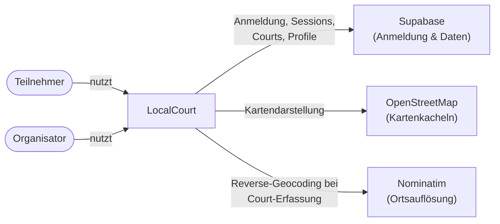

# P2 — Architekturüberblick

P2 zeigt LocalCourt als **Blackbox im Systemkontext**: die Akteure, die das System nutzen, die Nachbarsysteme, mit denen es kommuniziert, und die Richtung dieser Kommunikation. Nach Siedersleben Section 4.2 ist das Ziel dieses Bausteins die **vollständige Aufzählung aller Nachbarsysteme**, nicht die innere Architektur.

**Hinweis**: Interne Architektur (Komponenten-Zerlegung, Layering, Laufzeitsichten, Deployment-Details) ist **außer Scope** und steht in der [Architekturdokumentation](../arch/README.md).

---

## P2.1 Systemkontext

LocalCourt ist eine webbasierte Anwendung für die dezentrale Koordination lokaler Sportaktivitäten. Im Systemkontext ist LocalCourt eine einzige Blackbox: Zwei menschliche Akteure — **Teilnehmer** und **Organisator** ([F1](F1-geschaeftsprozesse.md), [F2](F2-anwendungsfaelle.md)) — nutzen das System; vier externe Nachbarsysteme stellen Anmeldung, Datenhaltung, Kartendarstellung und Ortsauflösung bereit ([P2.2](#p22-nachbarsysteme)).

### Kontext-Diagramm

```mermaid
flowchart LR
    teilnehmer(["Teilnehmer"])
    organisator(["Organisator"])

    lc["LocalCourt"]

    supabase["Supabase<br/>(Anmeldung & Daten)"]
    osm["OpenStreetMap<br/>(Kartenkacheln)"]
    nominatim["Nominatim<br/>(Ortsauflösung)"]

    teilnehmer -->|nutzt| lc
    organisator -->|nutzt| lc
    lc -->|Anmeldung, Sessions,<br/>Courts, Profile| supabase
    lc -->|Kartendarstellung| osm
    lc -->|Reverse-Geocoding bei<br/>Court-Erfassung| nominatim
```

### Kommunikationsrichtung

- **Teilnehmer, Organisator → LocalCourt**: einzige Eingangsrichtung; jede Aktion geht von einem der beiden Akteure aus, es gibt keinen eingehenden Kanal von außen ([S1.7](S1-nachbarsysteme.md#s17-nicht-genutzte-schnittstellen-und-abgrenzung)).
- **LocalCourt → Supabase**: Anmeldung sowie sämtlicher Datenzugriff auf Sessions, Courts, Teilnahmen und Profile.
- **LocalCourt → OpenStreetMap**: Kartendarstellung der Courts.
- **LocalCourt → Nominatim**: Ortsauflösung eines gesetzten Court-Pins bei der Court-Erfassung.

LocalCourt ist ein Greenfield-System ohne Legacy-Integration; alle Nachbarsysteme sind Cloud-Dienste, die über HTTPS angesprochen werden.

---

## P2.2 Nachbarsysteme

Vollständige Aufzählung aller Systeme, mit denen LocalCourt kommuniziert:

| ID | System | Rolle | Richtung | Kopplung | Owner |
|----|--------|-------|----------|----------|-------|
| **NB-01** | **Nutzerkanal (Browser)** ([S1.2](S1-nachbarsysteme.md#s12-nb-01--browser-nutzerkanal)) | Teilnehmer und Organisator nutzen LocalCourt; einziger Kontaktpunkt zum Menschen | Inbound | Synchron, je Nutzeraktion | Nutzer |
| **NB-02** | **Supabase Authentication** ([S1.3](S1-nachbarsysteme.md#s13-nb-02--supabase-auth)) | Anmeldung, Sitzungsverwaltung, Token-Ausgabe | Bidirektional | Synchron, je Login/Logout/Token-Refresh | Supabase (Third-Party) |
| **NB-03** | **Supabase PostgREST API** ([S1.4](S1-nachbarsysteme.md#s14-nb-03--supabase-postgrest)) | Lesen sowie fachlich geprüftes Anlegen/Aktualisieren von Sessions, Courts, Teilnahmen und Profilen | Bidirektional | Synchron, je Lese-/Schreibaktion | Supabase (Third-Party) |
| **NB-04** | **OpenStreetMap** ([S1.5](S1-nachbarsysteme.md#s15-nb-04--openstreetmap-tiles)) | Kartendarstellung der Courts | Outbound | Client-seitig, je Kartenanzeige | OpenStreetMap Foundation |
| **NB-05** | **Nominatim** ([S1.6](S1-nachbarsysteme.md#s16-nb-05--nominatim-reverse-geocoding)) | Reverse-Geocoding eines gesetzten Court-Pins | Bidirektional | Synchron, einmal je Pin-Setzen/-Verschieben | OpenStreetMap Foundation |

Supabase erscheint hier bewusst als zwei Schnittstellen (NB-02 Anmeldung, NB-03 Daten), weil beide unterschiedliche Contracts haben ([S1](S1-nachbarsysteme.md)); interne Supabase-Dienste wie Datenbank oder Edge Functions sind aus Sicht von LocalCourt kein eigenes Nachbarsystem und werden hier nicht gesondert ausmodelliert.

---

## P2.3 Schnittstellen

Die Schnittstellen-Contracts (Operationen, Ein-/Ausgaben, Fehlersemantik) je Nachbarsystem stehen vollständig in [S1 — Nachbarsysteme](S1-nachbarsysteme.md); die Zuordnung NB-nn → S1-Abschnitt steht dort in der Einleitung. P2 wiederholt diese Contracts nicht.

---

## P2.4 Deployment

Hosting, Infrastruktur-Tiers und die konkreten Free-Tier-Grenzen der genutzten Dienste sind interne Architekturentscheidungen und stehen in der [Architekturdokumentation, §6 Verteilung und Deployment](../arch/README.md#6-verteilung-und-deployment).

---

## P2.5 Datenflüsse

Der Ablauf einzelner Anwendungsfälle über mehrere Systeme hinweg (z. B. Session erstellen, beitreten, Check-in) ist eine Laufzeitsicht und steht in der [Architekturdokumentation, §5 Laufzeitsichten](../arch/README.md#5-laufzeitsichten). Die zugehörigen Ergebniscodes sind in [F3](F3-anwendungsfunktionen.md) definiert und in [N2.3](N2-querschnittskonzepte.md#n23-fehler-mapping-ergebniscodes--http) auf HTTP-Antworten abgebildet.

---

## P2.6 Eingesetzte KI-Werkzeuge

| Aspekt | Inhalt |
|---|---|
| Werkzeug | GitHub Copilot, Claude Code, Codex |
| Verwendung | Entwurf des Systemkontexts und der Nachbarsysteme sowie Zuschnitt auf eine reine Blackbox-Sicht; interne Bestandteile und Laufzeitsichten bleiben der Architekturdokumentation vorbehalten. |
| Prüfung | Abgeglichen mit [P1](P1-ziele-rahmenbedingungen.md), [F1](F1-geschaeftsprozesse.md), [F2](F2-anwendungsfaelle.md), [S1](S1-nachbarsysteme.md) und [docs/arch/README.md](../arch/README.md). |
