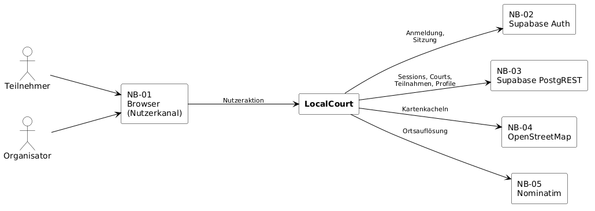

# S1 — Nachbarsysteme (Schnittstellen)

S1 beschreibt kompakt die Schnittstellen zwischen LocalCourt und seinen externen Nachbarsystemen: welche Operationen LocalCourt auslöst und welche Daten dabei in beide Richtungen laufen. Nachbarsystem im Sinne dieses Bausteins ist ausschließlich ein System außerhalb von LocalCourt mit eigenem Schnittstellen-Contract — nicht die innere Architektur des Frontends (siehe [docs/arch/](../arch/README.md)). Der umgebende Ablauf steht in [F2](F2-anwendungsfaelle.md), die fachlichen Regeln in [F3](F3-anwendungsfunktionen.md), die eigenen Entitäten in [D1](D1-datenmodell.md).

## Systemkontext

Das Kontextdiagramm aus [P2.1](P2-architekturueberblick.md#p21-systemkontext) zeigt LocalCourt als Blackbox mit seinen Akteuren und Nachbarsystemen und wird hier unverändert wiederverwendet:

Quelle: [`diagrams/P2-systemkontext.puml`](diagrams/P2-systemkontext.puml). Die vollständige Aufzählung mit Rolle, Richtung, Kopplung und Owner steht in [P2.2](P2-architekturueberblick.md#p22-nachbarsysteme); die Abschnitte S1.2–S1.6 unten detaillieren die Operationen je Nachbarsystem.

## S1.1 Konventionen

Die folgenden Zusagen gelten für jede in S1 beschriebene Operation und werden unten nicht wiederholt.

- **Synchron und blockierend.** Jeder Aufruf gehört zu einer Nutzeraktion im Browser und wird synchron beantwortet; es gibt weder Warteschlangen noch Hintergrundprozesse noch Push-Kanäle.
- **Fehlerbehandlung.** Fehler eines Nachbarsystems werden an den aufrufenden Anwendungsfall weitergegeben und in den Fehlerzuständen aus [B1.5.4](B1-dialogspezifikation.md#b154-fehler--und-ladezustände) angezeigt; fachliche Ablehnungen (Ergebniscodes aus [F3](F3-anwendungsfunktionen.md)) sind davon zu unterscheiden und ändern den fachlichen Zustand nicht. Ist ein Nachbarsystem nicht erreichbar, bleibt LocalCourt so weit bedienbar, wie es ohne dieses System auskommt ([N1-QA-01](N1-nichtfunktionale-anforderungen.md#n1-qa-01--konsistenz-von-beitritt-und-check-in)).
- **Authentifizierung.** Aufrufe gegen NB-03 tragen das Zugangstoken (JWT) aus NB-02. Der öffentliche Supabase-Projektschlüssel ist kein Geheimnis; der geheime Service-Role-Key wird vom Frontend **nie** verwendet und liegt nicht im Repository ([N1-QA-03](N1-nichtfunktionale-anforderungen.md#n1-qa-03--zugriffsschutz-und-datensparsamkeit)).

## S1.2 NB-01 — Browser (Nutzerkanal)

Der Browser ist der einzige Kontaktpunkt zum Menschen; die Schnittstelle ist die Dialogfläche aus [B1](B1-dialogspezifikation.md) (DLG-01–DLG-08). Ein eigener Protokoll-Contract ist nicht nötig.

| Aspekt | Inhalt |
|---|---|
| Zweck | Darstellung, Formulareingabe und Einstieg über einen Deep-Link in den Check-in-Dialog (`…/check-in?session=<id>&pin=<pin>`, [F3 AF-04](F3-anwendungsfunktionen.md#af-04--pin--und-qr-code-erzeugung)). |
| Schnittstelle | Dialoge aus B1; Ablage des Zugangstokens aus NB-02 für die Dauer der Sitzung. |
| Abgrenzung | LocalCourt nutzt weder die Kamera-Schnittstelle (der QR-Code wird mit der Kamera-App des Geräts gescannt, PIN-Eingabe ist gleichwertig) noch die Geolocation des Geräts (die Ortssuche ist eine manuelle Eingabe, [F2 UC-02](F2-anwendungsfaelle.md#uc-02--session-suchen)). Das innere Frontend (Komponenten, Routing) ist keine Schnittstelle, siehe [docs/arch/](../arch/README.md). |

## S1.3 NB-02 — Supabase Auth

Anmeldung und Sitzungsverwaltung per E-Mail und Passwort. LocalCourt übernimmt aus diesem System ausschließlich die Nutzerkennung als `profile.user_id` ([D1.4](D1-datenmodell.md#d14-entitätstypen-im-detail)); mit dem Auth-Nutzer entsteht automatisch das zugehörige Profil.

| Aspekt | Inhalt |
|---|---|
| Zweck | Registrierung, An-/Abmeldung, Token-Erneuerung und Auslesen der angemeldeten Nutzerkennung. |
| Schnittstelle | Fünf Operationen: `registrieren`, `anmelden`, `abmelden`, `sitzungErneuern`, `angemeldetenNutzerLesen`; Antwort ist jeweils eine Sitzung mit Zugangstoken (JWT). |
| Ausgetauschte Daten | E-Mail/Passwort bzw. Token (Anfrage); Sitzung mit Token und Nutzerkennung (Antwort). Das Token begleitet danach jeden Aufruf gegen NB-03. |
| Abgrenzung | Kein Social-Login (OAuth), kein Passwort-Reset, keine E-Mail-Bestätigung, keine Mehrfaktor-Authentifizierung — alle setzen E-Mail-Versand voraus, der außerhalb des MVP liegt. Läuft das Token ab, leitet LocalCourt zur Anmeldung um. |

## S1.4 NB-03 — Supabase PostgREST

Fachlicher Datenzugriff auf Sessions, Courts, Teilnahmen und Profile, per Row-Level-Security auf das beschränkt, was der angemeldete Nutzer sehen bzw. ändern darf ([N2.2](N2-querschnittskonzepte.md#n22-row-level-security-rls)).

| Aspekt | Inhalt |
|---|---|
| Zweck | Lesen von Sessions, Courts, Teilnehmern, Profilen und Sportarten; fachlich geprüftes Anlegen und Aktualisieren. |
| Schnittstelle | Acht lesende Operationen (u. a. `sessionsSuchen`, `sessionLesen`, `teilnehmerLesen`); drei atomare RPCs — `create_session`, `join_session`, `check_in` —, die Prüfung und Schreibvorgang als unteilbare Einheit ausführen ([F3](F3-anwendungsfunktionen.md)); einfache geprüfte Schreibzugriffe (`courtAnlegen`, `profilAktualisieren`, `sportpraeferenzSetzen`/`-Entfernen`). |
| Ausgetauschte Daten | Filter bzw. Nutzdaten (Anfrage); Datensätze bzw. Ergebniscode (Antwort). Die Session-PIN ist nur für Organisator und bestätigte Teilnehmer sichtbar. |
| Abgrenzung | Kein Offline-Betrieb und kein lokaler Datenbestand; ohne NB-03 ist LocalCourt fachlich nicht nutzbar. Nicht genutzt: Echtzeit-Kanäle (Realtime), Dateiablage (Storage — das Profilbild ist nur ein Verweis `avatar_url`) und Edge Functions außerhalb der Datenbank. Ergebniscodes (`OK`, `SESSION_FULL` u. a.) stehen in [F3](F3-anwendungsfunktionen.md), das HTTP-Mapping in [N2.3](N2-querschnittskonzepte.md#n23-fehler-mapping-ergebniscodes--http). |

## S1.5 NB-04 — OpenStreetMap-Tiles

Kartendarstellung der Courts. Der Kachel-Dienst von OpenStreetMap ist das Nachbarsystem; Leaflet ist eine Client-Bibliothek im Browser und kein eigenes Nachbarsystem.

| Aspekt | Inhalt |
|---|---|
| Zweck | Kartendarstellung bei Session-Suche/-Detail und beim Setzen eines Court-Pins ([F2 UC-02](F2-anwendungsfaelle.md#uc-02--session-suchen), [UC-10](F2-anwendungsfaelle.md#uc-10--court--sportort-erfassen-oder-auswählen)). |
| Schnittstelle | `kachelnLaden(kartenausschnitt, zoomstufe) → Kartenbilder`. |
| Ausgetauschte Daten | Ausschnitt und Zoomstufe (Anfrage); Kartenbilder, nicht persistiert (Antwort). Keine personenbezogenen Daten, kein Zugangstoken. |
| Abgrenzung | Nutzung gemäß OSM-Nutzungsrichtlinie (sichtbare Quellenangabe, kein Massenabruf). Ohne Kacheln bleiben Listen-/Detailansichten nutzbar; eine Court-Neuerfassung ohne Kartenpin ist nicht möglich. |

## S1.6 NB-05 — Nominatim Reverse-Geocoding

Bestimmt bei der Court-Neuerfassung aus dem gesetzten Kartenpin die nächstgelegenen Orts- und Adressdaten.

| Aspekt | Inhalt |
|---|---|
| Zweck | Reverse-Geocoding eines Court-Pins bei [UC-10](F2-anwendungsfaelle.md#uc-10--court--sportort-erfassen-oder-auswählen). |
| Schnittstelle | `ortAufloesen(latitude, longitude) → { city, address? }`. |
| Ausgetauschte Daten | WGS84-Koordinatenpaar (Anfrage); Ort und optionale Adresse des nächstgelegenen OSM-Objekts (Antwort). Keine Nutzerkennung. |
| Abgrenzung | Nutzung der öffentlichen Instanz gemäß [Nominatim Usage Policy](https://operations.osmfoundation.org/policies/nominatim/): höchstens eine Anfrage pro Sekunde, sichtbare Attribution, keine Adresssuche oder Autovervollständigung. Liefert der Dienst keinen verwertbaren Ort, wird kein unvollständiger Court gespeichert. |

## S1.7 Schnittstellenübersicht

| Nachbarsystem | Operationen |
|---|---|
| NB-01 Browser | Dialoge aus B1 (kein eigener Protokoll-Contract) |
| NB-02 Supabase Auth | `registrieren`, `anmelden`, `abmelden`, `sitzungErneuern`, `angemeldetenNutzerLesen` |
| NB-03 Supabase PostgREST | 8 lesende Operationen; `create_session`, `join_session`, `check_in`; `courtAnlegen`, `profilAktualisieren`, `sportpraeferenzSetzen`/`-Entfernen` |
| NB-04 OpenStreetMap | `kachelnLaden` |
| NB-05 Nominatim | `ortAufloesen` |

## S1.8 Eingesetzte KI-Werkzeuge

| Aspekt | Inhalt |
|---|---|
| Werkzeug | GitHub Copilot, Claude Code, Codex |
| Verwendung | Ausarbeitung der Schnittstellen-Contracts je Nachbarsystem (Operationen, ausgetauschte Daten, Abgrenzung). Nach Rückmeldung des Professors auf das Kontextdiagramm aus P2 und knappe Contracts gekürzt, ohne fachliche Schnittstelleninformationen zu verlieren; ausführliche UC-Zuordnungen, interne Frontend-Details und Wiederholungen aus P2/arch entfernt. |
| Prüfung | Abgeglichen mit [P2](P2-architekturueberblick.md), [F2](F2-anwendungsfaelle.md), [F3](F3-anwendungsfunktionen.md), [D1](D1-datenmodell.md), [D2](D2-datentypen.md), [B1](B1-dialogspezifikation.md), [N1](N1-nichtfunktionale-anforderungen.md) und [N2](N2-querschnittskonzepte.md). Repositoryweite Querverweise auf entfernte S1-Abschnitte wurden geprüft und angepasst. |
